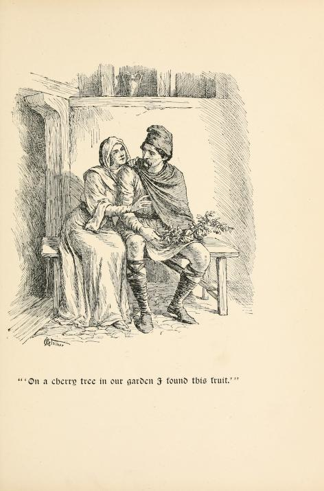
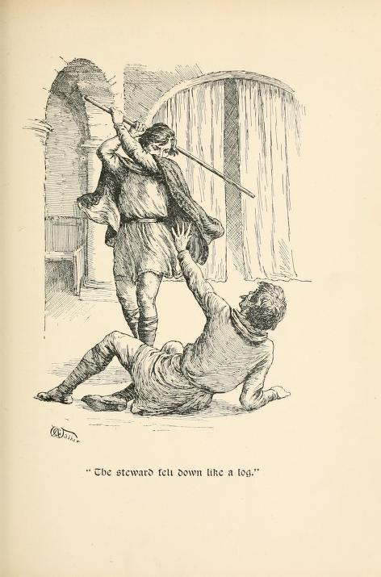

# Sir Cleges and the Winter Cherries

*First heard: David Heathfield (Exeter Storytellers), Yuletide Tales online, Dartmoor Storytellers, December 19th, 2022.*

Here's the gist of the tale:

> Sir Cleges was an old knight of Uther Pendragon. Generous to a fault, he gave alms to all, to such an extent that he and his wife Clarys had nothing left. It was midwinter, bitterly cold, and the sound of the King's court could be heard; but they had no gifts to take. A cherry tree in the garden bloomed, and gave a heavy crop of red chaerries. Sir Cleges took them to the King, but dressed as he was, looking like a pauper, was insulted as a *churl*. The porter let him through but demanded a third of what the King would give in return. The usher let him through, for a third. The steward let him through, for a third. The gift was given and Sir Cleges joined the feast. Uther is impressed (as is a certain "lady of Cornwall" whom he's perhaps trying to woo...). A reward is asked for, and granted: twelve strikes of the stick to be justly given. The steward, the doorman and guard were beaten by Sir Cleges. Sir Cleges returns, to find the harper singing songs of his old exploits. Prompted by the song, the King asks Cleges to come closer, at which point he recognises him as his old loyal knight, and rewards him.

*The "lady of Cornwall" is Iguerne, which it to say, Igraine, which is to say, King Arthur's mother. How Uther seduced her is, of course, another story... But there is great scope here for telling that tale in the same sitting as this, as the scene is already set...*

The original tale can be found in a couple of 15th century manuscripts in Middle English.

```{admonition} Pronunciation
I keep vacillating on this... The name may be spelled "Cleges" or "Clegys". After discussion with Prof. Richard D. Brown, I think I am settled on "Clegg-iz", but reserve the rights, as was apparaently the custom at the time, to vary the pronunciation as appropriate, which might variously allow *Clegg-iss*, "Cledjizz" and variants of "Clee-jiss".

I also need to learn to read and write IPA, the International Phonetc Alphabet!
```

A really concise and efficient telling of the tale appears in *Stories of Early England* by E. M. Wilmot-Buxton, published in 1906/7.

```{admonition} In *Stories of Early England*, E. M. Wilmot-Buxton, 1906/1907
:class: dropdown

https://archive.org/details/storiesofearlyen00wilm/page/238/mode/2up
Stories of early England
by Wilmot-Buxton, E. M. (Ethel Mary)

Publication date 1906, 1907
p239-243

THE TALE OF SIR CLEGES

THERE lived in the days of King Arthur's father a good knight named Sir Cleges. He was so kind and generous to everyone that after a time he had nothing left for himself and for Claris, his wife, and his little children. But still neither he nor his wife would despair, but hoped for better days. When Christmas-time came, however, Sir Cleges grew very despondent, for at that season he was wont to feed "both free and bond." On Christmas Eve he wandered about his garden feeling very sad, and inclined to grumble at his ill fate; but his good wife came to him, and, putting her arms round him, kissed him warmly, and bade him come in to his solitary meal, and be glad in honor of the day. So he went in, and played with his children, and made merry with them, and on the morrow went to church. And as they returned, he went alone into his garden, and, kneeling down under a cherry-tree, all frost-bitten with the wintry cold, he thanked God for the many blessings he still had left. But when he pulled himself up by a bough of the tree, strangely enough the bough was green, and had ripe cherries growing upon it. This was very surprising, and Sir Cleges hastened to show them to his wife. She at once proposed that he should put the Christmas cherries in a basket, and take them as a present to King Uther, his old master, in his castle at Cardiff. So the knight put on his oldest clothes for the journey, and took a staff in his hand, so thai he looked like a poor beggar, and, with his little son by his side to carry the basket of cherries, set off for Cardiff.

When they reached the gate of the castle, however, they found there a very surly porter, who threatened to break the poor man's head if he attempted to go in. So Sir Cleges called his son, and opened the basket, and showed the marvellous cherries to the man. When he saw them, and foresaw what great gifts they would draw from the King, he allowed Sir Cleges to enter, on condition that he promised him a third of what King Uther gave him.

The knight agreed, and, passing in at the gate, soon came to the door of the hall; and there stood the usher, grim and tall, with staff in his hand. He too spoke very roughly to the beggar, as he seemed to be, and only allowed him to pass the door on condition that he too received a third of the King's gift. Inside the hall the steward met him, and would have turned him out at once had not he seen the cherries and made the same bargain as the others.

Then Sir Cleges made his way to the King's room, opening out of the hall, and, kneeling down, presented his gift. King Uther was much astonished and delighted, and at once bade the beggar ask whatever he would, saying it should be granted him. And this was the request of Sir Cleges, who was inwardly raging at the way he had been treated by the King's underlings.

"Grant me, I pray you," said he, "twelve strokes to be given to whom I please."

"Far better," answered Uther, "had you asked gold or land, for you look in sore need of both."

But the knight replied: "You promised I should have what I asked, O King, and of that am I right glad." The King was very sorry; but he could not take back his words, so he gave him leave to "deal twelve strokes when and where he would."

Then the knight went out to teach a lesson of charity, and he certainly taught it in no gentle way. He entered the hall, and sought out the proud steward among all the lords who were present there, and gave him a blow with his staff which knocked him to the ground, and then, fulfilling his promise of a third of the King's gift, he gave him three strokes more, until the steward cried: "Sir, for thy courtesy, strike me not again."

Sir Cleges then went to seek the usher. "Have here thy promised part of my gift," said he, and gave him four such blows as would prevent him showing anyone the way for a very long time. Lastly, he went out to the porter, and treated him in the same way, saying grimly: "Now thou hast the third part of my gift, according to our agreement."

When Sir Cleges went back into the hall he found the King had taken his place there, and was listening to the songs of a harper. Now, when Sir Cleges had been rich he had been very kind to this harper, who now, seeing the poor attire of his benefactor, made songs about him, telling the King of his generous acts, and reminding him how in old days he had been one of his bravest followers. Then the King, looking upon Sir Cleges, recognized his old knight, and received him with joy, and asked him what he had meant by his mysterious request; and when Sir Cleges told him all, he was greatly amused and delighted. Moreover, he ordered that rich clothes be given to the knight and his son, and that his wife and the other children should be fetched; and he gave him part of Cardiff Castle for his own, and much store of money, so that Sir Cleges and his wife Claris lived there happily for the rest of their lives.

From the Old English Metrical Poems. Thirteenth century.

```

So what, then, was this *Old English Metrical Poems. Thirteenth century*? Jessie L. Weston's *Sir Cleges. Sir Libeaus Desconus. Two Old English metrical romances rendered into prose*, 1902, gives a prose version of the original metrical poem:

> Of the two romances contained in this volume, the first — *Sir Cleges* — scarcely, perhaps, deserves the name of a romance; it has rather the character of a *lai* or *fabliau* the tale being short and somewhat compressed in style, and the final incident distinctly humorous in character. It exists in a unique paper MS. of the fifteenth century, preserved in the Advocate's Library, Edinburgh, from which it was printed by Weber in the first volume of his *Metrical Romances*.

Weston continues:

> Though lacking in the grace and charm of the French *lais* the story of Sir Cleges is by no means wanting in interest; the simple faith and trust of the poverty-stricken knight, and the miraculous succour vouchsafed to him, contrasted with the somewhat rough humour of the closing scene, have a piquant and by no means unpleasing effect. The author is unknown, but the edifying character of the tale might lead to the conjecture that it was the work of an ecclesiastic gifted with a sense of humour. Slight as it is, the story seemed worth preserving, especially in a volume intended for Christmas publication.

```{admonition} In *Two Old English metrical romances rendered into prose*, J. L. Weston, 1902
:class: dropdown

https://archive.org/details/SirClegesLibeausDesconusWeston/page/2/mode/2up

Sir Cleges. Sir Libeaus Desconus. Two Old English metrical romances rendered into prose by Jessie L. Weston. With designs by Caroline M. Watts
by Weston, Jessie Laidlay, 1850-1928

Publication date 1902

pp. 3-18

Listen, lordings, and ye shall hear of the fathers that went afore us; hardy men they were and valiant. 'Twas in the days of King Uther, who was father unto King Arthur (fair was he to look upon); he had a knight, hight Sir Cleges `[A knight of a similar name, Clegis, is mentioned by Malory among the Knights of the Round Table, *Morte Arthur*, Books V., c. 9, and XIX., c. 12, but no hint of the story attaching to him is given. One of Chrétien de Troyes' earliest metrical romances has for hero a certain *Cligés*, nephew to the Emperor of Constantinople, and son of Sir Gawain's sister. He is, also, a Knight of the Round Table, but the story told of him and his love for his uncle's wife, Phenice, is apparently of Oriental origin, a variant of the tale of *Salomon and Markolf*. Though by no means an unfavourable specimen of Chrétien's style, the poem of Cliges does not appear to have won anything like the popularity enjoyed by *Erec*, *Yvain*, or *Perceval*, and references to the characters and incidents of the romance are rare in contemporary literature. It does not seem probable that the hero of our *fabliau*, who is represented as being of full manhood in the reign of Arthur's father, and before Arthur's birth, can be in any way connected with the *Cligés* of Chrétien, who, as mentioned above, is son to Sir Gawain's sister, and considerably the junior of the leading heroes of Arthur's Court; but which of the two Malory's knight represents it is not easy to say. It is perhaps more likely that the English compiler should have known, and referred to, the hero of our tale, than to Chrétien's knight.]`, one of the Round Table; none was there doughtier of deeds. He was a man of tall stature, thereto full fair of feature, and withal of great might. A more courteous knight than he might not be found throughout the realm, so gentle was he and free of hand. They that had wandered in lands wasted by war, and were fallen into poverty, to them he gave both gold and fee; the poor would he succour, and do wrong to no man.

Gentle of manner was Sir Cleges, and held open table to all who were fain to visit him, for he had great plenty. A fair wife had that knight, never a better was there in life, and passing merry of countenance. Dame Clarys was that lady hight; she was a good lady assuredly, and ever of joyful mood; she gave alms right freely to the poor, and cherished many; no man, rich or poor, bare ill-will towards them, for they ever did right.

Every year at Christmastide would Sir Cleges hold a great feast and royal, even as if he were a king, in honour of the day; throughout all the land was there no man, rich or poor, who would say nay when bidden thereto. Nor would the minstrels be behind, for they will ever be where they may find most mirth! Nor when the feast was done should they get them gone without largesse great and good; horses, robes, rich rings, gold, silver, and many a thing beside did they have to the amending of their mood.

Ten years did Sir Cleges hold such feast, to the honour of Holy Mary, that Maiden mild, and of Him who died on the Rood, and then did his goods begin to wax scant by reason of his much spending, that knight of gentle blood. Yet would not Sir Cleges be let from holding his Christmas feast, but set his manors in pledge (thinking well to redeem them), and so did he feast knight and squire full many a year for the honour of God Almighty till, sooth to say, it came to pass at the last that all his goods were spent, and he had but little left. Yet though it were his last penny would not that good knight stint of holding feast, for that he hoped in God; and thus did he, right royally, till that his manors were all gone and but one was left to him, and that of such little worth that he and his wife might scarce live thereon. His men, who were proud of mood, began to forsake him on every side; no man would dwell with him, but he was left with his wife and children twain; then was Sir Cleges in great woe, and bemoaned himself right bitterly.

Now it befell on Christmas Eve that the king, who dwelt beside Kardyf, bethought himself of the season, and ordained a great feast for all in his hall `[Here, and in the concluding passage, the M.S. appears to be defective, and I have added the passages italicised, in order to avoid adruptness aud dislocation of the narrative. —J. L. W.]` *but Sir Cleges (whose manor lay hard by the borders of Kardyf) was not bidden thereto, for 'twas many a year since the king had heard speech of him, and he deemed well that he was already dead*. But that good knight, when it drew towards noon, fell on swooning, thinking how it behoved him to make mirth, and how he had sold and lost his manors and his fair rents. Bitter sorrow did he make; he wrung his hands and wept sore for that his pride was brought thus low.

As he walked up and down, sighing sore, Sir Cleges heard the sound of divers minstrelsy, trump, pipe and clarinet; harp, lute and guitar; cithole and psaltery; on every side he heard the voice of singing, of caroles and of fair dancing; then did Sir Cleges wring his hands and weep, sighing right piteously: "Lord Jesu," he quoth, "King of Heaven, who hast made all things of naught, I thank Thee for these Thy good tidings; aforetime was I wont at this time to make merry for Thy sake; bondman and free did I reed alike; all that came to me in Thy name wanted for naught that was in my lands, rich meats and good drinks, the best that might be, by the Rood — never did I lend my goods upon usury." As he thus stood and made lament, his good wife drew nigh and clasped him in her arms; she kissed him with gladsome cheer. "My lord," she said, "my true comrade, I heard your speech; ye see well it helpeth naught to make moan, therefore I pray ye cease and put away your sorrow, and thank God of His love for all that He hath sent. For Christ's sake I pray ye think no longer of the griefs that beset ye, for honour of this day, wherein every man should rejoice. Therefore be no more sad, but think on what I say. Go we to meat forthwith, and let us be blithe and joyful as best we may; truly I hold this for the best, for your meat is all ready, and I trust well to your liking."

"That will I," quoth the knight, and turned him with her, and somewhat amended his mood. Yet he was heavy at heart, but she comforted him more and more to the setting aside of his sorrow, so that he began to wax blithe, and wiped away the tears that ran adown his cheeks. Thus they washed and went to meat with such victuals as they might get, and made them merry together.

When they had eaten, sooth to say, they passed the day in such mirth as they might; they made sport with their children, and after supper, when the night fell, they gat them to bed.

On the morrow they betook them to church, to do God service, as is both reason and right. Sir Cleges, he kneeled low on his knee and prayed unto Jesu Christ for his wife so dear. "Gracious Lord," he said, "have mercy alike on my wife and my children, and keep them far from strife." The lady, too, prayed for her husband that God should keep him from sorrow and bring him to life everlasting. When that the Mass was done they gat them home again, giving thanks of good heart to God, and put away care from their thoughts.

When Sir Cleges came again to his place, he had abated him somewhat of his sorrow and set it aside. Therewith he caused his wife and his children to go before him, and betook himself alone into the garden, and there did he kneel down and pray to God surely, thanking Him from his heart for the poverty and the want which He had sent upon him. When as he thus kneeled low and made his prayer beneath a cherry-tree, a bough smote him on the head, and he arose up quickly and knelt no longer, for even as he caught the bough in his hand he found green leaves thereon and berries beside. Quoth the knight, "Dear God in Trinity, what manner of berries may these be which grow thus at Christmastide? Never before saw I tree that bare fruit at this season." He thought to taste the fruit and spare not, and put one into his mouth. Lo! the flavour was such that never cherry that he had tasted since that he had grown to manhood was to be compared therewith.

Sir Cleges brake off a little bough, thinking to show it to his wife, and brought it to her. "Lo! dame, see here a marvel! On a cherry-tree in our garden did I find it growing. I fear me lest it be the foretoken of harm to follow; so it thinketh me forsooth! Yet, whether we have less or more, let us thank our God therefor, for truly so doth it seem fitting."

Then the lady spake of joyful cheer and said, "Fill we a basket of this which God hath now sent to us; to-morrow, when the day dawneth, ye shall to Kardyf, to the king, and bear this for a present. It may well be that ye have at his hand such a gift that we fare the better throughout the year, so I tell ye verily." The knight granted her prayer. "To-morrow," he quoth, "I will to Kardyf at your will."

On the morrow, when it was light, the lady made ready a basket, and called unto her her eldest son, "Take up this goodly basket," she said, "and bear it forth lightly with thy father." Then Sir Cleges took unto him a staff, no horse had he, saith the book, wherewith to ride on his way, neither steed nor palfrey, but a staff must needs be his hackney, as befitting a poor man.

Thus the good knight and his gentle son went on their way to Kardyf all on this Christmas Day; to the castle they came in safety, even as men made ready for meat, and Sir Cleges verily thought to enter. But he was poorly clad and in simple array, and the porter spake roughly, "Churl, withdraw thee speedily and without delay, so do I rede thee, else, by God and Holy Mary, I shall break thine head for thee. Go thou, stand in the beggar's row, an thou come further I shall give thee such a clout as thou shalt rue well!"

"Good sir," quoth the knight, "I prithee let me enter, believe me without a doubt I have brought unto the king a gift from Him that hath made all things of naught. Look thou here!"

With that the porter went unto the basket and raised the lid and looked upon the cherries; well he wist that he who brought such offering unto the king should receive a goodly gift: he quoth, "By Him who bought me thou comest not in hither, as I be a mortal man, save that thou grant me the third part of all that the king give thee, be it silver or gold!" Sir Cleges said, "Thereto I agree," and with that the porter bade him pass without further hindrance.

As he went in swiftly the usher stood at the hall-door, with his staff raised as he were fain to smite Sir Cleges. "Go back, thou churl?" quoth he, "apace, and tarry not, else will I grant thee no grace, but will smite thee on every limb, head and body, if thou make more pressing!"

"Good sir," quoth Sir Cleges, "for the love of Him who made mankind, cease this wrathful mood. I bring here a gift from Him who made all of naught, and died on the Rood; this night did it grow in my garden! Behold whether I speak false or true, they be fair and good!" With that the usher lift up the lid and beheld the berries, and marvelled much within himself -

Quoth the usher, "By sweet Saint Mary, churl, thou goest no further (that do I tell thee of a truth), but that thou grant me without fail the third part of thy guerdon whenas thou comest hither again."

Sir Cleges saw he might do no otherwise, naught else would he have: with heavy cheer he took his son and his basket, and went his way into the hall. The steward, in costly weed, walked there among the lords, he gat him to Sir Cleges boldly and quoth, "Who made thee so hardy as to come into this hall? Thou art overbold, churl! I rede thee, get thee hence with thine old clothes speedily."

Quoth the knight, "I bring hither a present from our Lord, who bought us full dear and bled upon the Rood." He proffered the basket unto the steward, and pulled out the pin as smartly as might be. Quoth the steward, "By Holy Mary, since I was born saw I never the like at this season of the year. Thou shalt come no nigher to the king save that thou grant me mine asking — by Him that bought me I will have the third part of the king's guerdon, or thou comest no further."

Then Sir Cleges bethought him, "My share is lost 'twixt these men, and I shall have naught; an I have a meal for my pains, 'tis all I may look for" — thus he bethought him, sighing. Quoth the steward, "Rascal, hast no tongue? Speak to me, and grant me mine asking without longer tarrying, else with my staff I shall wake thee, making thy ribs to quake, and put thee out headlong." Sir Cleges saw that there was none other remedy save that he grant his asking, and said, sighing sore, "Whatsoever the king's guerdon, be it less or more, ye shall have the third part thereof," Then soberly, and with good intent, the knight went up to the dais and knelt low before the king.

Sir Cleges uncovered the basket, kneeling low, and showed unto the king the bright red cherries, saying: "Jesus, our Saviour, sent thee this fruit with honour, causing it to grow upon the ground." The king looked upon the fresh cherries, and quoth, "I thank Christ Jesus, of a sooth 'tis a fair gift for a New Year." He commanded the knight to sit down to meat, thinking to speak with him thereafter.

Of certain of the cherries King Uther made a present and sent it unto a gentle lady of Cornwall `[This is, of course, Iguerne, wife, first of the Duke of Cornwall, and secondly of King Uther, and mother of Arthur. The Merlin gives an account of Uther's wooing of the lady and the embarrassment caused by his costly gifts, among which the cherries are not mentioned!]`, a bright and lovely lady she was, and withal of good repute. The rest he bade be served throughout the hall.

Quoth the king, that royal lord, "I counsel ye all that ye make merry, and he that brought me this present it shall avail him right well; full well shall I content him."

When all were merry and glad, spake the king unto a squire, "Bring now hither before me the poor man who brought the cherries." Sir Cleges tarried not but came anon, and fell low on his knees before the king and his lords, saying mildly unto the king, "Lord, what may be your will? I am your man freeborn." "I thank thee heartily," said King Uther, "of the gift and the present which thou hast now brought; through it hast thou honoured all my feast, old and young, great and small, and done me great worship. Whatsoever thine heart desireth I will grant thee for the asking — so may God save me!"

Quoth the knight, "Gramercy, noble king, this is a comforting unto me. I tell ye, of a surety, land or folk or other riches, that were over much for me, but sith that I may choose myself, I prithee of thy clemency that thou grant me twelve strokes, to deal where it liketh me best — to pay them all with my staff to mine adversaries here in the hall." `[A similar situation to this of our tale is found in one of the novels of Sachetti (Florence, 1724, vol. ii.). Here the hero is a peasant, who finds a hawk belonging to the King of France. An usher of the palace demands half the reward, and the peasant, when given his choice of a guerdon, prays for fifty lashes. The King demands the reason of his choice, and on learning it, orders that the usher shall be paid in kind, while the peasant receives his share in golden pieces. An even closer parallel is that afforded by the following little tale, included in Wright's *Latin* Stories, No. cxxvii. *"Vir quidam ad imperatorem Fredericum veniens cum fructibus quos multum dilexit, ingressum habere non potuit nisi janitori lucri promitteret medietatem. Imperator vero in fructibus illis delectatus, eum caegit ut aliquid peteret, qui petiit ut sibi centum ictus dan praeciperet. Cujuscausam cum imperator cognovisset, suos ictus leviter, alterius vero graviter solvt jussit."*  
This tale is drawn from the collection of John of Bromyard, an English Dominican of the fourteenth century, and the editor remarks that it can probably be traced through several centuries; a supposition which the large number of parallels cited by Doctor I. Bolte, of Berlin (to whose courtesy I owe the above Latin reference) fully bears out.  
The tale is apparently to be found in all times, and in all lands, even so far afield as among the Berbers of Africa. The immediate source of our *Sir Cleges* was not improbably a French *Lai*, but whether the Latin represents the germ from which the earlier poem was expanded, or whether it be but a condensed reminiscence of that source, it is impossible to say. In any case *Sir Cleges* is of undoubted interest as affording an ingenious and graceful variant of an ancient and oft-told tale.]`

Then answered King Uther, "I repent me of the grant that I made to thee. By heaven, thou had'st better have gold or fee, thou hast more need thereof."

Sir Cleges spake boldly, "Lord, 'tis your own granting, and thereof am I right glad." The king was sad at heart, but nevertheless he granted him that which he desired.

Straightway Sir Cleges betook him to the hall, among the great lords, and sought out the proud steward to give him his reward, since that he had so sorely grieved him. He gave the steward such a stroke that he fell as a log before them all; after, he gave him the other three, till he cried, "Sir, of thy courtesie smite me no more." Out of the hall went Sir Cleges, with intent to pay more without let or hindrance; he went swiftly to the usher, "Have here some strokes," he said when they met, — thereafter for many a day that usher forbade no man entrance, so grimly did he greet him!

Sir Cleges said "By my troth thou hast the third part of my guerdon, even as I promised thee."

Then went he to the porter, and four strokes he gave him, his full share; for many a day that porter would forbid no man entrance, came he ahorse or afoot. The first stroke Sir Cleges dealt him he brake his shoulder-bone and one arm; the knight quoth, "By my troth, thou hast now the third part of my guerdon, even the covenant that I made with thee!"

The king was set in his parlour with honour, mirth and solace. Sir Cleges went thither, and as he came a minstrel sang before the king the gest of a knight, even of himself. The king spake to the harper, "Where is knight Cleges? Tell me now, for thou hast journeyed far and wide; tell me the truth, knowest thou aught of that man?" Quoth the harper, "Yea, I knew him aforetime, he was a true knight, and of comely presence; we minstrels miss him sorely since that he departed from this land, he was fair of stature and free of hand."

The king said, "By my beard, I trow Sir Cleges be dead, I loved him much; would God he were alive, I had liever have him than any other five, for he was doughty at need." Sir Cleges kneeled low before the king, and thanked him courteously for that he had granted his boon. Then the king prayed him to say wherefore he had dealt those strokes to three of the king's men. The knight quoth, "Since that I might not enter till that I had granted to each the third part of all which ye should give me: with that I should have naught left for myself; wherefore I chose twelve strokes, for verily it seemed unto me better so!"

Then old and young, and all who were with the king, laughed loudly and made much solace thereof. The king might scarce stay his mirth, he quoth, "I vow by Heaven this is a doughty fellow!" He sent unto his steward. "Hast thou," he said, "thy reward? Christ, 'tis a man to praise!"

The steward made answer grimly, "May the devil burn him on a lowe!" Then quoth King Uther, "Tell me thy name, good man, here anon." "Sir Cleges am I hight who aforetime was your own true knight, that is my rightful name."

"Art thou Sir Cleges, who served me so truly? He who was so courteous and so free of hand, and so strong in fight?"

"Yea, my lord, that man was I, till that God in heaven visited me with sore poverty,"

Anon did the king give him all that belonged unto a knight, to enrich his estate — the fair castle of Kardyf, with many more gifts, that hereafter he might live merry and joyful. The knight betook him to Dame Clarys his wife, fairer lady was none alive, and *shewed her all that had befallen him in the king's hall, the ill-will of the three kings men, the guerdon that they had won therefor*, and the fair gifts with which the king had dowered him. Thereafter did Sir Cleges and his good wife live together in joy and bliss. May Mary, that fair Virgin, guard their souls, and the souls of all ye who have hearkened unto this my tale.

```

So how does this compare to the *Metrical romances of the thirteenth, fourteenth, and fifteenth centuries* as published by Henry Weber in 1810:

```{admonition} In *Metrical romances*, Henry Weber, 1810
:class: dropdown

https://archive.org/details/metricalromances01webeiala/page/328/mode/2up
Metrical romances of the thirteenth, fourteenth, and fifteenth centuries:
by Weber, Henry, 1783-1816

Publication date 1810
Vol 1

*The notes are taken from Volume III, [p345-6](https://archive.org/details/metricalromance01webegoog/page/n355/mode/2up).*

p329-353

SIR CLEGES.

Will ye lystyn, and ye schyll here  
Of eldyrs that before vs were,  
Bothe hardy and wyght:  
In the tyme of kynge Vter `[According to Geoffrey of Monmouth, and the romance of Artour and Merlin, Uter-Pendragon was the youngest son of King Constance. The eldest son, Constantine, preferred a monk's life to that of a king, and was hence entitled *Le Moine*. Aurelius Ambrosius, and his brother Uter, inherited the crown, which, however, was usurped during their minority by Vortigen. For the further history of King Uther, I refer the reader to Mr Ellis's abstract of the romance of Merlin. (*Spec, of Rom.* I, 195, *et seq.*)]`,  
That was fadyr of kynge A[r]thyr  
A semely man in sight.  
He hade a knyght, that hight Sir Cleges `[A knight of this name is mentioned three times in Malory's Morte d' Arthur (Part I. chap. 96; Part III. chap. 139 and 146); but none of his deeds are recorded which could lead us to decide whether he was the hero mentioned in the text. He is not enumerated among the knights of the Round Table in Leyland's list, printed in Robinson's Assertion of the Life, Actes, and Death of Prince Arthure, Lond. 1582; as quoted in "the British Bibliographer," I. 116.]`,  
A dowtyar was non of dedes  
Of the rovnd tabull ryght:   
He was a man of hight stature,  
And therto full fayr of feture,  
And also of gret myght.

A corteysear knyght than he was on,  
In all the lond was there non;  
He was so gentyll and fre;  
To men, that traveld in londe of ware  
And weren fallyn in pouerte bare,  
He yaue both gold and fee:  
The pore pepull he wold releve  
And no man wold he greve;   
Meke of maners was hee;  
His mete was fre to euery man,  
That wold com and vesite hym than:  
He was full of plentè. 

The knyght hade a gentyll wyffe.  
There might neuer better here life,  
And mery sche was on sighte:  
Dame Clarys hight that fayre lady;  
Sche was full good sekyrly,  
And gladsum both day and nyghte:  
Almes gret sche wold geve.  
The pore pepull to releue;  
Sche cherissched many a wight:  
For them had no man dere,  
Reche ar pore, wethyr they were,  
They ded euer ryght.

Euery yer Sir Cleges wold  
At Cristemas a gret fest hold,  
In worschepe of that daye,  
As ryall in all thynge  
As he hade ben a kynge  
Forsoth as I you saye.  
Rech and pore in the cuntrè abought  
Schulde be there wythoutton dought;  
There wold no man say nay.  
Mynstrellis wold not be behynde;  
For there they myght most myrthis fynd,  
There wold they be aye.

Mynstrellys, whan the fest was don,  
Wythoutton yeftes schuld not gon,  
And that bothe reche and good:  
Hors, robis and reche ryng,  
Gold, siluer and othyr thyng,  
To mend wyth her modde.  
Ten yere sech fest he helde.  
In the worschepe of Mari myld,  
And for hym that dyed on the rode.  
Be that his good began to slake  
For the gret festes that he dede make,  
The knyght gentyll of blode. 

To hold the feste he wold not lett;  
His maners he ded to wede sett, 
He thowght hem out to quyghtt.  
Thus he festyd many a yere,  
Many a knyght and squire,  
In the name of God allmyghtt.  
So at the last, the soth to say,  
All his good was spent awaye:  
Than hade he but lyght.  
Thowe his good were ner and leste,  
Yet he thowght to make a feste:  
Yn God he hopyd ryght.

This rialte he made than aye,  
Tyll his maneres were all awaye,  
Hym was lefte but on;  
And that was of so lytyll a value  
That he and his wyffe trewe  
Might not leve thereon.  
His men that weren mekyll of pride  
Gan slake awaye on euery syde;  
With hym there wold dwell non.  
But he and his childyrn too:  
Than was his hart in mech woo  
And he made mech mone.

And yt befell on Crestemas evyn  
The kyng bethowght hym full evyn;  
He dwellyd be Kardyfe syde.  
Whan yt drewe toward the novn  
Sir Cleges fell in svounyng sone,  
Whan he thowght on that tyde,  
And on his myrthys that he schuld hold,  
And howe he hade his maners sold  
And his renttes wyde.  
Meche sorowe made he there,  
He wrong his hdnd, and weped sore.  
And fellyd was his pride.

And as he walkyd vpp and dovn  
Sore syghthyng, he hard a sovne  
Of dyvers mynstrelsee;  
Of trompes, pypes, and claraneris,  
Of harpis, luttis, and getarnys,  
A sotile, and sawtrè;  
Many carellys, and gret davnsyng;  
On euery syde he hard syngyng,  
In euery place trewly.  
He wrong his hondes, and wepyd sore;  
Meche mone made he there,  
Syghynge petusly.

"Lord Jesu! he seyd, hevyn kynge,  
"Of nowght thou madyst all thynge:  
"I thanke thè of thy sond.  
"The myrth that I was wonte to make,  
"At thys tyme, for thy sake,  
"I fede both fire and bond;  
"All that euer cam in thy name  
"Wantyd neythyr wyld nor tame,  
"That was in my lond,  
"Of reche metis, and drynkkys good,  
"That myght be gott, be the rode,  
"For coste J wold not lend."

As he stod jn mornyng soo,  
His good wyffe cam hym vnto,  
And jn hyr armys hym hent;  
Sche kyssyd hym wyth glad chere:  
"My lord, sche seyd, my trewe fere,  
"J hard what ye ment:  
"Ye se will yt helpyth nowght  
"To make sorowe in your hart,  
"Therefore J pray you stynte.  
"Let your sorowe awaye gon  
"And thanke God of hys lone  
"Of all that he hath sent.

"For Crystis sake J pray you blyne  
"Of all the sorowe that ye ben jn,  
"In ono of thys daye.  
"Nowe euery man schuld be glade, 
"Therefore J pray you be not sade;  
"Thynke what J you saye.  
"Go we to oure mete swyth,  
"And let vs make vs glade and blyth,  
"As wele as we may.  
"J held yt for the best trewly  
"For youre mete is all redy,  
"I hope to youre paye."

"J asent," seyd he tho,  
And jn with hyr he gan goo,  
And sumwatt mendyd hys chere;  
But neuertheles hys hart was sore,  
And sche hym comforttyd more and more,  
Hys sorowe away to stere;   
So he began to waxe blyth,  
And whypyd away hys teris swyth,  
That ran dovn be his lyre.  
Than they wasschyd, and went to mete,  
Wyth sech vitell as they myght gett,  
And made mery in fere. 

Whan they had ete, the soth to saye,  
Wyth myrth they droffe the day away  
As will as they myght:  
Wyth her chyldyrn play they ded,  
And after soper went to bede,  
Whan yt was tyme of nyght:  
And on the morowe they went to chirch,  
Godes service for to werch,  
As yt was reson end ryght.

Sir Cleges knelyd on his kne  
To Jesu Crist prayed he,  
Becavse of his wiffe:  
"Gracius Lord, he seyd thoo,  
"My wyffe and my chyldyrn too  

"Kepe hem out of stryffe!"  
The lady prayed for hym ayen,  
That God schuld kepe hym fro payne  
In everlastyng lyf. 
Whan service was don hom they went,  
And thanked God with god entent,  
And put away penci.

Whan he to hys place cam  
His care was will abatyd than,  
Thereof he gan stynt:  
He made his wife afore hym goo,  
And his chyldyrn both to;  
Hymselfe alone went  
Jnto a gardeyne there besyde,  
And knelyd dovn in that tyde,  
And prayed God veramend;  
And thanked God with all his hartt  
Of his disese, and hys pouertt,  
That to hym was sent.

As he knelyd on hys knee,  
Vnderneth a chery-tre,  
Makyng his preyere,  
He rawght a bowe on hys hede,  
And rosse vpe in that stede;  
No lenger knelyd he there.  
Whan the bowe was in hys hand  
Grene leves thereon he fonde,  
And rovnd beryse in fere.  
He seyd: "Dere God in Trenytè,  
"What manere of beryse may this be  
"That grovyn this tyme of yere?

"Abowght this tyme J sey neuer ere  
"That any tre schuld frewght here,  
"As far as J have sowght."  
He thowght to taste, yf he cowthe,  
Arid on he put in his mowth,  
And spare wold he nat. 
After a chery the reles was  
The best that euer he ete in place  
Syn he was man wrowght.  
A lytyll bowe he gan of slyve,  
And thowght to schewe yt to his wife,  
And in he yt browght.

"Loo dame! here ys neweltè!  
"In oure gardeyne of a chery-tre  
"I fond yt sekerly.  
"J am aferd yt ys tokynnyng  
"Of more harme that ys comynge,  
"Forsoth thus thynkkyth me:  
"But wethyr wee have les or more,  
"Allwaye thanke we God therefore;  
"Yt ys best trewely." 

Than seyd the lady with good chere 
"Latt vs fyll a panyer  
"Of this that God hath sent:  
"Tomorovn whan the day dothe spryng  
"Ye schill to Cardyffe to the kynge,  
"And yeve hym to present;   
"And seche a yefte ye may haue there,  
"That the better wee may fare all this yere;  
"J tell you werament."  
Sir Cleges gravnted sone thereto:  
"To morovn to Cardyffe will J goo,  
"After your entent."

On the moroun, whan yt was lyght,  
The lady had a panere dyght;  
Hyr eldest son callyd sche;  
"Take vp thys panyer goodly  
"And here yt forthe esyly  
"Wyth thy fadyr fre."  
Than Sir Cleges a staffe toke;  
He had non hors, so seyth the boke,  
To ryde on hys jorny;  
Neythyr stede, ner palfray,  
But a staffe was hys hakenay  
As a man in pouertè.

Sir Cleges, and his son gent,  
The right waye to Cardiffe went  
Oppon Cristemas daye.  
To the castell he cam full right,  
As they were to mete dyght,  
Anon the sothe to say.  
In Sir Cleges thowght to goo;  
But in pore clothyng was he tho,  
And in sympull araye.  
The porter seyd full hastyly,  
"Thou chorle, withdrawe thè smertly,  
"J rede thè, without delaye!

"Ellys, be God and Seint Mari,  
"J schall breke thyne hede on high;  
"Go stond in beggers rowght!  
"Yf thou com more inward  
"Jt schall thè rewe afterward,  
"So J schall the clowght."  
"God sir, seyd Sir Cleges tho,  
"J pray thou lat me in goo,  
"Now without dowght:  
"The kyng J haue a present browghtt  
"From hym that made all thynge of nowght:  
"Behold all abowght."

The porter to the panere went,  
And the led vppe he hentt;  
The cheryse he gan behold.  
Will he wyst for his comyng  
Wyth that present to the kyng,  
Gret yeftes haue he schuld.  
"Be hym, he seyd, that me bowght,  
"Into thys place comste thou nott,  
"As J am man of mold,  
"The thyrde part but thou graunte me  
"Of that the kyng will yeve thè,  
"Wethyr yt be syluer or gold!"

Sir Cleges seyd, "J asent."  
He yaue hym leve, and in he went,  
Without more lettyng.  
Jn he went a gret pace:  
The vsscher at the hall dore was  
Wytli a staflfe stondynge,  
In poynte Cleges for to smyght.  
"Goo bake, thou chorle, he seyd,   
"Full tyghte without teryyng!  
"J schall thè bette euery leth,  
"Hede and body, wythout greth,  
"Yf thou make more pressynge."

"Good sir, seyd Sir Cleges than,  
"For hys loue that made man,  
"Sese your angrye mode!  
"J have herr a present browght  
"From hym that made all thynge of nowght,  
"And dyed on rode tre:  
"Thys nyght jn my gardeyne it grewe;  
"Behold wethyr it be false or trewe  
"They be fayre and good."  
The vsscher lyfte vp the lede smartly,  
And sawe the cheryse verily;  
He marveld in his mode.

The vsscher seyd, "Be Mari swet,  
"Chorle thou comste not jn yett,  
"J tell thè sekyrly,  
"But thou me graunte, without lesyng,  
"The thyrd part of thi wynnyng,  
"Wan thou comste ayen to me."  
Sir Cleges sey non other von;  
Thereto he grauntyd sone anon;  
Jt woll non othyr be.  
Than Sir Cleges with hevi chere  
Toke hys son and hys panere;  
Into the hall went he.

The styward walkyd there withall,  
Amonge the lordes in the hall,  
That were rech in wede.  
To Sir Cleges he went boldly,  
And seyd, "Ho made thè soo hardi  
"To com into ihys stede?  
"Chorle, he seyd, thou art to bold!  
"Wythdrawe thè with thy clothys olde  
Smartly, J thè rede!"  
"J haue, he seyd, a present browght  
"From our Lord that vs dere bowght,  
"And on the rode gan blede."

The panyer he toke the styward sone,  
And he pullyd out the pyne  
As smartly as he myght.  
The styward seyd, "Be Mari dere,  
"Thys sawe J neuer ihys tyme of yere,  
"Syn J was man wrowght!  
"Thou schalt com no nere the kyng,  
"But yf thowe graunt me myne askyng,  
"Be hym that me bowght:  
"The thyrd part of the kynges yefte,  
"That will J haue, be my threfte,  
"Ar forthere gost thou nott!"

Sir Cleges bethowght hym than,  
"My part ys lest betwyxt thes men,  
"And J schall haue nothynge;  
"For my labor schall J nott get  
"But yt be a melys mete."  
Thus he thought syynge.  
He seyd, "Harlot, hast noo tonge?  
"Speke to me, and terye nat longe,  
"And graunte me myn askynge;  
"Ar wyth a staSe J schall thè wake,  
"That thy rebys schall all to-quake,  
"And put thè out hedlynge." 

Sir Cleges sey non othyr bote,  
But his askyng graunte he most,  
And seyd with syynge sore:  
"Whatsoeuer the kypg reward,  
"Ye schall haue the thyrd part,  
"Be yt lesse or more."  
Full soborly and with good entent,  
Knelynge the kynge before.

Sir Cleges oncowyrd the panyere,  
And schewed the kynge the cheryse clere,  
On the grovnd knelynge.  
He seyd, "Jesu our savyor  
"Sent thè thys frewght with honor  
"On thys erth growynge."  
The kynge sye thes cheryse newe:  
He seyd, "J thanke Cryst Jesu;  
"Thys is a fayre neweynge."  
He commaundyd Sir Cleges to mete,  
And aftyrward he thowght with hym to speke,  
Wythout any faylyuge.

The kynge therof made a present,  
And sent yt to a lady gent `[This was Igema, first married to Gorlois, duke of Cornwall. King Uther haying been transformed by Merlin into the perfect semblance of the duke (who, in the mean time, was attacked, defeated, and slain by the king's forces), cohabited with her and begot the renowned Arthur upon her. After the news of her husband's death, she was married to Uther, and crowned queen.]`  
Was born in Cornewayle:  
She was a lady bryght and schene  
And also ryght will besene,  
Wythout any fayle.  
The cheryse were servyd thorowe the hall;  
Than seyd the kynge, that lord ryall,  
"Be mery, be my cunsell;  
"And he that browght me this present  
"Full will J schall hym content;  
"Yt schall hym wyll avayle."

Whan all men were mery and glade,  
Anon the kynge a squire bade,  
"Brynge nowe me beforn,  
"The pore man that the cheryse browght."  
He cam anon, and teryde natt,  
Wythout any skorn.  
Whan he cam before the kyng,  
On knese he fell knelynge.  
The lordes all beforn.  
To the kyng he spake full styll:  
"Lord, he seyd, watte ys your will?  
"J am your man fre born."  

"J thanke thè hartyly, seyd the kyiige,  
"Of thy yeft and presentynge,  
"That thou hast nowe i-doo.  
"Thowe haste onowryd all my fest,  
"Old and yonge, most and lest,  
"And worschepyd me also:  
"Wattsooeuer thou wolt haue,  
"J will thè graunte, so God me saue,  
"That thyne hart standyth to."

He seyd, "Gramarcy, lech kynge,  
"Thys ys to me a comfortynge:  
"J tell you sekyrly,  
"For to haue lond or lede,  
"Or othyr reches, so God me spede!  
"Yt ys to meche for me:  
"But seth J schall chese my selfe,  
"J pray you graunt me strokys twelve,  
"To dele were lykyth me:  
"Wyth my staffe to pay hem all  
"To myn adverseryse in the hall,  
"For send Charytè!"

Than aunsswerd Hewtar the kynge:  
"J repent my grauntetynge,  
"That J to thè made.  
"Good, he seyd, so mott J thee  
"Thowe haddyst be belter haue gold or fee;  
"More nede therto thou hade."  
Sur Cleges seyd, with a waunt,  
"Lord yt ys your owyn graunte,  
"Therfore J am full glade."  
The kynge was sory therfore,  
But neuerthelesse he grauntyd hym there;  
Therefore he was full sade.

Sir Cleges went into the hall,  
Among the gret lordes all,  
Without any more.  
He sowght after the prowghd styward,  
For to yeve hym hys reward,  
Becavse he grevyd hym sore.  
He yaffe the styward sech a stroke,  
That he fell dovn as a bloke,  
Before all that therin were:  
And after he yafe hym othyr thre;  
He seyd, "Sore, for thy corteci,  
"Smyghte me no more!"

Out of the hall Sir Cleges went,  
Moo to paye was hys entent,  
Wythout any lett.  
He went to the vsscher in a breyde:  
"Haue here sum strokys he seyde,"  
Whan he wyth hyrti mete;  
So that after and many a daye  
He wold warn no man the waye,  
So grymly he hym grett.  
Sir Cleges seyd, "Be my threft,  
"Thou hastte the thyrd part of my yefte  
"As J thè behyght."

Than he went to the portere,  
And four strokys he yaue hyiti there;  
His part hade he there [too]:  
So that after and many a daye,  
He wold warn no man the waye,  
Neythyr to ryde nether goo.  
The fyrste stroke he leyde hym on  
He brake in to bys schuldyrbone,  
And his on arme thereto.  
Sir Cleges seyd, "Be my threfte,  
"Thowe has the thyrd parte of my yefte;  
"The couenaunte we made soo." 

The kynge was sett in his parlor,  
Wyth myrth solas and onor;  
Sir Cleges thedyr went.  
An harpor sange a gest be mowth  
Of a knyght there be-sowth;  
Hymselffe werament.  
Than seyd the kynge to the harpor;  
"Were ys knyght Cleges, tell me herr,  
"For thou hast wyde i-went.  
"Tell me trewth yf thou can,  
"Knowyste thou of that man?"  
The harper seyd, "Yee, J wysse:

"Sum tyme forsoth J hym knewe;  
"He was a knyght of yours full trewe,  
"And comly of gesture.  
"We mynstrellys mysse hym sekyrly,  
"Seth he went out of cuntrè;  
"He was fayr of stature."  
The kynge seyd, "Be myne hede!  
"J trowe that Sir Cleges be dede,  
"That J lovyd peramore:  
Wold God he were alyfe!  
"J had hym lever than othyr fyve,  
"For he was stronge in stowre."

Sir Cleges knelyd before the kynge,  
For he grauntyd hym hys askynge,  
He thanked hym cortesly.  
Specyally the kynge hym prayed  
To tell hym whye tho strokes he payed  
To hys men thre.  
He seyd, "That he myght nat com inward,  
"Tyll euerych J graunttyd the thyrd partt  
"Of that ye wold yeve me:  
"With that J schuld have nowght myselfe;  
"Werefore J yaue hem strokes twelve:  
"Methowt yt best trewly." 

The lordes lowe both old a[nd] yenge,  
And all that weren with the kynge,  
They made solas inowe.  
The kynge lowe so he nott myght:  
He seyd, "This ys a noble wyght,  
"To God J make a wowe!"  
He sent after his styward,  
"Hast thou, he seyd, thy reward?  
"Be Cryst, he ys to lowe!"  
The styward seyd, with lok grym,  
"- - - - the dewle hym  
"Born on a lowe!" 

The kynge seyd to hym than,  
"What is thy name tell me, good man,  
"Now anon rygh[t]?"—  
"J hight Sir Cleges, soo haue J blysse!  
"My ryght name yt ys, i-wysse;  
"J was your owyn knyght"—  
"Art thou Sir Cleges, that servyd me,  
"That was soo jentyll and soo fre,  
"And so stronge on fyght?"—  
"Ye, sir, lord, he seyd, so mott J thee,  
"Tyll God in hevyn had vesyte me:  
"Thus pouerte haue me dyght."

The kynge yaue hym anon ryght  
All that 'longed to a knyght,  
To rech his body wyth.  
The castell of Cardyffe he yaue hym thoo,  
[With many other yeftes moo,  
Miri to lyue and blyth.  
The knyght rode to dame Clarys his wyue,  
Fairer ladie was non olyue;  
He schewyd his yeftes swyth:  
Now to Mari that hende may,  
For all yowr sowlys Y her pray  
That to my talys lythe.]

```

Weber's own introduction to the poem also suggests a parallel, or earlier, version in the form of a Novell by Saccheti dating back to about 1376, abstracted as follows:

> King Philip de Valois had a favourite hawk of great beauty and value. One day, after having taken several birds, the bird was pursuing another, but soared so high, that the king lost sight of it; and though eight of his squires were sent in search of the bird, they were unable to accomplish their design. The king now caused proclamation to be made, offering two hundred francs to any one who would bring the hawk, and threatening any person who detained him with the gallows. One day, the bird perched upon a tree, and a peasant, who happened to pass by, was so fortunate as to take him. By the fleurs de lis engraved on the bells, he discovered that he had caught a royal hawk, and, hearing the proclamation, set out for Paris in hopes of the reward. By the way, he met an usher of the king's palace, who demanded the hawk of him. The clown was wary and refused: but by the threats of the usher, he was induced to promise one half of the profits to him. Having reached Paris, the king was so delighted, that be ordered the peasant to choose his own reward. The latter immediately demanded either fifty lashes, or else an equal number of bastinadoes. The king very naturally asked the reason of such a whimsical choice. When the peasant had related the avaricious bargain which had been forced upon him, the poor usher received his share of the reward with great punctuality; but the half which the clown had retained was converted into two hundred livres, with which he returned contented to his home.

```{admonition} From *Introduction* to Weber, 1902
:class: dropdown
https://archive.org/details/metricalromances01webeiala/page/xxxviii/mode/2up
Introduction
p. xxxix-xli

SIR CLEGES.

We have here a complete specimen of the real fabliau, few of which occur in the English language. The style is certainly very mean, but the latter part of the story merits preservation, particularly as it coincides so nearly with the following abstract of one of Sacchetti's Novelle `[I know not if it has been before remarked, that the fourth novel of the author is very similar to the popular ballad of King John and the Abbot. The original of the tale was probably some French fabliau.]`, (Nov. cxcv, Firenze, 1724, Vol. II, p. 134.) Sacchetti was born about 1335, and died in 1400. His Novelliero was written about the year 1376, according to the opinion of Manni.

[As quoted above.]

It is probable, that the novel of Sacchetti, as well as Sir Cleges, owed its origin to some French fabliau. The ingenuity of the trouveurs, in telling several stories upon the same original foundation, is well known to the readers of Barbazan and Le Grand. There is also a distant similarity between these stories and the fabliau, entitled "Le Dit du Buffet," printed by Barbazan, (Edit. 1808, Vol. III. p. 264.)

The only copy of Sir Cleges extant, to my knowledge, is in a folio MS., lately added to the Advocates' Library, on paper, apparently of the beginning of the fifteenth century, and containing besides Mandeville's Travels, and Occleve's Speculum Regis. The end of Sir Cleges is imper-fect in the MS.; but as only part of one stanza seems to be wanting, the editor has attempted to supply the defect in the rough style of the original. His supplement will be found inclosed in brackets.

```

A more complete version of the Sacchetti tale mentioned by Weber can be found in Mary Steegman's translation *Tales from Sacchetti*, 1908:

```{admonition} *Tale 66 (cxcv)* in *Tales from Sacchetti*, Steegmann, 1908:
:class: dropdown
https://archive.org/details/talesfromsacchet00sacciala/page/238/mode/2up

Tales from Sacchetti;
by Sacchetti, Franco, ca. 1330-ca. 1400; Steegmann, Mary G

Publication date 1908

pp. 238-241

66.

(cxcv)

*A countryman of France catcheth a falcon belonging unto King Philip of Valois, and a master usher of the king, desiring to have a part of the reward, receiveth twenty-five blows.*

THE remembrance of a countryman of France hath come into my mind, persuading me to describe a subtle trick which he used towards a master usher of King Philip of Valois, because with the eagerness of avarice he endeavoured to take from him that which the King had commanded should be given unto him. It chanced that during the reign of this king, and when he had made his dwelling-place in Paris, he possessed a falcon which in beauty and goodness surpassed all falcons which had ever been in his court; and it had bells of gold and of silver all enamelled with the lilies of the royal coat-of-arms. The King being desirous, as ofttimes happened, of going forth to take his pleasure with these or the other birds or dogs, and to see the birds fly, he came to a place where there were very many partridges, and the king's falconer, who had it upon his hand, let fly this falcon at a partridge and the falcon seized it. Going a little further, he let fly at another, but the bird did not seize it, whatever might be the reason, (whether ill-treatment done unto the falcon, or other cause,) and whereas it used to be so docile that always when it seized not its prey it returned from the air to perch upon the fist, this time the falcon did just the contrary, and flew so high and so far away that it was lost to sight. Whereupon the king, seeing this, sent some eight of his grooms and the falconer in pursuit of the falcon in order that they might recover it. And so they went in divers directions, consuming eight days and finding nothing whatever, and they returned to Paris to report this unto the king. Wherefore the king became sad, because he was a valiant king and this was a noble falcon. And having waited a good while and the falcon not having been brought back by any one who had taken it, he caused a proclamation to be made that whoever should take that falcon and present it unto him again should have of him two hundred francs, and that he who caught it and did not bring it back should be hanged upon the gallows. And thus the noise and fame of the thing went forth, and when, about a month later, the falcon came into the neighbourhood of and perched upon a tree, the aforesaid countryman, whilst working in the field at the foot of the tree, heard the bells, and when he approached almost in jest and showed his rough and horny hand with an allurement fallen into disuse, the falcon came on to his hand. On feeling the grip of its talons the countryman was vexed, and being a man but little skilled in this business it seemed unto him a perplexity. Nevertheless, seeing the bells with the royal arms and having two daughters to marry, as he had heard of the proclamation he took hold of the jesses and threw down his spade, and going towards his house he cut off a cord from an ass's pack, and fastening it round the falcon's jesses, he tied it to a stake. And reflecting upon who he was, and how little fitted he was to carry the bird to Paris into the presence of the king, he was all downcast. At this moment a master usher of the king, passing before the man's house upon some business or other, heard the bells and said, "Thou hast caught the king's falcon!"

The man replied: "I do believe I have."

Then the usher asked the bird of him, saying, "Thou wilt spoil it if thou dost carry it; give it unto me."

The peasant answered: "What ye say is very true; but may it please you not to take away from me that which Fortune hath given unto me; I will carry it myself as well as I am able."

The usher used all his endeavour with good words and with threats to obtain it from the peasant, but with no avail; wherefore he said:

"See now, if thou wilt not do this for me, then render me another service. I am in the king's service, and I will do well by thee in whatsoever I am able, and thou must promise to give unto me the half of that which the king shall bestow upon thee."

The peasant made answer, "I am content," and he promised.

Then the usher returned to Paris. The countryman found a cloth glove which was all torn, and he sent unto a friend of his in a neighbouring village who took pleasure in birds of this kind, and prayed him he would lend him a hood. Then, having fed the falcon and put the hood upon it, he set out upon his way; and with much labour, because he had never before carried such a thing, and because the peasant had caught a nobler creature than himself, he came to Paris into the presence of the king. When the king saw him he rejoiced greatly because the falcon was found, and he laughed heartily to see how well it sat upon the countryman's hand. Wherefore the king said: "Ask of me whatsoever thou wilt."

Then the peasant replied:

"My Lord the King, this falcon came on to my hand as it pleased God; I took it as well as I was able, and the gift I ask of you is, that ye cause to be given unto me fifty blows with sticks or whips."

The king marvelled and asked the reason of this request. Then said the peasant:

"Seeing how that such a one, your master usher, was desirous that I should promise him the half of whatsoever your Holy Crown should bestow upon me, cause now to be given twenty-five blows to him and twenty-five to me. And notwithstanding that I am a poor man and have need of other things from your lordship in order that I may marry my two daughters, I shall depart much more contented receiving that which I have asked and seeing this man receive that which he deserveth (although I must needs have like unto him), than if ye gave me of your gold and your silver."

The king, like a wise man, hearkened unto the words of the foolish peasant, and determining to send him away satisfied with justice, he said unto his servants, "Call me that master usher." He was called immediately, and when he was come to where the king was, the king asked of him:

"Wert thou in that place where this man found the falcon?"

The usher replied: "Ouy, Monsignore le Roi."

Said the king: "Why didst not thou take it in charge?"

"This peasant would not consent," answered the usher.

Then the king returned: "Rather was it thine avarice for desiring to have the half of the gift he should receive."

And the peasant, on hearing this, cried: "Thus it was, my lord!"

"And I," said the king, "do bestow upon this peasant fifty lashes upon his naked flesh, of which, as thou didst agree with him, thou shalt have twenty-five."

And he commanded his executioner instantly to undress the usher and carry out the sentence, and thus it was done. Then the king caused the usher to appear before him and the peasant, and said unto him: "I have bestowed upon thee the half of the gift, and have fulfilled the agreement thou hadst with this knave; the remainder will I not give unto thee." But he said unto one of his attendants: "Go thou and see that two hundred francs are given unto this man, so that he may marry his daughters; and henceforth come thou to me when thou hast need of aught, for I will always succour thy necessity."

So the peasant departed with good hap, and the master usher made himself of these lashes an armour of honesty, because he had sought his own good rather than that of the king.

Great was the justice and the wisdom of this king. But no less a thing was this worthy request, (because it issued from the mouth of a peasant, and truly from a gentle mind, as one might say,) for rewarding the cupidity of the man who was never again in King Philip's favour as he had been before.

```

A comprehensive set of notes on parallel or alternative versions of the tale appear in the *Introduction* to G. H. McKnight's *Middle English humorous tales in verse*, c1913.

```{admonition} Introduction to *Middle English humorous tales in verse*, George McKnight, c1913
:class: dropdown

https://archive.org/details/middleenglishhum00mcknrich/page/lviii/mode/2up

Middle English humorous tales in verse
by McKnight, George Harley, 1871-1951

Publication date [c1913]

p. lxi-lxxv

... The time of composition was not far from that of the Canterbury Tales. If there had been a minstrel in the famous company of pilgrims, this tale might with fitness have been attributed to him. Not only is the tail-rime stanza employed in the tale the favorite one in later minstrel stories, but the hero is particularly a minstrel hero. The generosity of Sir Cleges is displayed particularly toward minstrels. At the Christmas feasts provided by Sir Cleges, the minstrels figure conspicuously, and the gifts of

Hors and robys and rych thynges,  
Gold and syluer and oper thynges

make it easy to believe in the sincerity of the words of the minstrel in the Edinburgh manuscript,

"We mynstrellys mysse hym sekyrly,  
Seth he went out of cuntre." (w. 496, 497.)

The animus `[Cf. *King Horn*, *Sir Tristrem*, and the ballad of *Hind Etin*.]` against porters and their kind is appropriate to minstrels and appears not infrequently in minstrel tales. Furthermore in the Edinburgh text the minstrel is actually represented as singing before King Uther a "gest" concerning the virtues of Cleges. The tale, then, may be regarded as a minstrel tale, exemplifying many of the qualities of style that Chaucer so gleefully burlesqued in his tale of Sir Thopas.

The story of Sir Cleges seems to have been a minstrel's Christmas story, for it will be noticed that the idea of Christmas is everywhere prominent. The lavish hospitality of Cleges was particularly displayed in the annual Christmas feasts, the loss of his property is particularly due to Christmas generosity, and the miracle through which he was restored to prosperity was a Christmas miracle. Doubtless the story was one which the minstrel loved to tell to encourage liberality at Yuletide feasts, and we can readily understand why to the listeners at Christmas entertainments this tale might be a favorite one in the minstrel repertory.

The story is one with an evident moral. This moral is enforced by a narrative of dual character. Probably what was intended to be the main theme, was the generosity of Cleges rewarded in this life by divine interposition; what was possibly not intended as the principal element, but which nevertheless most catches the attention and clings longest to the memory, is the reverse of this, the greed of the king's servants punished with logical justice. The unity in the story is to be found only in the presentation of the opposite rewards of generosity and of greed. If we look at the story in this way, we see a logical appropriateness in the inclusion of the humorous anecdote of the strokes shared within the pious tale of generosity divinely rewarded.

The man who has spent all his goods in generosity is by no means a unique character in romantic story. The close resemblance between the beginning of *Sir Cleges* and that of *Sir Amadace* `[Three Early English Metrical Romances (ed. Robson), Camden Society, London, 1842.]` has often been remarked. In the fifteenth-century tale of *The Knygbt and his Wyfe* `[Remains of the Early Popular Poetry of England, by W. C. Hazlitt, London, 1866, vol. n.]` also, the knight

. . . eche yere was wont to mak  
A gret fest for oure lady sake.  
But he spendyt so largely  
That in poverte he fel in hye.

In the late ballad, *A True Tale of Robin Hood* (Child, no. 154), we learn how Robin Hood, Earl of Huntington, consumed his wealth in 'wine and costly cheere.' In the versions of the Launfal story also, in the *Launfal* `[*Launfal* (ed. Ritson), reprinted, Edinburgh, 1891.]` by Thomas Chestre and the later version, Sir *Lambewell `[Bishop Percy's Folio Manuscript (ed. Hales and Furnivall), London, 1867, vol. i.]` we meet a similar character. In the *Launfal* we read how,

He gaf gyftys largelyche,  
Gold, and sylver, and clodes ryche,  
To squyer and to knyght.

The manner, however, in which the knight is restored to prosperity is widely different in these different tales. In the *Sir Amadace*, the account of the generous knight serves as an introduction to an interesting version of the well known folk tale of the 'grateful dead.' In *The Knyght and bis Wyfe*, it introduces a story of the direct interposition of the Virgin Mary, one of the Mary legends which were so popular in contemporary French literature. In the *True Tale of Robin Hood*, it introduces the well known ballad story of outlawry. In the Launfal stories, it introduces a tale of aid through the fairy mistress Trieamour. The tale of *Sir Cleges* is unlike any of these others. If classified according to its first element, it would be classed as a *dit* or *conte devot*, or perhaps better, as a legend, if Sir Cleges may be regarded as one of Saint Julian's devotees, a martyr to hospitality.

The means of relief in the case of Sir Cleges, the miracle of the cherries at Christmas time, is as pleasing as in any of the similar stories mentioned. Similar miracles figure not infrequently in romantic and legendary story. In the legend of St. Dorothy `[Caxton, *Golden Legend, Life of St. Dorothy*.]` we read how in response to the prayer of the chaste maiden, a fair child appears with a basket of roses and apples, which Dorothy sends to Theophilus. In the *Decameron* `[Tenth day, Novella 5.]` Ansaldo, the lover of Dianara, successfully accomplishes the supposedly impossible task imposed upon him, and on the first of January made to spring up a beautiful garden from which he picked the fairest fruits and flowers and sent as an unwelcome gift to the surprised lady. In the *Ludus Coventriae* `[Ed. Halliwell, Shakspeare Soc. London, 1841. Halliwell points out that "this fable of the cherry tree is the subject of a well known Christmas carol, which has been printed by [Hone, *Ancient Mysteries Described* ," p.90, [1823]](https://archive.org/details/ancientmysteries0000will_r5m2/page/90/mode/1up)]` (xv), in the play on "The Birth of Christ," when Joseph and Mary are on the way to Bethlehem in the winter time, a cherry-tree, at first bare, successively blooms, bears ripe cherries, and finally bends down to Joseph whom Mary wishes to pluck cherries for her. `[That similar stories circulate in modern folk-tales is shown by H. Finck in the *New York Evening Post* (quoted by the Literary Digest, Jan. 7, 1911). He cites a French folk-tale of the Department of Ille-et-Vilaine, of an apple-tree. Mary wished to taste the fruit, and Joseph refused to gather the apples for her, saying it was a shame to touch the apple-tree at Christmas time. Whereupon the branches, of their own accord, bent down, and Mary plucked the fruit. Joseph then tried to pick some of the apples for himself, but the branches suddenly returned on high.]` Ability to exhibit fruit out of season was also one of the accomplishments of the popular heroes of magic, Friar Bacon and Doctor Faustus. `[W. C. Hazlitt, *National Tales and Legends*, London, 1899, p. 75. Hazlitt cites other parallels, among them "Another story of this kind in Painter's 'Palace of Pleasure.'" E. K. Chambers (*The Mediaeval Stage*, I. 252, 253) cites the thirteenth-century Vita of St. Hadwigis, in which appears the story of trees in bloom in mid-winter, and gives reference to a number of parallel stories. The miracle of the Glastonbury thorn might also be cited in this connection.]` None of these stories, however, is more pleasing than that of Sir Cleges, who after kneeling in prayer "underneth a chery-tree," in rising takes a branch in his hand, and

Gren leuys her-on he fond  
And ronde beryes in fere.

The cherries have an appropriateness in English story. They have always been a favorite fruit among the English. In *Piers Plowman* (A 7,281) poor people are represented as eating "ripe chiries monye," `[Version C. "chiries sam-rede."]` and one of the English popular institutions was the *cherry fair* `[Brand, Popular Antiquities, II. 457.]` held in cherry orchards. But the presentation of a gift to the king seems not so appropriate to English story. It is hazardous to form a judgment concerning the origin of a winged tale like the present one, but the presentation of gifts to a king, although not infrequent in European folk-tales, seems like an oriental feature and is especially frequent in oriental story. According to Clouston, `[Popular Tales and Fictions, Edinburgh, 1887, II. 467.]` "All great men in the East expect a present from a visitor, and look upon themselves as affronted, and even defrauded, when the compliment is omitted. See I *Samuel*, ix, 7, and *Isaiah*, lvii, 9." The same custom persists to-day among African tribes, one is told.

Combined with the tale of generosity divinely recompensed is another story, of greed requited. As has been said, it is not easy to determine whether the author of *Sir Cleges* intended this second story as an episode in the story of the generous knight or if he intended the first part of the story to serve as a setting for the widely known story of the blows shared. If we judge by the structure of such a story as Chaucer's *Nonne Preestes Tale* we may conclude that the second part was intended as the *pièce de résistance*. In any case the author has devoted nearly half of his narrative to the second element, and it is this part of the story which provides the greater amount of entertainment whether to the modern reader or to the medieval listener.

The story of the man who is made to promise a share of an expected reward to one or more greedy servants and who, therefore, chooses blows for his reward, is one of the most wide-spread of tales. The universality of its theme makes it appropriate to any nation and to any time, and for that reason it is not possible to assign it to any nationality. The nature of the tale is such that it would be vain to attempt to discover the exact interrelations between the score and more of different extant versions.

The definiteness of the underlying idea in this story rendered it especially suitable for oral transmission. Hence it is not surprising to find it circulating widely as a folk-tale. Among the Arabs it was well known. M. René Basset `[René Basset, *Contes et Legendes Arabes*, no. 57, *Rev. des trad. pop.* xii. 675-7 M. Basset cites several other Arabic versions of this story, besides two Italian folk-tales.]` cites the following version. A eunuch promises El Mo'tadhib, the Prince of the Faithful, to bring him a man to make him laugh. He introduces a street story-teller named Ibn el Maghazik, but exacts from him a promise of half the expected reward. Ibn fails, and is ordered to be given ten strokes. He asks that the ten be made twenty. When he has received ten, he explains that the other half of the reward is to go to the eunuch. The king laughs.

Another `[R. Basset, *Nouveaux Contes Barbères*, Paris, 1897, no. 119, "*Part a deux*." In this volume M. Basset discusses numerous other versions, in Arabic, Italian, German, and French.]` Arabic version passed over among the Berbers. A chief bids his servant find a man to make him laugh. If the chief is made to laugh, he will pay a hundred *réaux*; if not, a hundred blows. The servant brings El' Askolani, but demands half of the *réaux* in case of success. El' Askolani fails, and the chief orders that one hundred strokes be given. When the storyteller has received fifty, he bids give the remaining fifty to the servant, at the same time explaining the servant's stipulation. The chief doubles up with laughter and gives El' Askolani one hundred *réaux*.

An Italian popular tale, in which a stupid boy presents a fine fish to the king, but is made to promise shares of the expected reward to three servants, is told by Marc. Monnier. `[*Let Contes Populaires en Italie*, pp. fcj6, 237. An Italian version, Nerucci, *Sessanta Novelle Populari Montalesi*, Florence, 1880, Nov 2,7, La Novella di Sonno, pp. 233-7.]` A Greek popular story with a similar beginning but with the conclusion rendered ineffective, is told by E. Legrand. `[*Recueil de Contes Populaires Grecs*, Paris, l88l, pp. 53-55.]` From Italy John G. Saxe supposedly derived the version that he tells under the title, "The Nobleman, the Fisherman, and the Porter, An Italian Legend." In Italy the story is also told by Sacchetti `[*Novelle*, Milano, 1815, vol. in. p. 169.]`  and by Straparola. `[*Notti Piacevoli*, Notta 7, Favola 3.]` In Spain it appears in the *Cuentos de Juan Aragones*, `[Another Spanish version cited by Oesterley (in his edition of *Schimpf und Ernst*) is that in the *Margerita Facetiarum*, Alfonsi Aragon, Reg. Vafredicti, etc., Argent. 1508, p. 4b.]` no. 3. In Sweden it is produced by Bäckstrom in his *Svenske Voksbocker* (2, p. 78, n. 30). In Germany it appears in Pauli's *Schimpf und Ernst* (no. 614), in Grimm's *Kinder und Hausmarchen* (no. 7), and in a poem by C. F. G. Hahn, `[Mecklenburg's *Volks-Sagen*, col. & ed. by A. Niederhöffer, Leipzig, 1859, III. 196-199.]` organist at Dargun, entitled "Wallenstein und der kühne Pferdehirte aus der Umgegend von Güstrow."

In the world's noodle literature the story is one frequently occurring. The adventure is attributed to the famous Turkish court-fool, Nasureddin Chodscha, `[Flogel, *Geschichte der Hofnarren*, 176-178.]` who presented early cucumbers to Tamburlane. In German jest-books it was one of the best-known adventures of the celebrated Pfarrer von Kalenberg. `[F. W. Ebeling, *Die Kahlenberger*, Berlin, 1890; F. Bobertag, *Narrenbuch*, Berlin, 1885, pp. 7-86; F. H. von der Hagen, *Narrenbuch*, Halle, 1811, pp. 271-351; *Lyrum Larum Lyrissimum*, 1700, no. 184; Henrici Bebelii, *Facetiarum*, Tübingen, 1544, Lib. II. (The last two references are from Liebrecht-Dunlop,* History of Fiction*, II. 153 note.)]` In England a similar story appears in "The Pleasant Conceites of Old Hobson the Merry Londoner." `[W. C. Hazlitt, *Shakespearte's Jest Books*, p. 40, no. 24.]`

The same story appears in the form of anecdotes connected with various persons. The anecdote is told of the Italian actor Mezzetin `[L. Moland, *Molière et la Comidie Italienne*, pp. 375-6.]` (fl. 1688-97). Mezzetin had dedicated a piece to the Duke of Saint Aignan, who paid liberally for dedications. He called on the Duke. The Swiss guard, suspecting the purpose of his visit, was unwilling to admit him. Mezzetin offered him a third of the expected gift. On the stairway he was obliged to make the same promise to the first lackey, and in the ante-chamber a like one to the *valet de chambre*. When he came into the presence of the Duke, Mezzetin said, "Here is a theatrical piece which I take the liberty of presenting to you and for which I ask that you give me a hundred *coups de bâton*." On hearing Mezzetin's explanation, the Duke gave the servants a severe reprimand and sent 100 louis to Mezzetin' s wife, who had promised nothing to the servants. Tallemantdes Réaux `[Tallemant des Reaux, Memoir* of Chancellor Séquler*.]` tells the same anecdote concerning the actor Jodelet. In this case the actor asked his patron, the Chancellor Séquler, to distribute a hundred *coups de baton* among four *valets de chambre* who had successively exacted promises.

This story, appearing so frequently in folk-tale, in jest-book, and in biographical anecdote, has a very obvious moral. This moral element made the story a useful one to the medieval preacher, and it appears in books of *exempla*. In the *Summa Praedicantium* of John `[See Bibliography.]` of Bromyard it appears (fol. C xiii. b) under the heading *Invidia*. This *exemplum*, which is reprinted in Wright's "Latin Stories," `[Percy Society Publications, VIII, 122.]` runs as follows: 'A certain man coming to the Emperor Frederick with fruits of which the Emperor was very fond, was unable to gain admittance unless he should pay to the door keeper half his gain. The emperor, delighted with the fruits, bade the bearer ask for something in return. The man asked that the emperor command that a hundred blows be given him. When the emperor learned the cause, he ordered the blows of the bearer of the fruits, to be paid lightly, those of the door keeper, heavily.' Another interesting *exemplum* version of the story is that in the English *Gesta Romanorum*, `[E. E. T. S. Extra series, XXXIII, 413-416, no. XC.]` no, XC. This version, like the one in the *Sir Cleges*, has an elaborate introduction. In certain essential details also it closely resembles the *Sir Cleges* version. A king had two sons. To one he gave his kingdom; to the other, a prodigal, he gave the choice between two caskets. The chosen casket contained twenty shillings; to these the king added a penny. Thus provided, the prince met a man with a pannier containing a wonderful fish with gold head, silver body and green tail. He bought the fish for twenty shillings and paid the remaining penny for the pannier. He bore the pannier with the fish to the manor house of a great lord. The porter demanded the head of the fish, and instead of it the prince promised him half the expected reward. The usher of the hall demanded the body and was promised half of the remaining reward. The chamberlain, who demanded the tail, was promised half the remaining part. The noble lord, upon receipt of the gift, bade the prince ask a boon. The servants advised various requests, but the prince asked twelve buffets. The lord granted the request regarding the buffets to be divided, but threw in for good measure his daughter and his kingdom for the prince alone.

The great variety `[There are in circulation many similar tales, such as the *Tale of the Three Wishes* (cf. Bédier, pp. 220, 221), the *Dit du Buffet* (cf. Montaiglon et Raynaud, Notes) the *Envious and the Avaricious* (cf. J. W. Jacobs, *op. cit.*, Notes), besides scattering folk-tales and adventures like those of Til Eulenspiegel. Most like of all, and closely associated with the story of the blows shared, is the one called "Luckily they are not Peaches" (Cf, W. A. Clouston, *Pop. Tales & Fictions*, n. 467 ff.)]` in the forms of this popular tale will have been noticed. The one who asks for the blows is in one story a groom, in another a prince; in one a stupid peasant boy, in another a witty actor. The number of greedy servants varies from one to four, of the blows, from two to five hundred. The variety of gifts offered in the different versions includes cucumbers, apples, berries, cherries, a falcon, and a fish, or the offering is a good story or a good play. The tale is told merely to excite a laugh, or to point a moral. The people who tell it are Berbers in Africa, Arabs in Asia, Germans, Swedes, Spaniards, Greeks, Italians, and English in Europe. But in all its migrations and with all the variation in detail, the essential idea remains constant.

None of the versions of this protean tale known to the present writer could have served as the exact original for the English *Sir Cleges*. Nor is it known who was the author or whether the English story is a translation from the French or an original English composition. But though singularly neglected `[The story of *Sir Cleges* is not mentioned by Körting, nor by Ten Brink; Jusserand mentions it only in a footnote.]` by earlier literary historians, it is a highly interesting composition. Its faults are evident. It is a mongrel composition consisting of a *fabliau* tale forming an episode in a *conte dévot* and the whole provided with an Arthurian setting. The scenes of the story in general lack the distinctness which usually characterizes the scenes in Chaucer's works. The characters lack the many-sidedness of reality; they are little more than types. For instance there is little attempt to distinguish between the porter, the usher, and the steward. Each represents the same type, that of the greedy servant. The description of Sir Cleges is like that burlesqued in *Sir Thopas*. The manner too is stiff; the humorous anecdote is not presented in correspondingly humorous style. But with all these faults, the story is a pleasing one. Besides the interest it affords as a narrative, the story, while not offering clear pictures, does give interesting details of minstrel customs, of life in the hall, of domestic relations and of Christmas cheer. There is a sweet domesticity in the scene where, after Cleges has been comforted by his loyal wife, 'they wash and go to meat' and then 'drive the time away with mirth' in playing with their children, and a prettiness of detail in the scene where Cleges, kneeling in prayer under the tree, finds the branch in his hand covered with green leaves and 'beryes' in clusters. The last part of the story makes up in comedy of situation what it lacks in appropriateness to the main theme. It is this part of the story which is told with greatest gusto. The truculent manners of the king's attendants are brought out with great distinctness by the minstrel who doubtless had himself experienced treatment similar to that experienced by Sir Cleges and been obliged to sit in the 'beggars row.' The minstrel lingers with evident satisfaction over the details of the blows paid to the servants.

The fyrst stroke he leyd hym onne,  
He brake a-two hys schulder bone,  
And hys ryjht arme also.

There are no fine shades of humor here, but doubtless the details were relished by a gleeman's audience, and they are not entirely unpalatable to the modern reader, it must be confessed.

The *Sir Cleges* is preserved in two paper manuscripts, both belonging to the end of the fifteenth century; one MS. Jac. v. 7, 27, in the Advocates' Library at Edinburgh, the other, Ashmole MS. 61, in the Bodleian Library at Oxford. The text of the Edinburgh manuscript was printed by Henry Weber, in his *Metrical Romances*, Edinburgh, 1810, i. 329 ff. The two texts have been printed in parallel columns by A. Treichel, *Englische Studien*, xxn. 374 ff. The Oxford text is printed in the present volume.

Between the texts in these two manuscripts there are many points of difference `[Treichel, *op. cit.* pp. 359 ff., gives a careful discussion of the differences between the two manuscripts. The Edinburgh MS. has 531 verses, the Oxford 570. Only 180 lines, about one third, are exactly alike. Of the remainder, 108 differ in one word, so that nearly half the verses are unlike in several words, or entirely unlike.]` in detail. As has been said, the story is a minstrel story, and it has evidently been written down twice independently, from oral recitation or from memory. The differences are such as one would expect to originate in oral transmission. Neither manuscript is derived from the other; both texts go back to a common original, and in each appear variations originating in the independent line of transmission. The two manuscripts complement each other admirably. When single lines, or more frequently, three lines, of a stanza, are missing in one, they can be supplied from the other. In some important details the Edinburgh text is the better one, but in the present volume the Oxford text has been printed because the Edinburgh lacks some stanzas at the end. The Edinburgh text has, however, been used to supply lines missing in the Oxford text. The most important variations are indicated in the notes.

The verse form used in the *Sir Cleges* is the twelve-line tail-rime stanza. The regular rime scheme is *a a b c c b d d b e e b*. Variations from this scheme are found in the Oxford manuscript only in stanzas 16, 17, 19, 33, 41, 46 and 47. Assonance appears in a few instances. There are also a few instances of impure rime, but several of the apparent instances are due to the scribe. Alliteration is not an organic feature of the verse, but occurs occasionally, either through the survival of old formulae or through the use of two words with the same root. For a detailed discussion of the metrical features, see Treichel, *op. cit.* 364 ff.

The dialect of the original work is somewhat disguised on account of scribal peculiarities. In the Oxford manuscript appear frequent Scottish features. From the evidence, however, of the rimes common to the two versions and of the inflectional forms, Treichel (*op. cit.* 371 ff. ) concludes that the original work was composed in the northern part of the Midland of England. In the present volume the different inflectional forms will be found registered in the glossary.

From the evidence of the rimes *i3t*, *yte* and *ee*, *y*, Treichel (*op. cit.* 374) sets the date of composition at not earlier than the beginning of the fifteenth century.

```

```{admontion} the Romance of "Sir Amadace"
:class: seealso

*For `Sir Amadace` [[synopsis](https://middleenglishromance.org.uk/mer/50)], see [Three early English metrical romances, John Robson, 1842](https://archive.org/details/trent_0116401961861/page/26/mode/2up), the introduction to which states: "Sir Amadace was published by Weber in the third volume of his Metrical Romances (1810) from a manuscript, supposed unique, in the Advocates’ Library at Edinburgh, — which he says was probably written by a monk at the end of the fifteenth century". In passing, I note [`Sir Isumbras`](https://middleenglishromance.org.uk/mer/58) might also be interesting to tell.. As might [`Sir Gowther`](https://middleenglishromance.org.uk/mer/57).*
```

```{admonition} Bibliography, McKnight, c1913
:class: dropdown seealso

https://archive.org/details/middleenglishhum00mcknrich/page/88/mode/2up

pp.89-91

TO DO

1. Editions

H. WEBER, Metrical Romances, i, 329 ff. Edinburgh, 1810. A. TREICHEL, Englische Studien, xxn, 374 ff. J. L. WESTON, Modern English rendering in volume ivith Libeaus Disconus. London, 19 .

2. Other versions of the story of 'the blows shared' I. English:

J. G. SAXE, The Nobleman, the Fisherman, and the Porter. An Italian legend.

Gesta Romanorum (E. E. T. S.), no. 90. a. French:

TALLEMANT DES REAUX, Les Historiettes. . . . L. Mo LAND, Moliere et la Comedie Italienne, pp. 375, 376, Nouveaux Contes a Rirc, p. 1 86. Cologne, 1702. VOLTAIRE, (Euvres Completes, t. x, Preface de Catherine Vadi, p. 781. Ref. from M. Rene Basset. 3. German:

GRAESSE, Sagenkreise, p. 251. Ref. from Liebrecht-Dunlop.

GRIMM, KindertnSrchen, in, p. 20, no. 7.

PAULI, Schimpf und Ernst (ed. Osterley), no. 614.

F. BOBERTAG, Narrcnbuch, pp. 786. Berlin, 1885,

F. H. VON DER HAGEN, Narrcnbuch, pp. 271352. Halle, 1811.

F. W. EBELING, Die Kalenberger. Berlin, 1890.

A. NIEDERHOFFER, Mecklenburg* s Folks-Sagcn, m, 196-9. Leipzig, 1859.

Lyrum Larum Lyrissimum, no. 184. 1700.

4. Latin:

J. DE BROMYARD, Summa Praedicantium, fol. clxiu, b. The same story is told in T. Wright's Latin Stones (Percy Soc.), no. 127.

Facetiarum Henrici Bebelii . . . Libri tret. Tubingen, 1542.

5. Greek:

E. LEGRAND, Recueil de Contes Populaires Greet. Paris, 1 88 1. (This story in its conclusion is unlike that in the Sir C/eges.)

6. Spanish:

Cuentos de Juan Aragones, no. 3 in Tunoncda, El Sobremeta t etc. Ref. from Liebrecht-Dunlop.

Margerita Facetiarum Alfonsi Aragon, p. 4 b. Argent. 1508.

7. Swedish:

BACKSTROM, Svenske Volhbvcker, 2. Oefvers., p. 78, n. 30.

8. Italian:

STRAPAROLA, Piacevole Notte, n. 7, Fav. 3.

MARC. MONNIER, Les Contes Populaires en Italic, La Nouvelle du Sommeilj pp. 236, 237.

Nerucci, Sessanta no-vellc popular! montalesij n. 27, La novella di sonno, pp. 2337. Florence, 1880.

9. Turkish:

FLOGEL, Geschichte der Hofnarren y 1768.

10. Arabic:

R. BASSET. Contes et Legendes arabes, no. 57. Rev. des trad, pop., xm, 675-7.

R. BASSET, Nouveaux Contes berberes, Paris, 1897. Other Arabic versions cited by M. Basset are:

Kitab NozAat el Djallas, p. 23.

MAS'OUDI, Prairies for, t. vm, ch. cvxni, p. 163. Reproduced by Ben Sedira, Cours de Litterature arabe, 348, p. 32 ff. Found also in Les Mille et une Nutts, ed. Beyrout, t. in, p. 176; ed. Quaire, t. n, p. 206.

3. Related stories

Les Quatre Souhaits Saint-Martin. The different versions are discussed by Bedier, op. cit. t pp. 112-28.

Lucky they are not Peaches. W. A. Clouston, Popular Tales and Fictions, vol. u, 467 ff. This tale is closely associated with the one in Sir Cleges.

Fable of Avaricious and Envious. See notes by Jacobs in his edition of Aesop's Fables.

Du Vilain au Bufet, Montaiglon-Reynaud, in, Fab. 80.

4. Other stories having points of resemblance to that in "Sir Cleges"

The ballad of Hind Etin. Child, Ballads.

N. BOZON, Contes Moralises, no. 112.

Adventures of Otvleglass, no. 39.

P. SEBILLOT, Contes des Provinces de France. Les Jacqueut a la Cour.

Del Convoiteus et de r Envieus (Montaiglon-Raynaud, T, au-4).

Latin Gesta Romanorum, ed. Osterley, cap. 73.

```

As you might expect, McKnight's version of the poem, taken from the Oxford manuscript, with omissions repaired by inclusions from the Edinburgh manuscript, also provides a critical review, rich in annotations (there is also a useful [glossary](https://archive.org/details/middleenglishhum00mcknrich/page/92/mode/2up)).

```{seealso} Middle English alphabet

There are several "lost" letters we need to be aware of:

- þ: the letter *thorn*; pronounced as the unvoiced "th" in "think", although it may also be used as the voiced th in "that";
- ȝ: the letter "yogh" (yog, or yough (as in cough))
```

```{admonition} Annotated text, 1913
:class: dropdown

TO DO + notes https://archive.org/details/middleenglishhum00mcknrich/page/70/mode/2up?q=cleges

https://archive.org/details/middleenglishhum00mcknrich/page/38/mode/2up?q=cleges scan includes marginalia

Middle English humorous tales in verse
by McKnight, George Harley, 1871-1951

Publication date [1913]

p38-59

Sir Cleges

*Ashmole MS. 61*

`Since the difference between the two texts is so great that it is impossible to print the variant readings at the bottom of the pages, it seems desirable to illustrate the difference by printing the first stanza of the E. text in full in the notes:`

> WiLL ye lystyn, and ye schyll here Of Eldyrs that before vs were
> Bothe hardy and wyȝt.  
> In the tyme of kynge Vter  
> That was Fadyr of kynge A[r]thyr,  
> A semely man in siȝt.  
> He hade A knyȝt þat hight sir Cleges,  
> A dowtyar was non of dedis  
> Of the Rovnd tabull Right.  
> He was A man of hight stature,  
> And therto full fayr of ffeture  
> And Also of Gret myȝt.

`The notes are taken from pp. 71-80.`

[L]ystyns, lordynges `A conventional minstrel address to his audience. Cf. *Sir Eglamour*, 4, 5, *Sir Isumbras*, 4, 5, *Octavian* (South, vers. 20), etc. The variant forms of this manner of opening a story are illustrated in an interesting manner by Halliwell (*Thornton Romances*, 267-9), who cites the varying opening lines from six texts of Sir Isumbras.`, and ye schall here  
Off ansytourres, þat be-fore vs were,  
Bothe herdy and wyght `[Stereotyped expression. Cf. the *Squyr of Lowe Degre* (ed. Mead), 9, and the parallel passages cited by the editor from *Kyng Alisaunder*, 4892; *Arthour and Merlin*, 4532; *Eglamour*, 8; *Guy of Warwick*, B 1434; *Lancelot*, 2592; *Eger and Grime*, 2573 j *Isumbras*, 8. Further instances are not hard to find: e.g. *Sir Degrevant* (ed. Halliwell), 10, 102, and the present poem, 537.]`,  
Yn tyme of vter and pendragonn, `[In the romances of Merlin Vther is represented as being the younger brother of Pendragon. The E. text obviously offers the correct reading here.]`  
Kyng artowr fader of grete renoune,  
A sembly man of syght. `[Cf. 'semely on to see,' *Erl of Tolous*, 12175 'semly were to see,' *Sir Isumbras*, 15. Cf. present poem, 27.]`  
He had a knyȝht, hygt sir clegys; `[ The name is not a common one. It is used a few times in Malory's *Morte d'Arthur*. The name Syr Clegius (Schir Clegis) also appears in the *Awnturs of Arthur*, 96.]`  
A douȝtyer man was non at nedys  
Of þe ronde-tabull ryȝht. `[The connection of this story with the Arthurian cycle, it will be noticed, is the slightest. The story of Sir Cleges, like that of another generous Arthurian knight, Sir Launfal, was originally quite independent.]`  
He was man of hy statour  
And þer-to feyre of all fetowr,  
A man of mekyll myȝht. `[For similar conventional descriptions of strength see *Sir ISumbras*, 13-15, etc., *The Grene Knight*, 41, etc.]`

Mour curtas knyȝht þan he was one  
Yn all þis werld was þer non.  
He was so gentyll and fre, `[Cf. Chaucer's Knight.]`  
To squyres þat traueyled in lond of werre  
And wer fallyn in pouerte, bare,  
He gaff þen gold and fe. `[A phrase of frequent occurrence. Cf. *Sir Isumbras*, 270, 292, *Sir Amadace*, 849, *Squyr of Lowe Degre*, 481. Cf. present text, 437.]` 
Hys tenants feyr he wold rehete;  
No man he wold buske ne bete; `[Prof. J. M. Hart suggests that the word *buske* here is used transitively in the sense 'hasten' (cf. N. E. D. *buske*, 6) and that its use here is like the modern colloquial transitive use of 'hustle,' an interpretation quite in keeping with the amiable character of the knight. Cf. E. text: The pore pepull he wold Releve, And no man wold he Greve.]`  
Meke as meyd was he.  
Hys mete was redy to euery man  
That wold com and vyset hyw than;  
He was full of plente.

The knyght had a gentyll wyffr, `[Cf. description of a noble wife in *Sir Isumbras*, 25-30.]`  
A better myȝht non be of lyfe,  
Ne non semblyer in syght.  
Dame clarys hyght þat lady;  
Of all godnes sche had treuly  
Glad chere boþe dey and nyȝht.   
Grete almus-folke boþe þei were  
Both to pore man and to frere;  
They cheryd many a wyȝht.  
ffor þem had no man ouȝht lore  
Wheþer þei wer ryche or pore,  
Of hym þei schuld haue ryȝht.

Euery ȝere sir clegys wold  
In crystyn-mes a fest hold `[For a contemporary account of Christmas festivities, see *Sir Gaiwayne and the Grene Knight*, *Sir Perceval*, 1803, stanzas in, xx, xxi, Berners-Froissart, vol. IV, p. 150, Book II, Cap. 28. For contemporary account of entertainment for the poor, see *Clannesse*, 77 ff.]`  
Yn þe worschype of þat dey, 
[As Ryall in all thynge  
As he hade ben A kynge,  
For-soth as I you saye.] `[Verses 40-42 are supplied from the Edinburgh MS.]`  
Ryche and pore in þat contre  
At þat fest þei schuld be;  
Ther wold no man sey nay.  
Mynstrellus `[See note by Halliwell, *Thornton Romances*, p. 270, *Sir Degrevant*, 81 ff., 1157, 1861, *Sir Eglamour*, 1327, *Torrent of Portyngale*, 941 3, *Sir Isumbras*, 19-21, *Libeaus Disconus*, 21 1 6, *Octavian* (South, vers.), 67-72, *Sir Thopas*, 134. See also *Piers Plowman* (ed. Skeat), B xiii, 225 ff., 437 ff., C viii, 97 ff., C x, 127-136 and notes.]` wold not be be-hynd,  
Myrthys wer þei may ffynd,  
That is most to þer pay.

Mynstrellus when þe fest was don,  
Schuld not with-outyn gyftes gon  
That wer both rych and gode,  
Hors and robys and rych thynges,  
Gold and syluer and oþyer thynges,  
To mend with þer mode  
X ȝere our xii sych festes þei held  
Yn worschype of hym, þat all weld  
And for vs dyȝed vpon þe rode. `[Cf. *Sir Isumbras*, 247, 286.]`  
Be than his gode be-gan to schake,  
Sych festes he gan make,  
The knyght of jentyll blode.

To hold hys feste he wold not lete;  
Hys rych manors to wede he sete:
He thouȝt hym-selue oute to quyte.  
Thus he festyd many a ȝere  
Both gentyll men and comener  
Yn þe name of god all-myȝht. `[Note the riming words, *quyte*, *lyte*, showing that the ȝh was not pronounced.]`  
So at þe last, soth to sey,  
All hys gode was spendyd a-way;  
Than he had bot a lyte.  
Thoff hys god were ne-hond leste,  
Yn þe wyrschyp he made a feste;  
He hopyd god wold hym quyte.  

Hys ryalty he forderyd ay, `['His munificence, he continued ever.' In N. E. D. the earliest citation of * royalty ' with this meaning is 1548. E. reads, This rialte he made than Aye.]`  
To hys maners wer sold a-wey,  
That hym was left bot one;  
And þat was of lytell valew,  
That he and hys wyfe so trew  
Oneth myȝht lyfe þer-one.  
Hys men, þat wer so mych of pride,  
Wente a-wey one euery syde; `[At this point this story differs from Sir Amadace, of which the beginning is strikingly similar. Sir Amadace is advised to "putte away fulle mony of ȝour men," but prefers to conceal his straitened circumstances, and keeps up appearances by being more liberal than ever, 37-60.]`
With hym þer left not one.  
To duell with hym þer left no mo  
Bot hys wyfe and his chylder two;  
Than made he mekyll mone.

Yt fell on a crystewmes eue; `[Notice the rimes cue, wyfe (O. E. ī: O. E. æ ) which indicate a pronunciation of the sound from O. E. ī tending toward the modern pronunciation. Cf. Note to 219, 222, 225, 228.]`  
Syr clegys and his wyfe, `[E. has: The kynge be-thouȝt hym full Evyn.]`  
They duellyd by cardyff syde. `[Caerleon, near Cardiff, is the more usual center in Arthurian story.]`  
When it drew to-werd þe none,  
Syr clegys fell in swownywg sone; `[swownywg: Not unusual for heroes of medieval romance. See Floris and Blauncheflur, 246, etc.]`  
Wo be-thought hym þat tyde,   
What myrth he was wonte to hold,  
And he, he had hys manors solde, `[E. offers the better reading, And howe he hade his maners sold.]`  
Tenandrys and landes wyde.  
Mekyll sorow made he þer; `[Mekyll: Northern dialect. Cf. also 107. In each of these cases E. has the Southern form mech.]`  
He wrong hys hondes and wepyd sore,  
ffor fallyd was hys pride. `[pride, wyde, tyde, syde. These rimes, which arc the same in E., are sufficient to indicate a non-Southern dialect.]`

And as he walkyd vppe and done,  
Sore sȝeng, he herd a sowne  
Off dyuerse mystralsy,  
Off trumpers, pypers, and nakerners,  
Off herpers, notys and gytherners.  
Off sytall and of sautrey.  
Many carrals and grete dansyng  
Yn euery syde herd he syng,  
In euery place, treuly.  
He wrong hys hondes and wepyd sore; 
Mekyll mon he made þer,  
Syȝeng full pytewysly.

A Ihesu, heuen-kyng,  
Off nouȝht þou madyst all thyng;  
Y thanke þe of thy sonde.  
The myrth þat I was won to make  
Yn þis tyme for þi sake.  
Y fede both fre and bond,  
And all þat euer com in þi name,  
They wantyd noþer wylde ne tame,  
That was in any lond,  
Off rych metys and drynkes gode  
That longes for any manus fode,  
Off cost I wold not wonde."

Als he stode in mournyng so,  
And hys wyfe com hym to,  
Yn armys sche hym hente.  
Sche kyssed hym with glad chere,  
And seyd: "My trew wedyd fere,  
Y herd wele what ȝe ment.  
ȝe se wele, sir, it helpys nought,  
To take sorow in ȝour thought;  
Ther-for I rede ȝe stynte. 
[Let youre sorowe A-waye gon  
And thanke God of hys lone  
Of all þat he hath sent.] `[Verses 130-132 are supplied from the Edinburgh MS. 145 MS]`

Be crystes sake, I rede ȝe lyne  
Of all þe sorow þat ȝe be Ine  
A-ȝene þis holy dey.  
Now euery man schuld be mery and glad  
With sych godes as þei had;  
Be ȝe so, I ȝou pray.  
Go we to ouer mete be-lyue  
And make vs both merry and blythe,  
Als wele as euer we may.  
I hold it for þe best, trewly;  
Y haue made owre mete treuly,  
Y hope, vnto ȝour pay."

"Now I assent," quoþ cleges tho.  
Yn with hyr he gan go  
Som-what with better chere.  
When he fell in thouȝt and care,  
Sche comforth hym euer mor,  
Hys sorow for-to stere.  
After he gan to wex blythe  
And wyped hys terys blyue,  
That hang on hys lyre.  
Than þei wesch and went to mete,  
With sych god as þei myȝht gete,  
And made mery chere.

When þei had ete, þe soth to sey,  
With myrth þei drofe þe dey a-wey,  
The best wey þat they myȝht.  
With þer chylder pley þei dyde  
And after euensong went to bede  
At serteyn of þe nyght.  
The sclepyd, to it rong at þe chyrche  
Godes seruys forto wyrche,  
As it was skyll and ryght.  
Vp þei ros and went þeþer,  
They and þer chylder togeþer,  
When þei were redy dyȝht.

Syr cleges knelyd on hys kne,  
To Ih[es]u cryst prayd he  
Be chesyn of hys wyfe:  
"Grasyos lord," he seyd tho,  
My wyfe and my chylder two,  
Kepe vs out of stryffe."  
The lady prayed hym ageyn;  
Sche seyd: u god kepe my lord fro peyn  
Yn-to euer-lastyng lyffe."  
Seruys was don and horn þey wente;  
The thankyd god omnipotent  
They went home so ryfe.

When he to hys palys com,  
He thouȝt his sorow was ouer-gon;  
Hys sorow he gan stynt.  
He made hys wyfe be-for hym gon  
And hy[s] chylcder euerychon;  
Hyw-selue a-lone he wente  
Yn-to a garthyn þer be-syde.  
He knelyd a-don in þat tyde  
And prayd to god verament.  
He thankyd god with all hys hert  
Of all desesyd in pouerte  
That euer to hym he sente.

As he knelyd onne hys kne  
Vnder-neth a chery tre,  
Makying hys praere,  
He rawȝht a bowȝe in hys hond,  
To ryse þer-by and vp-stond;  
No lenger knelyd he þer.  
When þe bowȝhe was in hys hond,  
Grene leuys þer-on he fond  
And ronde beryes in fere.  
He seyd: "Dere god in trinyte,  
What maner beryes may þis be,  
That grow þis tyme of ȝere?"

"Y haue not se þis tyme of ȝere,  
That treys any fruyt schuld bere,  
Als ferre as I haue sought."  
He thouȝt to tayst it, yff he couthe;  
One of þem he put in hys mouthe;  
Spare wold he nought.  
After a chery it relesyd clene,  
The best þat euer he had sene,  
Seth he was man wrought.  
A lytell bow he gan of-slyfe;  
And thought he wold schew it hys wyfe;  
Yn hys hond he it brought.

"Lo, dame, here is a nowylte;  
In ouer garthyn vpon a tre  
Y found it, sykerly.  
Y ame a-ferd, it is tokenywg  
Be-cause of ouer grete plenyg,  
That mour greuans is ny."  
His wyfe seyd: "It is tokenywg  
Off mour godnes is comywg;  
We shall haue mour plente.  
Haue we les our haue we mor,  
All-wey thanke we god þer-fore;  
Yt is þe best treulye."

The lady seyd with gode cher:  
"Late vs fyll a panyer  
Off þe frute þat god hath sente.  
To-morow, when þe dey do spryng,  
ȝe schall to cardyff to þe kyng,  
ffull feyre hym to presente.  
Sych a gyft ȝe may hafe þer,   
That a [ll] we schall ye beter fare;  
I tell ȝou, verament."  
Sir clegys grantyd sone þer-to:  
To-morow to cardyff I wyll go  
After ȝur entent."

The morne, when it was dey-lyght,  
The lady had þe pawnyer dyght;  
To hyr eldyst son seyd sche:  
Take vp þis pawnyer gladly  
And here it at thy bake esyly  
After þi fader so fre."  
Syr clegys þan a staff he toke;  
He had no hors, so seyth þe boke,  
To ryde hys jorneye,  
Bot a staff was his hakney,  
As maner in pouerte.

Syr cleges and hys son gent  
The ryght wey to cardyfe went  
On crystenmes dey.  
To þe castell-ȝate þei com full ryȝht,  
As þei wer to mete dyght,  
At none, þe soth to sey.  
As sir cleges wold in go,  
Yn pore clothyng was he tho,  
In a symple aray.  
The porter seyd full spytously:  
"Thow schall with-draw þe smertly,  
Y rede, with-oute deley.

Els, be god and seynt mary,  
Y schall breke þi hede smertly,  
To stond in begers route.  
Yff þou draw any mour in-werd,  
Thow schall rew it aftmverd;  
Y schall þe so cloute."  
"Gode sir," seyd sir cleges tho,  
"Y pray ȝou, late me in go;  
Thys is with-outen doute.  
The kyng I haue a present browȝt  
ffro hym, þat made all thinge of nouȝt;  
Be-hold and loke a-boute!"

The pourter to þe pawnyer wente;  
Sone þe lyde vp he hente;  
The cherys he gan be-hold.  
Wele he wyst, for his commmyng,  
ffor hys present to þe kyng,  
Grete gyftes haue he schuld.  
He seyd: "Be hym þat me dere bouȝht,  
Yn at þis ȝate commys þou nought,  
Be hym þat made his mold,  
The thyrd parte bot þou graunte me  
Off þat the kyng wyll gyff þe,  
Wheþer it be syluer our gold."

Syr cleges seyd: "þer-to I sente."  
He ȝaue hym leue, and in he wente  
W/th-outen mowr lettyng.  
Yn he went a grete pas;  
The offycers at þe dore was  
With a staff standyng.  
Yn com sir cleges so wyght;  
He seyd: "Go, chorle, out of my syght,  
With-out any mour lettyng.  
Y schall þe bete euery lythe,  
Hede and body, with-outyn grythe,  
And þou make mour presyng."

"Gode sir," seyd sir cleges than,  
"For hys loue, þat made man,  
Sese jour angry mode!  
ffor I haue a presante brouȝt  
ffro hym þat made all thyng of noȝht  
And dyed vpon þe rode.  
Thys nyght þis fruyt grew;  
Be-hold, wheþer I be fals our trew;  
They be gentyll and gode."  
The vsscher lyfte vp þe lyde smertly;  
The feyrest cherys þat euer he sey;  
He meruyllyd in his mode."

The vsscher seyd: "Be mary suete,  
Thou comyst not in þis halle on fete,  
Y tell þe, sykerly,  
Bot þou grauwte me, with-out wernyng,  
The thyrd parte of þi wyneng,  
When þou comyst a-geyn to me."  
Syr cleges sey now oþer wone,  
Bot þer he grantyd hym a-non;  
Yt wold now oþer-weys be.  
Than sir cleges with heuy chere  
Toke his son and his pawnyer;  
In-to þe hall went he.

The stewerd stert fast in þe hall,  
Among þe lordes in þe halle,  
That weryd ryche wede.  
He went to sir cleges boldly  
And seyd: "Who made þe so herdy,  
To come heþer, our þou were bede?  
Cherle," he seyd, "þou arte to bolde.  
With-draw þe with þe clothes olde,  
Smertly, I þe rede."  
He seyd: "Sir, I have a presant brouȝht  
ffro þat lord þat vs dere bought  
And on þe rode gan bled."

The stewerd stert forth wele sone  
And plukyd vp þe lyde a-non,  
Als smertly as he mouȝt.  
The stewerd seyd: "Be mary dere,  
Thys saw I neuer þis tyme of ȝere,  
Seth I was man I-wrouȝht.
Thow schall cum no nere þe kyng,  
Bot if þou gnmte me myn askyng,  
Be hym þat me dere bouȝht.  
The thyrd parte of þe kynges gyfte  
Y wyll haue, be my thryfte,  
Or els go truse þe oute!"  

Syr cleges stode and be-thouȝt hym þan:  
And I schuld parte be-twyx thre men,  
My-selue schuld haue no-thyng.  
ffor my traueyll schall I not gete,  
Bot if it be a melys mete."  
Thus thought hym sore syȝeng.  
He seyd: "Herlot, has þou no tong?  
Speke to me and tary not long  
And grante me myn askyng,  
Or with a staff I schall þe twake  
And bete þi ragges to þi bake  
And schofe þe out hedlyng!'  

Syr cleges saw non oþer bote,  
Hys askyng grante hym he mote,  
And seyd with syȝhyng sore:  
What fyat euer þe kyng rewerd,  
ȝe schall haue þe thyrd parte,  
Wheþer it be lesse our more."  
When Sir Cleges had seyd þat word,  
The stewerd and he wer a-corde  
And seyd to hym no more.  
Vp to þe kyng sone he went;  
ffull feyn he proferd hys presente,  
Knelyng onwe hys kne hym be-fore.

Syr cleges vn-coueryd þe pannyer  
And schewyd þe kyng þe cherys clere,  
Vpon þe ground knelyng.  
He seyd: "Ihesu, ouer sauyoure,  
Sente þou þis fruyt with grete honour  
Thys dey onwe erth growyng."  
The kyng saw þe cherys fressch and new,  
And seyd: "I thanke þe, swete Ihesu,  
Here is a feyre newyng."  
He comandyd sir cleges to mete,  
A word after with hym to speke,  
With[out] any feylyng

The kyng þer-for made a presente  
And send vn-to a lady gente,  
Was born in corne-weyle.  
Sche was a lady bryght and schen;  
After sche was hys awne quen,  
With-outen any feyle.  
The cherys wer serued throuȝhe þe hall.  
Than seyd þe kyng, a lord ryall:  
"Be mery, be my conseyle!  
And he þat brouȝt me þis present,  
Y schall make hym so content,  
It schall hym wele a-vayle."

When all men wer merye and glad,  
Anon þe kyng a squyre bade:  
"Bryng hym me be-forne,  
The pore man þat þe cherys brouȝt."  
Anon he went and taryd nought,  
With-outen any scorne.  
He brought cleges be-for þe kyng;  
Anon he fell in knelyng,  
He wend hys gyft had be lorn.  
He spake to þe kyng with wordes felle.  
He seyd: "Lege lord, what is ȝour wylle?  
Y ame ȝour man fre-borne."  

"I thanke þe hertely," seyd þe kyng,  
"Off þi grete pmentyng.  
That þou hast to me do.  
Thow hast honouryd all my feste  
With þi deyntes, moste and leste,  
And worschyped me all-so.  
What þat euer thou wyll haue,  
Y wyll þe grante, so god me saue,  
That þin hert stondes to,  
Wheþer it be lond our lede,  
Or oþer gode, so god me spede,  
How-þat- euer it go."

He seyd: "Garemersy, lege Kyng!  
Thys is to me a hye thing.  
ffor sych one as I be.  
forto grante me lond our lede  
Or any gode, so god me spede,  
Thys is to myche for me.  
Bot seth þat I schall ches my-selue,  
I aske no-thyng bot stroke XII  
ffrely now grante ye me,  
With my staff to pay þem all,  
Myn aduersrarys in þis hall,  
ffor seynt charyte."  

Than ansuerd vter, þe kyng;  
He seyd: "I repent my grantyng,  
The couenand þat I made."  
He seyd: "Be hym þat made me and the,  
Thou had be better take gold our fe;  
Mor nede þer-to þou hade."  
Syr cleges seyd witb-outen warryng: 
"Lord, it is your awne grante[yng];  
Yt may not be deleyd."  
The kyng was angary and greuyd sore;  
Neuer-þe-les he grante hym thore,  
The dyntes schuld be payd.  

Syr cleges went in-to þe hall  
Among þe grete lordes all,  
With-outen any mour.  
He sought after þe stewerd;  
He thouȝt, to pay hym his rewerd,  
ffor he had greuyd hym sore.  
He gafe þe steward sych a stroke,  
That he fell doune lyke a bloke  
Among all þat ther were.  
And after he gaff hym stroke thre,  
He seyd: "Sir, for þi curtasse,  
Stryke þou me no mour!"  

Out of þe hall sir cleges wente;  
To pay mo stroke he had mente,  
With-owtyn any lette.  
To þe vsscher he gan go;  
Sore stroke ȝaffe he tho,  
When þei to-geder mette,  
That after-werd many a dey  
He wold wern no man þe wey;  
So grymly he hym grete.  
Syr [cleges] seyd: "Be my thryfte,  
Thou hast the thyrd parte of my gyfte,  
Ryght euyn as I þe hyȝht."  

To þe porter com he ȝare;  
ffoure strokes payd he thare;  
His parte had he tho.  
Aftyr-werd many a dey  
He wold wern no man þe wey,  
Neuer to ryde ne go.  
The fyrst stroke he leyd hym owne,  
He brake a-two hys schulder bone  
And hys ryȝht arme also.      
Syr cleges seyd: "Be my thryfte,  
Thow hast þe thyrd parte of my gyfte  
Couenant made we so."  

The kyng was sett in hys parlere,  
Myrth and reuell forto here;  
Syr cleges theder wente.  
An harper had a geyst I-seyd,  
That made þe kyng full wele apayd,  
As to hys entente.  
Than seyd þe kyng to þis herper;"  
Mykyll þou may ofte-tyme here,  
ffor thou hast ferre wente.  
Tell me trew, if þou can;  
Knowyst þou thys pore man  
That þis dey me presente?"  

He seyd: "My lege, with-oute les,  
Som-tyme men callyd hym cleges;  
He was a knyght of ȝoure.  
Y may thinke, when þat he was  
ffull of fortone and of grace,  
A man of hye stature."  
The kyng seyd: "þis is not he in-dede;  
Yt is long gon þat he was dede  
That I louyd paramour.  
Wold god þat he wer wyth me;  
Y had hym leuer than knyghtes thre,  
That knyght was styff in stoure."  

Syr cleges knelyd be-for þe kyng;  
ffor he had grantyd hym hys askyng,  
He thankyd hym curtasly.  
Spesyally þe kyng hym prayd,  
The thre men, þat he stroke payd,  
Where-for it was and why.  
He seyd: "I myght not com in-werd,  
To I grantyd Iche of þem þe thyrd parte  
Off þat ȝe wold gyff me.  
Be tyat I schuld haue noȝht my-selue;  
To dele among theym strokys xii  
Me thouȝt it best, trewly."  

The lordes lewȝe, both old and ȝenge,  
And all þat ther wer wyth þe kyng,  
They made solas I-nowȝe.  
They lewȝe, so þei myȝt not sytte;  
They seyd: "It was a nobull wytte,  
Be cryst we make a vow."  
The kyng send after hys stewerd  
And seyd: "And he grante þe any rewerd,  
Askyth it be þe law."  
The stewerd seyd and lukyd grym;  
"Y thynke neuer to haue a-do with hym;  
Y wold I had neuer hym knaw."  

The kyng seyd: "With-outen blame,  
Tell me, gode man, what is þi name,  
Befor me anon-ryght!"  
"My lege," he seyd, "þis man ȝou tellys,  
Som-tyme men callyd me sir cleges;  
Y wasȝour awne knyght."  
"Arte þou my knyght, þat seruyd me,  
That was so gentyll and so fre,  
Both strong, herdy and wyght?" 
"ȝe, lord," he seyd, "so mote I the,  
Tyll god all-myȝht hath vyset me;  
Thus pouerte hath me dyȝht."  

The kyng gaffe hym anow-ryȝht  
All þat longer to a knyght,  
To a-ray hys body with.  
The castell of cardyff also  
With all þe pourtenas þer-to,  
To hold with pes and grythe.  
Than he made hym hys stuerd  
Of all hys londys after-werd,  
Off water, lond, and frythe,  
A cowpe of gold he gafe hym blythe,  
To here to dam clarys, hys wyfe,  
Tokenyng of Ioy and myrthe.  

The kyng made hys son squyre  
And gafe hym a coler forte were  
With a hundryth pownd of rente.  
When þei com home in þis maner,  
Dame clarys, þat lady clere,  
Sche thankyd god verament.  
Sche thanked god of all maner,  
For sche had both knyght and squyre  
Som-what to þer entente.  
Vpon þe dettys þat they hyght,  
They payd als fast as þei myght,  
To euery man wer content.  

A gentyll stewerd he was hold;  
All men hym knew, ȝong and hold,  
Yn lond wer þat he wente.  
Ther fell to hym so grete ryches,  
He vansyd hys kynne, mour and les,  
The knyght curtas and hend.  
Hys lady and he lyued many ȝere  
With Ioy and mery chere,  
Tyll god dyde for them send,  
ffor þer godnes þat þei dyd here,  
Ther saulys went to heuen clere,  
Ther is Ioy with-outen ende.  

Amen.

```

*Another critical review of the poem can be found in a dissertation published in 1896, "Sir Cleges. Eine mittelenglische Romanze. I. Einleitung" by Adolf Treichel. It's in German, so I'll need to run it through a translation tool first...*

A version of the poem presented using a rather more "modern" form of English can be found in various works by Henry Morley published as part of Cassell's *Library of English Literature*. The notes include multiple comments on etymology and pronunication, though not, it has to be said, on how to pronounce *Cleges*!

```{admonition} In *Shorter English Poems*, Henry Morley, 1870
:class: dropdown
https://archive.org/details/dli.ministry.06321/page/23/mode/2up

Shorter English Poems
by Morley, Henry

1870

p23

Translation of metrical romances from the French was a marked feature of our verse literature in the latter part of the thirteenth century, and throughout the fourteenth. Let us be, therefore, among. the listeners to an old minstrel who has romance to chant for our amusement, and he shall give us the Fabliau of Sir Cleges. `[This was first printed in 1810 by Mr. Henry. Weber, in his "Metrical Romances of the Thirteenth, Fourteenth, and Fifteenth Centuries," from a fifteenth century MS. in the Advocate’s library.]` A Fabliau was a 'short metrical tale, busy with action, and told with a lively freedom. It would be recited not without dramatic animation. to its audiences, had its origin in Northern France, and was related to the ballad of North Europe. I preserve old spelling only where the verse requires it.

p24-30

The reader of Early English should remember that words from the Norman-French, retaining much of their original pronunciation, have the accent on the last syllable in such words as "hardy," "stature," and often on the last syllable of a participle, as "parting;" also that syllables in such words were often distinctly pronounced, where in modern English they are run together, thus making three syllables of such a word as "cre-a-ture." In course of time the tendency of English accents upon syllables is to be transferred to an earlier one than that to which it first gave stress. In reading old verse we should place the accent where the measure tells us that it fell. The final e that represented old case-endings, &c., was usually sounded before a consonant, and dropped before a vowel. Except where errors of a copyist have marred the music, the most unpractised reader of an Early English poem who makes proper allowance for these differences will soon learn to preserve its rhythm. The pronunciation generally should be less slurred than it now is, and tend slightly to bring the vowel-sounds into accord with those of our neighbours over sea.

SIR CLEGES.

Will ye listen, and ye shall hear  
Of elders that before us were,  
Both hardy and wight, `[Wight, vigorous. Swedish "vig," at active. The "vig" in vigour is from the same root.]`  
In the time of King Uthér  
That was father of King Arthúr,  
A seemly man in sight.  
He had a knight that hight Sir Cleges,  
A doughtier was none of deeds  
Of the Round Table right:  
He was a man of high statúre,  
And thereto full fair of feature,  
And also of great might.

A courteouser knight than he was one  
In all the landé there was none;  
He was so gentle and free;  
To men that travelled in land of ware `[Ware, cost, expense. In Scottish dialect, to war or ware is to lay out in expense. Moeso-Gothic "wairths," Icelandic "verth," worth, prices. Ware as merchandise is from the same root. ]`  
And weren fallen in poverte bare  
He gave both gold and fee:  
The pooré people he would relieve  
And no man would he aggrieve;  
Meek of manners was he;  
His meat was free to every man  
That would come and visit him than; `[Than, then]`  
He was full of plenty.

The knight had a gentillé wife,  
There might never better bear life,  
And merry `[Merry, softly pleasing. See Note (8 on page 18) to "The Land of Cockaigne."]` she was in sight.  
Dame Clarice hight that fair lady;  
She was full good sickerly,  
And gladsome both day and night;
Almés great she woldé give  
The pooré people to relieve,  
She cherished many a wight;  
For them haddé no man dere; `[ Dere, hurt; no man receivd hurt, becuase of them. "Dere" from "derian," to injure.]`  
Rich or poor whether they were,  
They did ever right.

Every year Sir Cleges would  
At Christmas a great feast hold  
In worship of that day,  
As royál in allé thing  
As he haddé been a king  
For sooth as I you say.  
Rich and poor in the country about  
Should be there withouten doubt;  
There would no man say nay.  
Minstrels would not be behind,  
For there they might most mirthés find  
There would they be aye.

Minstrels when the feast was done  
Withouten giftés should not gon,  
And that both rich and good:  
Horsé, robes and riché ring,  
Gold, silver, and other thing,  
To mend with their mood.  
Ten yearé such feast he held,  
In the worship of Mary mild  
And for Him that died on the rood.  
By that his good began to slake  
For the great feasts that he did make,  
The knight gentil of blood.

To hold the feast he would not let, `[Let, hinder or stop.]`  
His manors he did to wed `[Wed, pledge; the sense in the word wedding]` set;  
He thought them out to quite; `[Quite, obtain quittance, redeem.]`  
Thus he feasted many a year  
Many a knight and many a squier  
In the name of God Almight.  
So at the last, the sooth to say,  
All his good was spent away,  
Then had he but lite. `[Lite, little.]`  
Though his good were near hand leste `[Leste, lost; from First English "leosan."]`  
Yet he thought to make a fest:  
In God he hopéd right.

This royalty he made then aye,  
Till his manors were all away,  
Him was left but one:  
And that was of so little valúe  
That he and his wifé true  
Might not live thereon.  
His men that weré mickle of pride  
Gan slake away on every side;  
With him there would dwellé none,  
But she and his children two.  
Then his heart was in much woe,  
And he made much moan.

And it befel on Christmas even  
The king bethought of him full even;  
He dwelt by Cardiff side.  
When it drew towards the noon,  
Sir Cleges fell in swooning soon  
When he thought on that tide,  
And on his mirths that he should hold,  
And how he had his manors sold,  
And his rentés wide.  
Muché sorrow made he there;  
He wrung his hand and wepéd sore,  
And felléd was his pride.

And as he walkéd up and down  
Soré sighing, he heard a soune `[Sowne, sound. French "son."]`  
Of divers minstrelsie;  
Of trumpés, pipés, and claranis, `[Claranis, clarions; a line for wind instrument is followed by two: Hines for stringed. instruments, and two for voices.]`  
Of harpés, lutés, and getarnis, `[Getarnis, citterns or guitars. The German "zither,"’ a citole, was a sort of dulcimer, an arrangement of some fifty wires stretched on a sounding-board, and played with sticks, one having its end padded for use in the softer passages. An old Cornish drama of the fourteenth century "Ordinale de Origine Mundi," groups in one line "cythol, crowd, fyth, ha sautry"—citole, fiddle, viol, and psaltery. The original psaltery is said to have been triangular and ten-stringed;
afterwards its form was changed, and more strings were added.]`  
A citole and psaltrie;  
Many carols and great dancing;  
On every side he heard singing,  
In every place trulie.  
He wrung his hands and wepéd sore, 
Muché moané made he there,  
Sighing piteouslie.

"Lord Jesu," he said, "heaven's king,  
Of nought Thou madest allé thing,  
I thank Thee of thy sonde; `[Sonde, that which is sent, a gift. 'I thank Thee for thy gift." So the author of "Piers Plowman" makes Conscience say to Meed, who had quoted half a text to get Scripture warrant for ascribing victory and honour to those who gave money, that the soul which receives the gift is by so much in bondage: "The soule that the sonde taketh bi so moche is bounde."]`  
The mirth that I was wont to make.  
At this timé for Thy sake  
I fed both free and bond;  
All that ever came in Thy name  
Wanted neither wild nor tame  
That was in my lond;  
Of rich metés and drinkés good  
That might be got, by the rood,  
For cost I would not lend." `[Lend, abate. French "lentir," retard the pace.]`

As he stood in mourning so  
His good wife came him unto,  
And in her arms him hent: `[Hent, took, seized. First English "hentan."]`  
She kisséd him with gladsome cheer:  
"My lord," she said, "my trué fere, `[Fere, companion. First English "fera" and "gefera"]`  
I heard what ye ment; `[Ment, bemoaned. First English "meanan."]`  
Ye see well it helpeth naught  
To make sorrow in your heart,  
Therefore I pray you stint.  
Let your sorrow away gon,  
And thanké God of His loan  
Of all that He hath sent.

"For Christis sake I pray you blin `[Blin, cease. First English "blinnan."]`  
Of all the sorrow that ye be in  
In honour of this day,  
Now every man should be glad,  
Therefore I pray you be not sad;  
Think what I you say.  
Go we to our meaté swithe, `[Swithe, quickly; unchanged from First English.]`  
And let us make us glad and blithe  
As well as we may.  
I hold it for the best truly,  
For your meat is all ready,  
I hopé to your pay." `[Pay, content, French. Old French "paie," from Latin "pacare," to pacify.]`

"I assenté," said he tho, `[Tho (First English "tha"), then.]`  
And in with her he gan go,  
And somewhat mended his cheer;  
But nevertheless his heart was sore,  
And she him comforted more and more,  
His sorrow away to stere; `[Stere, turn away; from "styran," to steer, guide, remove.]`  
So he began to waxé blithe,  
And whipped `[Whipped away, whip and quip, First English "hweop" (still in vulgar use as "whop"), Cymric "chwip," are mimetic words, representing the sound of a quick movement through the air. It is still used, as here, in its first sense, to represent quick movement simply.]` away his terés swithe,  
That ran down by his lere. `[Lere, face. First English "hleor," the jaw, cheek, face.]`  
Then they washed and went to meat,  
With such victual as they might get,  
And made merrie in fere. `[In fere, together. First English "fera," a companion.]`
 
When they had eat, the sooth to say,  
With mirth they drove the day away  
As well as they might;  
With their children play they ded,  
And after supper went to bed,  
When it was time of night;  
And on the morrow they went to church 
Godés service for to werch, `[Werch, work, do; First English "wyrcan," in which the c might be hardened or softened, like the c in circe, which has become kirk and church.]`  
As it was reason and right.

Sir Cleges kneeléd on his knee,  
To Jesis Christ prayéd he,  
Because of his wife:  
"Gracious Lord," he saidé thoo, `[Thoo (First English "tha" ), then. ]`  
"My wife and children two,  
Keep them out of strife!"  
The lady prayed for him again,  
That God should keep him from pain  
In everlasting life. 
When service was done home they went,  
And thankéd God with good intent,  
And put away pensi. `[Pensi, thought. French "pensée."]`

When he to his placé came,  
His care was well abated then,  
Thereof he gan stint: 
He made his wife afore him go,  
And his children `[Here the r in children gives the word a third syllable. So Shakespeare, in "Comedy of Errors," Act i., sc. 2—" These are the parents??? children." In "Timon of Athens," Act iii., ac. 5—"But?? is man that is not angry?" and in other places.]` both two,  
Himself aloné went  
Into a garden there beside,  
And kneeléd down in that tide  
And prayed God verament, `[Ferament, truly. French "vraiment."]`  
And thankéd God, with all his heart,  
Of his disease `[Dis-ease, want of ease.]` and his povert  
That to him was sent.

As he kneeléd on his knee,  
Underneath a cherry tree,  
Making his prayére,  
He raught `[Rought, reached. First, English "raecan," to reach, had for its past tense "raehte"]` a bough on his head  
And rose up in that stead, `[Stead (First English "stede"), place.]`  
No longer kneeled he there.  
When the bough was in his hond,  
Greené leaves thereon he fond,  
And round berries in fere.  
He said, "Dear God in Trinity,  
What manner of berries may these be,  
That grow this time of year?

"About this time I saw never ere  
That any tree should fruit `[fruit has each vowel sounded, as in French]` bear,
As far as I have sought.  
He thought to taste it if he couth, `[Couth, could. First English "cunnan," to ken, know, be able, had for its present "can," and for its past "cúthe;". this was. written "couthe," "couth," "coud," then "cou'd," because (from a supposed relation to would and should) l seemed to be wanting; then the l was inserted, and we came to "could". ]`  
And one `[Pronounce "o-ne," not "wun."]` he put in his mouth,  
And spare would he not.  
After a cherry the relish was  
The best that ever he ate in place  
Since he was man wrought
A little bough he gan off slive, `[Off slive, to slive off. First English "slifan," to cleave, splitt.]`  
And thought to shew it to his wife,  
And 1n he it brought.

"Lo, dame Here is novelty  
In our garden of a cherry-tree  
I found it sickerly  
I am afeard it 1s tokening  
Of more harm that is coming,  
Forsooth thus thinkheth me `[Thinketh me, methinks, it seems to me. From the First English impersonal verb "thincan," to seem; past "thúhte.". To think is from "thencan," past "thóhte."]`  
But whether we have less or more,  
Alway thank we God theretore,  
It 1s best truly"

Then said the lady, with good cheer,  
"Let us fill a pannier  
Of this that God hath sent,  
To-morrow when the day doth spring  
Ye shall to Cardiff to the king,  
And give him this present,  
And such a gift ye may have there  
That the better we may fare this year,  
I tell you verament"  
Sir Cleges granted soon thereto  
"To-morrow to Cardiff will I go,  
After your intent ."

On the morrow when it was light,  
The lady had a pannier dight, `[Dight, prepared. First English "dihtan." ]`  
Her eldest son called she,  
"Take up this pannier goodly, `[Goodly has the d and l so sounded as to give the effect of a short vowel sound between them. So Shakespeare in "Henry IV., Part II; "(A rotten case abides no handling," and in "Taming of the Shrew", "While she did call me rasca fiddler." ]`  
And bear it forth eisily  
With thy father free"  
Then Sir Cleges a staff took  
He had no horse so saith the book,  
To ride on his journey   
Neither steede nor palfrey,  
But a staff was his hachney,  
As man in povertie.

Sir Cleges and his sone gent  
The righte way to Cardiff went  
Upon Christmas-day  
To the castle he came full right  
As they were to meate dight,  
Anon, the sooth to say.  
In Sir Cleges thought to go;  
But in poor clothing was he tho, `[Tho, (First English "tha"), then.]`  
And in simple array.  
The Porter said full hastily,  
"Thou churl, withdraw thee smartly, `[Smartly: see note 15, page 26. So in "As You Like It," "The parts and graces of the wrestler."]`  
I rede `[Rede (First English "raedan," past "réd"), advise. "Raedan" to read, discern, rule, made its past "raedde."]` thee, without delay.

"Ellés, by Heaven and Saint Mary,  
I shall break thine head on high!  
Go stand in beggar’s rout!  
If thou comé more inward  
It shall thee rue afterward,  
So I shall thee clout?"  
"Good sir," said Sir Cleges tho,  
"I pray thou let me in go  
Now withouté doubt:  
The King I have a present brought  
From Him that made all mee: of nought:  
Behold all. about!"

The Porter to the pannier went,  
And the lid up he hent;  
The cherries he gan behold.  
Well he wist for his coming  
With that present to the King  
Great gifts have he should.  
"By Him," he said, "that me bought,  
Into this place com’st thou not,  
As I am man of mould,  
The third part but `[But, except, unless.—The r in third adds a syllable, "the thir-rid part." "So also in lines 474, 476. See Note 4, page 26.]` thou graunt me  
Of that the King will givé thee,
Whether `[Whether was often pronounced as a monosyllable, by elision of th. So in Shakespeare, *"Julius Cesar," Act.v., sc. 4— "But see whether Brutus be alive or no."]` it be silver-or gold!"

Sir Cleges said, "I assent."  
He gave him leave, and in he went.  
Withouten more letting.  
In he went a greaté pace:  
The Usher at the hall door was  
With a staff standing,  
In point Cleges for to smite:  
"Go back, thou churl," he said,  
"Full tite `[Tite, quickly. Icelandic "tithr" and "titt."]` without tarrying!  
I shall thee beat every leth, `[Leth limb." "Finet English "lith."]`  
Head and body, without greth, `[Greth. privilege of protection to you. First English "grith," the??-peace or protection given to officials; privilege of security within a certain place.]`  
If thou make more pressing!"

"Good sir," said Sir Cleges than,  
"For His love that madé man,  
Cease your angry mood!  
I have here a present brought  
From Him that made all things of nought  
And diéd on the rood:  
This night in my garden it grew.  
Behold whether `[Whether is here again contracted into a monosyllable. ]` it be false or true;  
They be fair and good."  
The Usher lift the lid smartly,  
And saw the cherries verily;  
He marvelled in his mood.

The Usher said, "By Mary sweet,  
Churl, thou comest not in yet  
I tell thee sickerly,  
But thou me grant, without leasing,  
The third `[The r here adds a syllable. See Note 4, page 26.]` part of thy winning  
When thou com’st again to me."  
Sir Cleges saw none other won, `[Won, way. First English "wune," practice, custom.]`  
Thereto he granted soon anon,  
It will none other be.  
Then Sir Cleges with heavy cheer  
Took his son and his pannier;  
Into the hall went he.

The Steward walkéd therewithal  
Among the lordés in the hall  
That were rich in weed. `[Weed, dress. First English "weed," a garment, clothing. The word remains in "widow's weeds."]`  
To Sir Cleges he went boldly,  
And said, "Who made thee so hardy  
To come into this stead?  
Churl," he said, "thou art too bold!  
Withdraw thee with thy clothés old   
Smartly, I thee rede!" `[Rede, advise. First English "rae’dan," to counsel, made its past tense "réd," and participle "rae’den." "Raedan," to read, interpret, decree, rule, made its past "rae’dde," and its participle "rae'ded."]`  
"I have," he said, "a present brought  
From our Lord that us dear bought  
And on the rood gan `[Gan often served, as here, only to give more emphasis to the verb that followed; and the inceptive sense was seldom so strongly marked as to bear translation by the word "began." In First English "gin," meaning opeh, spacious, vast, from the root of the word "yawn," was used in composition as simply intepsive: "faest," firm;. "ginfaest" very firm. Although "ginan," to yawn, become spacious, past "gán," is not related to the verb "onginnan," to begin, past "ongan,". I am not sure whether the use of one root as intensive may not, in some degrees, have affected the use of the other. ]` bleed."

The pannier took the Steward soon,  
And he pulled out the pin  
As smartly as he might.  
The Steward said, "By Mary dear,  
This saw I never this time of year  
Syne I was man wrought!  
Thou shalt come no nearer the King  
But if `[But if, unless.]` thou grant me mine asking,  
By Him that me bought:  
The third part of the King’s gift  
That will I havé, by my thrift,  
Or further go'st thou not!"

Sir Clegés bethought him then,  
"My part is least betwixt these men,  
And I shall have nothing:  
For my labour shall I not get  
But it be a mealé’s meat,"  
Thus he thought sighing.  
He said, "Harlot, hast no tongue?  
Speak to me and tarry not long,  
And grant me mine asking;  
Or with a staff I shall thee wake  
That thy ribs shall all to quake,  
And put thee out headlíng." `[Headling, headlong.]`

Sir Cleges saw none other bot `[Bot (First English, "bót"), help, remedy, amends; as in "It boots not," and such later phrases.]`  
But his asking grant he mot,  
And said with sighing sore:  
"Whatsoever the King reward  
Ye shall have the third part `[See Note 4, page 26.]`   
Be it less or more."   
Up to the dais Sir Cleges went,  
Full soberly `[The y in "soberly" runs into one syllable with the following vowel. So in Milton—" Though all our glory extinct and happy state" (Paradise Lost, i. 141).]` and with good intent  
Kneeling the King before.

Sir Cleges uncovered the pannier  
And shewed the King the cherries clear  
On the ground kneeling.  
He said, "Jesu our Saviour  
Sent thee this fruit with honour  
On this earth growing."  
The King saw these cherries new;  
He said, "I thanké Christ Jesu,  
This is a fair newing." `[Newing, New-Year's gift.]`  
He commanded Sir Cleges to meat,  
And after thought with him to speak,  
Without any failing.

The King thereof `[Thereof, out of them.]` made a present  
And sent it to a lady gent  
Was born in Cornewaile:  
She was a lady bright and shene, `[Shene (First English, "scén" (German "schön"), beautiful; from "scínan", to shine]`  
And also right well beseen,  
Without any fail.  
The cherries were served through the hall,  
Then said the King, that lord royál,  
"Be merry, by my counséil;  
And he that brought me this presént  
Fudl well I shall him content,  
It shall him well avail."

When all men were merry and glad  
Anon the king a squiér bade  
"Bring now me beforn  
The poor man that the cherries brought!"  
He came anon and tarried not,  
Without any scorn.  
When he came before the King  
On his knees he fell kneeling  
The lords all beforn.  
To the King he spake full still:  
"Lord," he said, "what is your will?  
I am your man free born."  

"I thank thee heartily," said the King,  
"Of thy gift and presenting  
That thou hast now i-do.  
Thou hast hondéuréd all my feast,  
Old and youngé, most and least,  
And worshipp’d me also:  
Whatsoever thou wilt have,  
I will thee grant, so God me save,  
That thine heart standeth to."

He said, "Gramércy, liegé. King,  
This is to me a comforting:  
I tell you sickerly  
For to havé land or lede `[Lede, people. First English "leode"]`  
Or other riches, so God me speed,  
It is too much for me.  
But sith `[Sith, since.]` I shall choosé myself,  
I pray you grant me strokes twelve  
To deal where liketh me;  
With my staff to pay them all  
To mine advérsaries in the hall,  
For Saint Charitie."

Then answeréd Uthér the King,  
"I repent of my granting  
That I to thee made.
Good," he said, "so mote I thee, `[So mote I thee, so may I thrive. First English "theon," to.
thrive; "ic theo," I thrive.]`  
Thou haddest better have gold or fee,  
More need thereto thou had."  
Sir Cleges said, with a waunt, `[Waunt, shake of the head. First English "wagian," to wag or shake.]`  
"Lord, it is your owen grant,  
Therefore I am full glad."  
The King was sorry theréfore,  
But nathéless he granted him there,  
Therefore he was full sad.

Sir Cleges went into the hall  
Among the greaté lordés all  
Withouten any more.  
He sought after the proud Steward,  
For to give him his reward  
Because he grieved him sore.  
He gave the Steward such a stroke  
That he fell down as a block  
Before all that therein were:  
And after he gave him other three  
He said, "Sir, for thy courtesy  
Smité me no more!"

Out of the hall Sir Cleges went,  
More to pay was his intent  
Without any let. `[Let, hindrance.]`  
He went to the Usher in a braid, `[Braid, start. Old Norse "bregth," quick motion; "bregtha" to wake out of sleep, start. So in "Genesis and Exodus" when Pharaoh had dreamt of the fat and lean kine, it is said "The king
'abraid and woc in thogt."]`   
"Have here some strokés," he said,  
When he with him met,  
So that after and many a day  
He would warn `[Warn, forbid. First English "wyrnan," to forbid, to deny; "warnian," to take care, to warn.]` no man the way,  
So grimly he him gret. `[Gret, greeted. First English "grétan."]`  
Sir Cleges said, "By my thrift,  
Thou hast the third `[Here and in the two following stanzas third, as before, becomes a dissyllable, by rolling the r.]` part of my gift  
As I thee behight." `[Behight (First English "behét."), promised.]`

Then he went to the Portere,  
And four strokés he gave him there  
His part had he thereto,  
So that after and many a day  
He would warn no man the way  
Neither to ride neither go.  
The firsté stroke he laid him on  
He brake in two his shoulder-bone  
And his one arm thereto.  
Sir Cleges saidé, "By my thrift,  
Thou hast the third part of my gitt,  
The covenant we made so."

Sir Cleges kneeled before the King,  
For he granted his asking  
He thank’d him courteously.  
Specially the King him prayed  
To tell him why those strokes he paid  
To his men three. `[Three counts as two syllables (ther-ee) in the metre by the rolling of r.]`  
He said, "I might not come inward  
Till each I granted `[Granted: ed after t was scarcely sounded, often it was not written. So Shakespeare in "Cymbeline," "I fast and prayed for their intelligence."]` the third part  
Of that ye would give me.  
With that I should have nought myself,  
Wherefore I gave them strokés twelf,  
Methought it best truly."

The lordés laughed both old and yeng,  
And all that weren with the King,  
They made solace enow.  
The King laughed [on till it was night;] `[The words in square brackets are substituted for "so not might." Square brackets indicate some alteration in following lines of this stanza.]`  
He said, "This is a noble wight:  
To God I make a vow!"  
He sent after his [sore] Steward,  
"Hast thou," he said, "thy reward,  
[Or shall he pay more now?"  
The Steward said, and he looked grim,  
"I think me now in debt to him  
For my taste of his bough." ]

The King was set in his parlóur  
With mirth, solace, and great honóur,  
Sir Cleges thither went.  
A harper sang a gest by mouth  
Of a knight was there by sooth,  
Himself verament.  
Then said the King to the Harpér,  
"Where is knight Cleges?  
Tell me here,  
For thou hast wide i-went.  
Tell me the truth if thou can,  
Knowest thou aught of that man?"  
The Harpér said, "Yea, i-wis. `[First English "gewis," certainly.]`

"Sometimé, for sooth, I him knew,  
He was a knight of yours full true,  
And comely of gestare.  
We minstrels miss him sickerly  
Sith he went out of country, `[Here the r in country makes it a word of three syllables. So Shakespeare in "Twelfth Night." Act i., sc. 2:— "Mine own???? holdeth to mine hope The like of him. Know’st thou this count-r-y?]`  
He was fair of statúre."  
The King said to him, "By mine head,  
I trow that Sir Clegés be dead,  
That I loved par amour.  
Wouldé God he were alive!  
I had him liever `[Liever (First English "leófre"), dearer. The v in words like over, ever (o'er, e'er), having, evil, liever, devil (de'il), was often dropped in a pronunication, making of any such word, as here, a monosyllable.]` than other five,  
For he was strong in stour." `[Stour, battle. Old French "estour;"’ Icelandic "styr."]`

The King Uthér said to him than,  
"What is thy name? tell me, good man,  
Now anon right."  
"I hight Sir Cleges, so have I blisse,  
My righté name it is i-wis;  
I was your owen knight."  
"Art thou Sir Cleges, that served me,  
That was so gentil and so free,  
And so strong in fight?"  
"Yea, Sir Lord," he said, 'so mot I thee, `[So mot I thee, so may I thrive. See Note 10, page 28. It was a common form of asseveration. In the "Vision of Piers Plowman," when Avarice, preached to by Repentance, told of Misdeed, he added an oath, so might he thrive, that he would give up that sin. "Ac I swere now, so the ic, that synne wil I lete."]`  
Till God in heaven had visit me  
Thus poverte hath me dight."

The King gave him anon right  
All that 'longed to a knight  
To rich his body with;  
The Castle of Cardiff he gave him then.  
[What else is now beyond our ken;  
We have the pith.  
Lost lines had told, to close the song,  
Of Clarice gentle, Cleges strong,  
And all their kith,  
How lands came back and love remained,  
And trust in God the knight retained  
To rich his spirit with. ]

```

A simpler narrative version of the tale has previously appeared in the popular American children's *St. Nicholas* magazine in the winter of 1910:

```{admonition} In *St Nicholas Magazine*, Arthur Guiterman, 1910
:class: dropdown

https://archive.org/details/stnicholasserial381dodg/page/254/mode/2up
St. Nicholas VOLUME XXXVIII. Part I.— November, 1910, to April, 1911.
by Dodge, Mary Mapes, 1830-1905

p254-7


TO DO - images (Illustrated by Julie C. Pratt)

SIR CLEGES AND HIS GIFT

(An Old English Christmas Legend)

by Arthur Guiterman

Not in the time of King Arthur, but in that still earlier day when King Arthur's father, the great Uther Pendragon, ruled Britain with a strong hand, there dwelt near the city of Cardiff, so tell the old chronicles, "a worthy, strong, tall, fair, courteous, gentle knight, named Sir Cleges, with his good wife, Dame Clarys." In his youth Sir  Cleges had been a great champion. Right well had he served his king in the wars against the heathen invaders, — the Saxons, Danes, and Northmen,— and worthily had he won much wealth in lands and treasure. But he cared little for wealth, loving to give, rather than to hold in store. Both he and his dame were wont to bestow bountiful alms on the poor and rich guerdon to wandering minstrels. Each Christmas-tide they held a great feast at which they gave presents of food and robes to all who might come. So one Christmas morning Sir Cleges awoke to find that he had no more the means of giving, for all his treasure was spent, all his lands were gone, and little enough remained for himself and his wife.

So he went forth heavily from his door, and his sorrow was heightened as he heard on all sides the sounds of rejoicing and the music of "trompes, pipes, clarions, harps, lutes, and gitterns," celebrating the dawning of Christmas Day.

Then out came the good Dame Clarys and comforted him, saying, "Surely, we have each other; and will not the Lord provide the little that we may need in our old age?" So they went in together and ate joyfully such food as they had.

And then Sir Cleges again went forth into his garden, and kneeling beneath a great cherry-tree, thanked God for all His mercies and prayed for the welfare of those he loved. As he arose he grasped the bough above him to help him to his feet; and as he looked upon that bough, behold! it was laden down with green leaves and rich red cherries!— although it was the Yule-tide.

Then greatly he marveled and rejoiced, and cried out to Dame Clarys. "But now," said she, "take this gift of Heaven to the king in his castle of Cardiff, and sure am I it will much avail us."

"Aye, good wife," replied Sir Cleges, "to Cardiff will I go and to the court where I have not been these many years; for fain would I again see my lord the king, at whose right hand I fought in my youth,— though small chance is there that he will know his strong knight of the old wars in this mean garb and this long gray beard."

So Sir Cleges gathered the cherries into a huge pannier, covering them with the leaves, and set out for Cardiff, poorly clad as he was and staff in hand, for he had neither war-horse nor palfrey.

Now, when he came to the king's gate he found a proud porter. And the porter, seeing that he was ill clad, called to him gruffly: "Thou churl, withdraw thee smartly, without delay, or else shall I break thy head! If thou seekest again to come in, it shall rue thee,— for then shall I beat thee!" Sir Cleges answered mildly, though his heart was wroth: "Good sir, I pray thee, let me go in; for I have brought a present for the king. Behold it!" and he uncovered the pannier.

Now the porter, seeing the cherries, knew full well that he that brought so marvelous a present would surely receive rich gifts in return; so he said: "Churl, thou comest not into this place unless thou grantest me a third part of that which the king shall give thee, — whatever it may be."

As he needs must, Sir Cleges gave his word thereto and passed through the gate and on.

At the hall door he met the king's usher, holding his staff of office raised as if to smite, and saying, "Go back, thou churl, without tarrying! or I shall beat thee, head and body!"

Again answered Sir Cleges, humbly: "Good sir, I have brought the king a Christmas gift that even this morning grew in my garden."

The usher lifted the leaves from the pannier, beheld the untimely fruit, and marveled. "I tell thee truly, churl," said he, with cunning, "e'en yet thou goest not in unless thou grantest me a third part of thy winning when thou com'st back."

Sir Cleges saw no other way, and so agreed.

And, with heavy heart, he went on into the hall.

And there was feasting, harping, and singing.

And the king sat on a raised seat at the great table, amid his knights and lords. Then came the steward bustling from  among the richly clad nobles and went boldly to Sir Cleges. "Churl," said he, "who made thee so hardy as to come into this place? Thou art too bold. Withdraw thee with thine old clothes!"

Simply and sadly answered him Sir Cleges: "I bear a gift for the king," and showed it.

Then marveled the steward: "This saw I never at this time of year since I was man. And thou shalt come no nearer the king unless thou grantest me a third part of the gift that he shall give thee." "Alas!" thought poor Sir Cleges, "among these thieves I shall have naught for my labor unless it be a dinner!" But, sighing sore, he answered: "So let it be. Whatever the king award, thou shalt have the third part, be it less or more."

Then the steward made way for him among the throng and hastened out beyond the curtains to await his returning. And Sir Cleges went up to the  dais,  where,  kneeling  before  the  king,  he uncovered his pannier, saying, "My lord, Heaven hath willed that earth should bear this fruit this very day, and sendeth it to thee with honor."

And the king said: "Heaven be thanked; and likewise do I thank the bringer. In truth, this is a fair sight and a great wonder."

Then he commanded that place be made for Sir Cleges at his board, and bade him feast and be merry, for that his gift should much avail him. And he caused the cherries to be served bountifully through the hall; and never before had any that were there tasted of such luscious fruit. And when the feast was done he said to his squire: "Bring now before me the poor man that brought the cherries!"

So Sir Cleges came again before the king and fell on his knees, saying, "My lord, what is your will?  I am your man, free-born."

Said the king: "I thank thee heartily for thy gift. Thou hast honored all my feast. So shall I grant thee whatever thou wilt have."

Now said Sir Cleges joyfully, yet, withal, somewhat grimly: "Gramercy, my liege king! right comforting is this to me. I tell thee truly, to have land or other riches is too much for such as I am. So, if I may choose for myself, I pray thee grant me twelve strokes of my staff to be dealt where they are due; for fitting it is that men should pay their debts."

At that was King Uther troubled, for he loved not unseemly brawling. "Now do I repent my granting," said he. "I would advise thee, thou hadst better have gold or fee; more need of them thou hast than of sturdy blows, given or taken."

"My liege," answered Sir Cleges, "it was thine own grant, therefore am I full glad thereof. Yet do I promise, and pledge my head thereto, that these twelve strokes, thy gift, shall be bestowed only where they are rightly due; so I pray thee to send after me two trusty knights who, unseen, shall note all that is said and done, and bear witness whether or not I keep my word."

Ill content was Uther, yet might he not gainsay that which he had granted; therefore he gave Sir Cleges leave to go, and bade two knights follow him secretly as he had desired.

While he was gone the king still sat with his lords in hall, and the minstrels sang to them ballads of brave deeds in old wars; and the chief of them all sang of a gallant adventure of Sir Cleges. Whereat said the king: "Harper, tell me of this knight, Sir Cleges, since thou hast traveled widely; knowest thou him?"

"Yea, in sooth," answered the harper; "some time since I knew him. He was a true knight of yours, and a comely, and fair of stature. We minstrels miss him greatly, for free was his bounty."

Then said the king: "I trow Sir Cleges is dead. Would he were alive! I would sooner have him than five others. I loved him much, for gentle he was, and stark in fight."

But now arose a great noise and bawling without the hall; and presently in rushed the steward, the usher, and the porter, crying for the king's justice upon a false churl; and amongst them was not one head unbeaten. And behind them followed the two knights, holding their sides for laughter; and behind all strode Sir Cleges, grim and tall, tightly gripping his stout oak staff.

The king commanded silence and bade one of the two knights tell freely what he had seen and heard.  Then said the knight, when that he could speak for merriment: "My liege, we two, as was thy pleasure, followed this good man whom these three varlets misname 'churl.' Hardly had he left thy hall when up to him came this thy worthy steward, seeing us not, for we were well hidden behind a curtain. 'Churl,' said he, 'now give me, according to thy promise, a third part of what the king hath given thee.' 'Aye,' answered the stout man, 'have here some strokes!' and four masterly strokes he laid on with good will, and left the steward blubbering. Then, as he went on his way, thy usher and thy porter in turn likewise demanded of him a third part of thy gift, and likewise did he deal with them right worthily. So do we two bear true witness, on the honor of our knighthood, that he hath paid these strokes but where they were due according to his word. And truly do we discern that no churl is he, but a stout man-at-arms, for from his stark bearing may it be seen that his hand knoweth sword-hilt better than plow-handle." Now loudly laughed the lords, both old and young, and louder laughe4 King Uther; and steward, usher, and porter were fain to slink away to nurse their broken heads in shame.

Then said the king: "What is thy name? tell me, good man."

And he answered": "My name is Sir Cleges. I was thy own knight till poverty came upon me."

Now the king came down from the dais and clasped both Sir Cleges's hands in his own. "Old friend," said he, while all the assembled guests ceased talking, "oft hast thou done me good service with sword and lance on battle-field years agone when we both were younger and stronger than we are to-day, when each would have gladly given his life to save the other. But of all the timely and valuable services thou didst render me in the past, I have never received better service than thou hast done me this day, when thy stout staff hath dealt justice on the grasping knaves who would stand betwixt true people and their king." So he clothed Sir Cleges in fine robes, befitting his rank, and bestowed upon him  much riches, together with the castle of Cardiff, where the good knight and his dame dwelt long in peace, bounty, and honor, beloved by all the people.

```

A different version of the tale would also appear in *St Nicholas* magazine in November 1920:

```{admonition} Sir Cleges, 1920
:class: dropdown
https://archive.org/details/stnicholasserial4811dodg/page/119/mode/1up
St Nicholas for Boys and Girls, November 1920

TO DO includes images

pp.119-4

SIR CLEGES

By GEORGE PHILIP KRAPP

In the days of Uther, the father of King Arthur, there lived a knight in England who was a member of the famous Round Table, and his name was Sir Cleges. Of all his knights none was dearer to King Uther than Sir Cleges. There was nothing strange in this, for everybody loved Sir Cleges, both because he was brave and good and cheerful, and, above all, because he was so generous. No poor man ever came to Sir Cleges in vain. He was always ready to help those upon whom sickness or the waste of war or any other misfortune had fallen, and far and wide he was known as the poor man's friend. And not only was Sir Cleges known for his charity to the poor, but he was famous also for his generosity toward those of his own rank and station in life. His hall and his chambers were always filled with guests, and his tables were always spread for those who were hungry. There was no lack of the very best food and drink in Sir Cleges' house, and when good food and drink are to be found, you may be sure there will be plenty of friends to enjoy them.

Thus Sir Cleges and his fair wife, the Lady Clarys, kept open house with the most generous hospitality. Most of all at Christmas-time there were great feasting and merriment in Sir Cleges' castle. From every corner of England the knights and their ladies gathered there, and so cheerful and kind were Sir Cleges and Lady Clarys, and so abundant was the fare provided for all comers, that you might have searched all through King Uther's kingdom and not have found any Christmas feasting happier or more cheerful than that under Sir Cleges' roof.

Thus for many years Sir Cleges lived in this generous fashion, and never thought of his money except as a means whereby he could help the needy or give pleasure to his friends. But there is always an end even to the longest purse, and, as time went on and as Sir Cleges' friends grew more numerous, it took more and more to entertain them. All the money he' had. Sir Cleges spent freely; and when his money was gone, he sold his cattle and other goods to keep up his household. But this was soon used, and after that Sir Cleges' lands went the same way as his money and his cattle. As long as he had a penny left, said Sir Cleges, no friend should know the lack of it. But at last, when Sir Cleges had nothing more to sell and nothing in which the swarm of friends who had gathered about him could find their pleasure and profit, then straightway they heartlessly left him.

Thus the good Sir Cleges, who had never thought of his own welfare, but had spent all his substance in order that others might be comfortable and happy, now found himself deserted as soon as he had nothing more to give. He was no longer able to appear at King Uther's court, and he who had been one of the merriest and best loved of the knights of the Round Table dropped quietly out of sight and soon was altogether forgotten. With his wife and his children, Sir Cleges went to live in the one poor house that was left to him, and there in poverty and obscurity he strove to forget the fickle friends who had so readily forsaken him.

Now it happened some years after this that King Uther decided to spend the Christmas-tide at the royal castle of Cardiff, which stood not far from Sir Cleges' humble dwelling. Great preparations were made for the Christmas feasting, and invitations were sent out to all the brave knights of the kingdom. On Christmas eve all the knights and their ladies were come together at Cardiff, and then the feasting began in earnest. The cooks and the servers ran hither and thither, and all was excitement and bustle. In the great hall, there were tumblers and dancers and magicians to amuse the Christmas feasters with their tricks and gamboling. Singers and minstrels of all kinds had been summoned, and the music of the pipes and trumpets and bugles was heard far and wide. Nothing was spared that might help to make the time speed rapidly and joyously for all the assembled knights and their ladies.

In his little house not far away, Sir Cleges heard the sounds of rejoicing in the great hall of the castle, and it made him sad and bitter. He had not been invited to the feasting, for long since he had been forgotten and none of his old friends troubled to inquire whether he was dead or living. "Many a happy day," said Sir Cleges, to the Lady Clarys, "have I given to those who reck not now of m>' sorrow." But the Lady Clarys would not allow Sir Cleges to dwell on thoughts of unkindness, and bade him consider how much they still had to be grateful for, and thus little by little she comforted him and brought him again to contentment.

Thus the Christmas eve Sir Cleges and the Lady Clarys spent quietly in their humble cottage, and found such pleasure in the innocent joys and playfulness of their happy children that they had no longing for the noisy revelry of the courtiers in the castle of Cardiff.

The next day was Christmas day, and, with good will in their hearts for all men. Sir Cleges and the Lady Clarys went to the church to give thanks for their many blessings. Now after the church was over. Sir Cleges walked in his garden ; and after a time he knelt down to pray beneath a cherry-tree that stood in the midst of the garden. As Sir Cleges knelt, praying, he suddenly felt a bough of the tree striking him on the head, and, seizing hold of it and springing to his feet, lo, what was his astonishment to see the bough covered with green leaves and full of cherries — red, ripe, and luscious! Picking one of the cherries. Sir Cleges put it into his mouth, and it seemed to him he had never tasted anything so delicious. Gathering more of the fruit, he ran into the house and cried out, "Behold, Dame Clarys, what a marvel is here!" And when the Lady Clarys had come she could hardly believe her eyes. "Cherries at Christmas-time!" she exclaimed. "How can such a thing be!" And when Sir Cleges had told her how he had been praying beneath the tree, how he had felt a bough striking him on the head, and how, when he took hold of it, he had found it filled with green leaves and ripe fruit, then the Lady Clarys believed that the cherries were real, and great was her wonder at the marvel which had happened in their little garden.

"Now hast thou indeed," she said, "a present fit for a king ! No longer grieve that thou hast no Christmas offering for the good King Uther, for cherries such as these I doubt he has ever seen."

And then the Lady Clarys counseled Sir Cleges to gather the cherries and to put them in a basket and bear them straightway as a present to the king. And Sir Cleges, glad at heart that even in his poverty he could do something to add to the joy of the king's Christmas feasting, readily consented so to do.

To Cardiff Castle Sir Cleges took his way, and on his arm he bore the basket of the wonderful fruit. It was just dinner-time when Sir Cleges reached the castle gate, and all the court were about to sit down to meat. But when the porter at the gate saw the poverty-stricken man with a basket on his arm approaching to enter, he drove him away with scorn and reviling.

"Begone, old beggar," he said, "with thy rags and thy tatters! What have such as thou to do entering kings' castles? Let me see the last of thee, or thou .shalt not soon forget where thou belongest."

"Pray let me through the gate, good porter," answered Sir Cleges, to this greeting, "I have here in this basket a Christmas present for the king."

"Thou a Christmas present for the king! A likely story, in sooth! Show me what thou hast in thy basket that thou thinkest worthy a king."

And then, when Sir Cleges lifted the cover of the basket and showed him the cherries, he was surprised almost beyond speech. "Heaven defend us!" he exclaimed; "cherries at Christmastime! How can such a thing be? Certainly this is a present worthy a king. But listen, old man," said he, greedily, "thou shalt not pass through this gate unless thou dost promise to give me a third of the reward which the king shall give for the present thou bringest." And Sir Cleges, seeing no other way of passing the gate, promised the porter that one third of the reward should be his.

Now after Sir Cleges had passed by the porter, he thought all would be well; but no sooner had he reached the door of the hall than he was met by the usher, who forbade him to go in.

"Out with thee, old fellow!" he exclaimed. "How camst thou here? This is no place for beggars and basket-men such as thou."

Then when Sir Cleges said he had a present in his basket for the king, the usher, like the porter, must see what the present could be.

"Holy Saint Peter!" he gasped, when Sir Cleges had lifted the cover of the basket. "Cherries at Christmas-time! How can such a thing be?

But he soon recovered from his surprise and told Sir Cleges he might go in, but only if he promised that one third of the reward which the king gave him should come to him. And Sir Cleges, thinking how hard it was to do even a kindness to a king, must needs promise as he had done before.

When Sir Cleges entered the great hall all was bright and merry there. The knights and the ladies of King Uther's court, all decked in their finest feathers and silks, were about to sit down to the banquet. The ser\ing-men went scurrying back and forth from the kitchen, bearing the platters of rich food for the king's feasters and stumbling over each other in their excitement and hurry. The table was hardly able to carry everything they wanted to put upon it. There were great haunches of venison, and roast swans and geese and ducks and pheasants by the dozen. At each end, there stood a huge pasty almost as big around as a cart-wheel. The king's cooks had used all their art in concocting cakes and pies and puddings, to say nothing of the sweetmeats of marchpane molded into the forms of towers and castles, or of knights on horseback, or baskets of fruit and flowers, and various other fanciful and astonishing structures. Ever>'body's mouth was watering, but the king was not yet ready to sit down to the feasting, and the courtiers and their ladies stood chatting and laughing merrily with one another. All were too busy to pay any heed to the shabby Sir Cleges, with the basket on his arm, until the watchful eye of the king's haughty steward happened to fall upon him. Horrified to see such a melancholy figure in the midst of so gay a company, he hastened up to Sir Cleges and was hustling him out of the hall with short ceremony before Sir Cleges managed to say that he had a present for the king.

"Beggars are not givers," said the steward; "but show me, what is the present thou dost bring?"

Then, when Sir Cleges had lifted the cover of the basket and had shown him the cherries, he was no less surprised than the others had been, nor was he less greedy.

"Cherries at Christmas!" he exclaimed. "Whoever heard of such a thing? But listen, sir," said he, in a low voice, "thou speakest not with the king unless thou promise me one third of the reward he gives thee."

When Sir Cleges heard these words he thought to himself: "Little enough am I to get out of this. If I have a dinner for my pains, it 's as much as I may look for." But he said nothing until the steward prodded him again, and then, seeing that there was no other way of getting by this greedy officer, he promised him a third of his reward, as he already had done to the porter and the usher.

At last the way was free for Sir Cleges; and with his precious basket, he made his way through the throng of the courtiers to the place where the king was seated on a dais.

"Receive, O King," said he, falling on his knees before King Uther, "this Christmas ofTering from one of thy most humble subjects."

And when King Uther looked into the basket and saw that it was filled with luscious red cherries, he too, like the Lady Clarys, could hardly believe his eyes.

"Cherries at Christmas!" he cried. "Now certainly this is a marvel, and a right worthy gift thou hast brought to us, good fellow." Then when he had tasted one of the cherries he declared a better cherry he had never eaten. And then he gave some to each of the knights and the ladies; and they all wondered greatly to see such fruit at that bleak season.

"The king's thanks hast thou won," said Uther to Sir Cleges, "for thou hast made this Christmas

feasting forever memorable. But sit thou now at our table and have part in our dinner, and afterward thou shalt have whatever reward for thy gift that thou askest."

Then he motioned to the haughty steward to make a place for Sir Cleges; and certainly a strange figure this shabby knight made among all the gay lords and their ladies. Little they thought that this humble stranger had once bestowed benefit upon many a one of them, and little heed they paid to one whom they took to be but a poor old gardener! But Sir Cleges said nothing, and sat quietly at the table, to his heart's content enjoying all the good things the king had provided for his Christmas dinner. And though the best cooks of the land had shown there all their skill and cunning, nothing at that feast was so wonderful as the cherries which had been brought by the humble stranger.

Now when the dinner was over, the king had not forgotten the poor man who had brought him the unexpected present, and, summoning Sir Cleges to him, he bade him ask whatever reward he would in return for his welcome present. Then Sir Cleges bethought himself of the promises he had made to the porter, the usher, and the steward, and he said :

"Lord King, this is the reward I ask: twelve strokes of this good staff that I bear in my hand, to be delivered on whomsoever it may please me within this royal castle."

"A strange fellow art thou !" answered the king, in astonishment at this; "and from thy looks, thou hadst done better to ask for something more worthy my giving. But, since it is thy request, thou sha't not find the king fail of his promise. Take thy strokes and deliver them as thou see'st fit."

"Thanks for thy boon, King Uther," answered Sir Cleges; "none other shall please me so well as this one."

And then, turning to the steward in the hall, with his staff Sir Cleges gave him a blow on the shoulders that made him bend double. "Three more thou gettest," he said, "for that is the full share coming to thee!"

And with a right good will Sir Cleges gave the three strokes, and left the proud steward groaning with pain and terror. Then to the hall door Sir Cleges made his way and delivered another four, no less hearty and stinging, on the shoulders of the astonished usher.

"There, thou hast thy share!" said Sir Cleges, as he hastened to the gateway.

The porter greeted him eagerly, but he little guessed what was coming. Four times Sir Cleges lifted his staff and let it fall with all his might on the back of the greedy porter. And this last third of Sir Cleges' boon you can be sure was not less light than the others had been.

When Sir Cleges had thus delivered the three thirds of the reward for his present, he found at his elbow a messenger from the king, who bade him return to the great hall of the castle. All the courtiers and the king were still there and were listening to a song the minstrel was singing. Now this song, as it happened, was made about Sir Cleges himself, and the minstrel was telling how this generous knight had spent all his days making other people happy and now was altogether lost and forgotten.

"Poor Sir Cleges!" sighed the king, "I loved him well, but alas! 1 have no hope ever again to see him."

Just then, however, Sir Cleges knelt down before the king and thanked him for the reward he had given him, and told him that the twelve strokes had been duly delivered.

"But I beseech thee, good fellow," answered the king, "tell me what the meaning of this may be. Why were these strokes on the shoulders of my varlets more pleasing to thee than a reward of gold or silver?"

Then Sir Cleges told the king how the porter, the usher, and the steward had each demanded a third of his reward before they would permit him to make his present, and he added, "May they learn thus to be more free in giving and less greedy in demanding. Perchance the next poor man may not find it so hard to come into the king's presence."

When the king and his courtiers heard all this, they laughed, and were delighted with the story.

"Well done," said the king, "thou wielder of the staff! Thou hast taught these knaves a good lesson. How now, master steward, how likest thou thy share of this fellow's present?"

"May the fiends burn him in flames below!" muttered the steward, as he rubbed the bruises on his shoulders.

Now the king was so pleased with all these happenings that had made his Christmas feasting

so merry that he turned again to Sir Cleges and asked him what his name was.

"My name, sire," answered the poverty-stricken knight, "is one not unknown to thee in the days of old. My name is Sir Cleges."

"What!" exclaimed the king, "art thou the long-lost Sir Cleges whom men to this day praise for his good deeds and his charity?" And so moved with joy was the good King Uther to find his old friend again that he came down from his high seat and took him by the hand and could not make enough of him. When the courtiers saw how things were going, they all flocked around Sir Cleges claiming his friendship and acquaintance.

But the king did not stop with kind words. He knew that a knight with a heart as true and loyal as the heart of Sir Cleges was not easily to be found, even among the knights of the Round Table, and now he was determined never again to lose him. So he gave to him the good castle of Cardiff to dwell in and other lands and fees wherewith he might live worthily.

Thus ended the king's Christmas feasting in the castle of Cardiff, and a happy day it was for the knight Sir Cleges and the Lady Clarys. Many a long year they lived in the noble castle the king had given them, and you may be sure that no selfish porters or ushers or stewards stood at the gates and doorways to stop any poor man who would enter there.
```

Other narrative versions appeared with illustrations, as in the following case:

```{admonition} In *A Wonder Book of Romance*, F. J. Harvey Darton, 1907
:class: dropdown

https://archive.org/details/wonderbookofoldr00dart/page/66/mode/2up
A wonder book of old romance
by Darton, F. J. Harvey (Frederick Joseph Harvey), 1878-1936; Walker, Arthur G., ill

Publication date [1907?]
With illustrations p71, p77
p67-80

LISTEN, and you shall hear of the men of the old time before us, hardy and gallant. In the time of King Uther, father of the great King Arthur, there lived a knight by name Sir Cleges; no doughtier man was there at the Round Table than he, and none of greater might or fairer looks.

He was so gentle and open of hand that he gave freely to all wandering men who had fallen on evil days. The poor he succoured, and he did no man harm. Any man might come to eat at his board, where always plenteous meat and drink stood ready.

This knight had a gentle wife, the best of her day. Dame Clarys was her name. She was ever of good cheer and merry, bountiful to the poor, true in all her dealings.

Every year at Christmas Sir Cleges would hold a great feast, in honour of the season, providing as royally in all things as if he had been a king. Rich and poor in the country round came to his feast; and there were minstrelsy and mirth, and rich gifts of robes and jewels, horses, gold and silver, for the guests when they departed.

For ten years did Sir Cleges hold his feast for charity's sake. But at the last his goods began to fail, so that he had little wealth left. But he would not give up the feast for many years more, until at length all his store was spent, and he had no more, save barely enough for himself and Dame Clarys and their two children to live upon. His proud friends and servants began to fall away from him on every side; none would dwell with him in his poverty.

It befell that one Christmas, when Sir Cleges was in his sorry case, the King, dwelling at Kardyf, made a feast. As it drew towards noon of the appointed day, Sir Cleges, who formerly had sat at the King's table, but now was forgotten as if he had been dead, chanced to fall a-thinking on his lost fortunes; he remembered how, with a free hand, he had wasted his rents and sold his manors, and great sorrow came upon him. He wrung his hands and wept, and all his pride was humbled. As he paced to and fro he heard the noise of the King's feast; the sound of singing and carolling, and dancing, of pipes, trumpets, harps, psalteries, and lutes; and at that his heart was utterly cast down.

"Lord Jesus, King of Heaven," he prayed in his humility, "Thou hast made all things of nought: I thank Thee for the sound of this mirth. Even as now the King does, so did I formerly feast slave and free-man alike at this Thy season. All who came to me in Thy name wanted for nothing, were it rich meats or goodly drinks, and never did I lend for usury."

As he stood mourning, his good wife came to him and caught him in her arms. "My lord and true lover," she said, "I heard your words. It avails nought to make this lament; I pray you cease, and thank God for all that He has sent. On this Christ's day put aside your sorrow. Go we to our meal now, and make blithe and merry as best we may."

"Yes," said Sir Cleges, and went in with her, and somewhat abated his grief. Yet his heart was still sore till Dame Clarys comforted him once again Then he began to wax blithe, and wiped away his tears. They washed, and went in to eat of such victuals as they had, and made merry together. They drove the day away as best they might, and played with their children, and after supper went to bed in due time.

On the morrow they went to church, and there Sir Cleges kneeled down and prayed that no harm or strife might come upon them; and his wife prayed the like, and for Sir Cleges also, that God would keep him safely. Then they went home comforted, and put away sad thoughts from them.

But when Sir Cleges had come home, with his sorrow lessened, he sent his wife and children apart, and himself w T ent into his garden, and there knelt down, and thanked God for the content that had come into his heart instead of sadness, and for the poverty that had been sent to him.

As he knelt thus and prayed under a tree, he felt a bough upon his head. He rose up, and laid his hand upon the bough, and behold, a marvel was before him. Green leaves he found upon the bough, and round cherries (for it was a cherry tree) in plenty.

"Dear God," quoth he, "what manner of berry may this be that grows at this time of the year? At this season I know not that any tree should bear fruit."

He thought to taste the fruit, and put it in his mouth, and eat plenteously. It tasted like a cherry, the best that ever he had eaten. Thereat he cut off a little bough to show to his wife, and took it into the house.

"Lo, dame!" said he, "here is a new thing. On a cherry tree in our garden I found this fruit. I trow this is a great marvel; I fear it is a token of more harm that is to come to us. Yet whether we have less or more, let us always thank God: that is best, in truth."



Then said Dame Clarys with gladness, "Let us fill a basket-ful of the gift that God hath sent. To- morrow at dayspring you shall to Kardyf to the King, and give the cherries to him for a present. You may have from him such a gift that we may fare well all this year. I tell you truth."

Sir Cleges agreed. "To-morrow to Kardyf will I go, according to your counsel."

On the morrow, when it was light, Dame Clarys made a basket ready. She called her eldest son. "Take up this fair basket," said she, "and bear it to Kardyf with your father."

Sir Cleges took a staff: he had no horse (so says the story) to ride, neither steed nor palfrey; only a staff was his horse, as is the lot of a man in poverty. Together he and his son set out on foot on the road to Kardyf.

In time they came to the Castle, where the King lay, about the hour when men sat down to feast; and Sir Cleges thought to enter at the great gate. But he was clad in poor and simple raiment, and the porter barred the way.

"Churl," said the man, "withdraw, I bid you, right speedily, or I will break your head. Go stand with the beggars. If you come further in, I will smite you a buffet that you will rue."

"Good sir," said Sir Cleges, "I pray you let me go in. I have a gift for the King from Him who made all things of nought. Behold what I bring."

The porter went to the basket, and lifted the lid, and beheld the cherries. Well he knew that for such a gift he who brought it would have a great reward.

"You come not into this place," he said, "unless you promise me the third part of whatsoever the King grants you, whether it be silver or gold."

Sir Cleges said, "I agree." The porter gave him leave to enter, and in he went without more ado.

But at the hall door stood an usher with a staff, ready to smite him if he entered unbidden.

"Go back, churl," he cried. "Haste and tarry not. I will beat every bone in your body, without stint, if you press further."

"Good sir, for the love of Him who made man," said Sir Cleges, "cease your angry mood. I have here a present from Him who made all things out of nought and died on the Cross. Last night in my garden it grew: behold whether it be true or false."

The usher lifted the lid of the basket, and saw the cherries in very truth, and marvelled thereat.

"You come not in yet, churl," he answered, "until you grant me the third part of whatsoever you are given for these cherries."

Sir Cleges saw no other way, and granted what the usher asked. Then with sadder heart he led his son with the basket into the King's hall.

The King's steward walked to and fro in the hall among the lords and knights. To Sir Cleges he came straightway and said, "Who made you so bold as to come here? Get hence, with your rags, and that speedily."

"I have here brought a present for the King from our Lord who bought us on the Cross," answered Sir Cleges.

The steward took the basket, and opened it. "Never saw I such fruit at this season of the year," he cried, "no, not since I was born. You shall not come nigh the King unless you grant me this the third part of whatsoever the King gives you. This I will have, or no further do you go."

"My reward is all swallowed up by these three men," thought Sir Cleges, "and I shall have nothing. I shall get nought for all my labour in coming hither unless it be but a meal."

"Have you no tongue, rogue?" cried the steward, since Sir Cleges did not answer. "Speak to me, and delay no longer: grant what I ask, or I will rouse you with a staff, so that your ribs rattle, and you are cast out headlong."

Sir Cleges saw nothing for it but to agree, and he answered with a sigh, "Whatsoever the King grants me, you shall have a third part, be it less or more."

Up to the dais Sir Cleges went, and full soberly and with good intent knelt before the King. He uncovered the basket and showed the cherries, and said, "Our Saviour hath sent these to the King."

The King saw the fresh cherries. "This is a fair gift," said he, and bade Sir Cleges sit down to feast, meaning to speak with him thereafter. The cherries he sent in part to a fair lady in Cornwall, and in part divided them among his guests there in the hall.

When the feast was done, the King bade a squire, "Call now before me the poor man that brought these cherries."

Sir Cleges came, and tarried not, and fell on his knees before the King and his nobles. "Lord King, what is your will?" he asked. "I am your man free-born."

"I thank you heartily," said the King, "for this your gift. You have honoured my feast and my guests, young and old, and you have honoured me also. Whatsoever you will have, I will grant you."

"Gramercy, liege King," said Sir Cleges; "this is good tidings to me. I tell you truly, to have land or other riches would be too much for me. But since I may choose for myself, I pray you grant me twelve strokes, to deal out as I please, and to give to my adversary with my staff even in this hall."

Then answered Uther the King, "I repent my boon that I have granted you. It were better that you had gold or reward: you have more need of it."

"Sire, what I ask is in your gift. I am fain to have it."

The King was sad and sorry at this reward, but nevertheless he granted it. Sir Cleges took his staff and went into the hall among the great lords and knights, without more words. He sought the proud steward, and found him speedily; and he gave him such a stroke that he fell down like a log before them all; and then Sir Cleges dealt him other three strokes, so that he cried out, "Sir, for your courtesy, smite me no more."



Out of the hall Sir Cleges "went to pay his other debts, and no man hindered him. He went to the usher, and, "Take your strokes," he said when he met him; and he dealt him that which would make him forbid no man the way to the King for many a day afterwards, so grimly did Sir Cleges greet him. "You have there the third part of my reward," quoth Sir Cleges.

Sir Cleges went to the porter and gave him four strokes also. The first broke his shoulder blade and his arm, and he gave him three more for his full share, so that he would stop no more entering for many a day. "You have the third part of my reward," quoth Sir Cleges, "according to our covenant."

The King was in his chamber with mirth and steward fell Down lihe a log," honour. Thither came Sir Cleges to thank King Other again; and it chanced that a harper sang to the King the former deeds of a certain knight, even of Sir Cleges himself.

"Where is Sir Cleges?" asked the King. "You have wandered wide, harper tell me truth, if you can. Know you of the man?"

"Yes," answered the harper. "Aforetime I knew him. He was a true knight, and a comely. We minstrels miss him, in sooth, since he went out of this land."

"I trow Sir Cleges is dead," said the King. "I loved him well. Would that he were alive! I would rather that he were alive than any other five, for he was strong and valiant."

Sir Cleges knelt before the King and thanked him for his boon. But the King asked him why he had paid the twelve strokes to the three servants, the steward, the usher, and the porter.

"Sire, I might not enter into your presence until I had granted each one of these three the third part of whatsoever you granted me. With that I should have nought myself, wherefore I asked and gave them twelve strokes; I thought that best."

The lords both old and young, and all that were with the King, made merry thereat, and the King could scarce withhold his laughter.

"This is a noble wight," quoth he, and sent for his steward. "Have you your reward?" he asked.

But the steward only reviled Sir Cleges, with a surly look.

Then said the King to Sir Cleges, "What is your name, good man? Tell me truly."

"I am Sir Cleges," he answered. "I was your own knight, King Uther."

"Are you Sir Cleges who served me, and were so generous and free, and so stout in the fight?"

"Even so, lord King; so was I, until God visited me and clad me thus in poverty."

Thereupon the King bestowed upon Sir Cleges all that belonged of right to a knight, to befit his rank; he gave him also the Castle of Kardyf, with many other gifts, that he might live with mirth and joy. And Sir Cleges rode home to Dame Clarys, his wife, and told her all that had been given him; and they lived thereafter in happiness to the end of their days.

```

Concise versions of the tale also appeared in some collections of Arthurian tales:

```{admonition} In *The court of King Arthur*, William Henry Frost, 1896
:class: dropdown
https://archive.org/details/courtofkingarthu00frosiala/page/128/mode/2up?q=cleges+cherries
The court of King Arthur; stories from the land of the Round table
by Frost, William Henry, 1863-1902; Burleigh, Sydney Richmond, 1853-1931, ill

Publication date c1896
p128-132

...

"But Cardiff Castle did belong to Uther Pendragon, without any doubt. And in those same days there was a good old knight named Sir Clegea. He was rich once, but he entertained his friends so handsomely and gave so much to the poor that he found at last that he had scarcely anything left. He did not care for this so much for himself, but it made him sorrowful that he could not give any more to the poor.

"One Christmas Eve he was feeling more sad than usual, because that was the time in the year when he used to give the most and when he used to have the most of his friends about him. But his wife tried to cheer him and told him that he ought to be grateful that they still had enough for themselves to eat, though they had not modi more. So Sir Oeges and his wife and their children sat down and ate what they had, and tried to be as merry as they could, and then they all went to bed.

"The next day they went to church. When they came home Sir Cleges went into his garden and knelt down under a cherry-tree and prayed and thanked God for all He had given him, whether it was much or little. Then, as he was an old man, he took hold of a low branch of the tree to help him in rising, and as soon as he took hold of it he saw that the branch was covered with leaves and cherries.

"He called his wife and showed her the wonder, and she told him that he ought to take the cherries to Cardiff Castle and give them to the King. Ton know there were no hothouses in those days, to raise fruits out of season, and there were no fast ships to bring tropical fruits to England. So at Christmas even a king might look at cherries as a good deal of a luxury.

"Sir Cleges took his wife's advice, picked the cherries, and carried them it a basket to the castle. He dressed himself like a poor man, as indeed he was. At the door of the castle stood a porter, who would not let him in at first. You would know just by that that it was not in King Arthur's time. No porter would ever turn any poor man away from King Arthur's castle. But when the porter saw the cherries in the basket he knew that the King would be likely to give something handsome for them. So he told Sir Cleges that he would let him in if he would promise to pay him a third of what the King gave him for the cherries.

"There was nothing for Sir Cleges to do but promise, so he promised. When he got to the door of the great hall he found an usher, and the usher told him he could not come in. Then the usher saw the cherries too, and, being just as good and faithful a servant as the porter, he also told Sir Cleges that he would let him in if he would promise him a third of what he got from the King for the cherries. And again Sir Cleges had to promise. Then he went into the hall, and the King's steward stopped him and would not let him go near the King, till he too saw the cherries and made Sir Cleges promise him a third of the pay for them. That made three thirds, so you see the prospect was that whatever the pay turned out to be, he was not going to have much of it left for himself.

"But now, at last, he came before the King and offered him the cherries. And the King was so much pleased that he promised to give him just whatever he should ask in payment. You see Uther Pendragon was not so careful about making that kind of promise as Arthur was. 'My lord,' said Sir Cleges, 'what I ask is that you will let me strike twelve blows wherever I like.'

"That is a very foolish thing to ask,' said the King; 'I am sorry I let you choose; think again; let me give you money or land, or a horse or something that will do you some good.'

"'You have promised, my lord,' Sir Cleges answered, 'to give me whatever I ask. These twelve blows are what I ask and you must give them to me.'

"' If you will be a fool, then,' said the King, 'have your own way and go.'

"Now while this little talk had been going on the steward had been turning all sorts of colors and wishing he was out of his bargain. And as soon as the King had told Sir Cleges that he might have what he had asked, he turned and struck the steward four good blows with his staff. Then he went to the door of the hall and treated the usher to his four blows, and then to the door of the castle, where he gave the porter his third of the pay.

"Then he started away from the castle, but he had not gone far when a page came running after him, to tell him that the King commanded him to come back. Sir Cleges went back to the hall and there he found an old minstrel playing on a harp and singing about him to the King. The minstrel had recognized Sir Cleges at the very first, because he was one of the many to whom he had been kind when he was rich. So as soon as he had gone the minstrel began to sing this song, which he was clever enough to make up on the spot, to tell the King who he was and what good things he had done.

"So the King had sent for Sir Cleges to come back, and when he saw him again he too remembered his old knight. He made him tell the whole story about the porter and the usher and the steward, and he enjoyed the story so much that he gave him Cardiff Castle and a good deal more besides. Kings do often enjoy jokes on other people. So Sir Cleges was rich again, and I hope that this time he did not give away everything that he had, but I am afraid he did, for when Geraint came here Cardiff Castle did not belong to Sir Cleges or to anybody of his family, and it had not in a long time.

```

And finally, as ever, the Reverend Sabine Baring Gould waxed rather more lyrical in his retelling of the tale in *The Crock of Gold*, published in 1899. And as with many of his retellings, rather than provide a purely narrated version, or a purely metrical version, his text combines narrative elements interspersed with verses:

```{admonition} In *The Crock of Gold*, Sabine Baring-Gould, 1899
:class: dropdown

https://archive.org/details/cu31924013210681/page/n209/mode/2up?q=cleges+cherries
The crock of gold
by Baring-Gould, S. (Sabine), 1834-1924

Publication date 1899
p187-198

SIR CLEGES

THE course of life is as the turning of a wheel, or as a see-saw. Now you are up and tomorrow are down, and he that is bottom-most will shortly soar high aloft, and let him be shrewd when aloft to keep his head and not fall.

In the days of Pendragon, father of King Arthur, there was at his court a right honourable and gallant knight, whose name was Cleges. He was tall, well built, and of fair hair and very bright blue eyes.

Now Cleges did his duty by the king, and then, instead of remaining at the court doing nothing but dancing and perfuming himself, and saying pretty or smart things, he returned to his home, for he was happier there than anywhere else in the world. He loved his people on his land, and he loved his land, but above all he loved his wife. She was a good and gentle woman, and gracious to everyone, rich or poor. Dearly Cleges and his wife loved each other. He was generous to all, and so was she; and they were both entirely content to live far from the envy and revelry of a court among their own people, and find happiness in each other, and in the sports of the field, and in the cultivation of a garden of herbs and sweet flowers. There lacked in Cleges but one thing, and that was a sound judgment, to know when to stay his hand. He was ready to give to all who asked, and his wife never ventured to say to him — Be less liberal, for thou art becoming prodigal.

Moreover, they kept open house, and whosoever passed that way received there good entertainment. Every year at Christmas they made a great feast in honour of the festival of Christ's birth of a pure maiden.

"As royal in everything,  
As if that he had been a king.  
To none would he say Nay.  
Minstrels were not behind,  
For there they mirth did find,  
There gladly would tarry they.

"And when the feast was done,  
Without good gifts went away none,  
Beside their ale and food.  
Horses, and robes, and costly rings.  
Gold, silver too, and other things.  
That suited to their mood."

Now it may well be supposed that a man of so free a hand and large a heart would in time come to penury. No fortune would endure such extreme generosity — we may say prodigality. And so it was that the estate of the good knight Cleges was lessened; moreover losses came on him for which he was not accountable. But this he ought to have weighed, that evil days come on most men, and that a lesson may and ought to be taken from the ant that lays by against the winter.

When Sir Cleges was no longer able to entertain as afore, then his friends drew away from him. No more did the minstrels come to his castle and harp on their harps and sing merry ballads.

So he and his wife and children lived in great straits, and with hardly an attendant in the castle, which itself fell into ruin; and the grass grew in the courts, and the wild wallflowers started out of the joints between the stones. One day the good knight saw a pretty pink blossom crowning the decaying walls, and he laughed and said to his wife, "See, that is Thrift. It comes on our ruin; would that we had it in our hearts in the days of prosperity."

The slates of the roof were carried away by gales, and let through the rain.

Now it befell on Christmas Even that the king summoned to a great entertainment at Cardiff, where he then abode. And he went forth hunting, and his hawk was on his wrist. Then he unhooded it and sent up the falcon on high — and the bird flew away and he saw it no more. Thereat King Uthyr was sore aggrieved, because that was his best hawk, and he loved the bird greatly; and he issued a proclamation that whosoever found the hawk should bring it to him at Cardiff, and he should be largely rewarded.

Now it came to pass that same day, that Cleges, looking forth from a broken window, saw minstrels and knights wending their way to Cardiff with much mirth, and all gaily accoutred. And not one turned in at his gate and saluted him.

Moreover, he knew that he had no palfrey and no knightly accoutrements befitting his rank, so that he could not go to Cardiff.

And as he walked upon the ground.  
Sore sighing, then he heard a sound  
Of pleasant minstrelsy.  
Trumpets, and pipes, and twitf ring flutes,  
Of chiming harps, and pleasant lutes.  
And of the psaltery.

On every side he heard men sing.  
And silver bells on bridles ring,  
As on their way they went.  
Sir Cleges wrung his hands to think  
That he should stand on ruin's brink.  
These all on pleasure bent.

And as he stood in mourning so,  
His good wife unto him did go  
With smiles, as she were glad.  
She kissed him, and said, "My dear  
Sweet lord, I pray be of good cheer,  
And be not all so sad."

She bade him come within and eat what meat they had in the house, and make merry with the children, who, with their pretty ways, were good sport.

With their children play they did,  
And after supper went to bed  
When it was time of night;  
And on the morrow went to church —  
God's service not left in the lurch —  
As it was reason and right.

Now when divine service was done, then Sir Cleges walked in his garden, and sad thoughts came over him once more.
As he walked, he passed under a cherry tree, and to his great marvel, not only were there green leaves on the cherry tree, but ripe fruit as well — just as in June; yet was the time winter, and the day the Feast of Christmas.

As he stood full of wonder, looking into the cherry tree, he heard a bird flutter, and he saw that in the tree sat a falcon — a finer bird he never had seen. And the bird was plucking at the cherries.

Then Sir Cleges took his glove, and softly approached, and drew his glove over the head of the bird, or ever it was aware, and so caught it.

Now when he had done this, then he brake a branch of the cherry tree on which were green leaves and a bunch of seven ripe cherries all together, and he seated the falcon on the branch and conveyed it within.

So when his wife saw this, then was she glad, and she said: —

"To-morrow, when the day doth spring,  
You shall to Cardiff to the king.  
And give him this," she said.  
"Then such a gift you may have there  
That we shall better fare this year  
Than in the past that's sped."

To this Cleges agreed.

On the morrow early he started, and had his eldest son with him. They went together towards Cardiff, and the knight held the branch of fruited cherries whereon sat the beautiful bird. He had no horse, and was fain to walk and assist his steps with a staff.

When Cleges and his boy reached the palace of the king, then the knight walked up the steps to the grand hall, as he was wont to do in former days, and to enter by the great doorway.

But now he was in poor, homespun array, and the porter repelled him, and said, "You churl, get you gone at once! This is no place for you."

Then the good knight said, "I pray you, let me in, for I am taking to the king a present of ripe, red cherries in mid-winter, and of a falcon, the which I think he must have lost, for there is a gold circlet round the neck, on which is graven a dragon displayed. If this be a bird of his, he will give me a great reward for having recovered it."

The porter now looked at the branch with the ripe cherries. They made his mouth water. And he took two of the seven, and ate them himself. As to the falcon, he knew that it belonged to the king; so he said to Sir Cleges, "Very well, I will let you pass, but only on one condition — that you give me one third of the reward which the king grants you. Consent to this, or you do not pass at all."

Sir Cleges said, "I assent."  
He let him through. In he went  
Without more delay.  
In he went at a great pace.  
The usher within the door was.  
And him with staff did stay.

The usher threatened to strike the knight for entering without his leave, and he said, "Go back, churl, or I will thrash you black and blue, and send you away crying."

"Good sir," said Sir Cleges, "I pray, be not so fierce with me. I have brought a present of ripe cherries to the king, and I have found a bird that I believe is his, and which I would restore to him. For this he will give me a reward."

Now when the usher saw the ripe cherries, he lusted after them, and took two himself. Then he said, "Fellow, I will suffer you to pass, but on one condition only — that you give me one third of the reward granted you by the king."

Then said Sir Cleges, "I agree," and so passed on into the hall.

The steward walked there withal  
Among the lords within the hall,  
Robed in rich weed.  
"Churl," he said, "thou art too bold!  
Withdraw thee in thy clothes old  
Smartly, I thee rede (advise)."

Then answered the knight, "Good sir, I have here a present for your master and mine, even red cherries at Christmas, and what is more, a rare falcon."

Then the steward plucked two of the cherries, and put them into his mouth; and he knew the bird to be that of the king, which had been lost for some while, so he spoke less roughly, and said, "Fellow, you may go on and offer the present, but only on condition that I receive one third of what the king orders shall be given you in reward."

Sir Cleges bethought him then,  
"My part is small between these men,  
I shall in sooth have naught;  
For my labour shall I not get  
More than a mouthful of good meat ";  
Thus, sighing sore, he thought.

But as he could get no further without he assented, he agreed it should be as the steward had required, so was allowed to go forward.

He now walked up to the king's high table, and he presented him with the cherry-bough, on which was now one single cherry; for the porter, the usher, and the steward had eaten the rest.

But the king was rejoiced, and he took the twig with the one ripe fruit on it, and said, "I will not eat it myself, but I will send it to the fair lady out of Cornwall, my wife, and it will give her great pleasure."

Right glad was he to receive the falcon, which had been lost for many days, and he said to Sir Cleges, "Good man, ask a reward, and it shall be given you, if so be that there be naught immoderate therein."

Then Cleges said: —

"Grammercy, liege king,  
This is to me right comforting,  
I tell you in verity.  
But to have houses and land.  
Or golden pieces in hand.  
That is too much for me.

But in that I may choose.  
Give me twelve lusty blows  
To deal as it liketh me.  
With my staff to pay them all,  
Whom I will in this hall.  
Grant it in charity."

King Uthyr Pendragon was much surprised. He laughed and said, "I repent me of my grant. Take instead houses and land and a gold fee in hand."

But Sir Cleges held to what he had demanded, and as the king had passed his word, he could not withdraw it.

Sir Cleges went into the hall,  
Among the lords great and small,  
Without any words more.  
He sought after the proud steward.  
For to give to him his reward,  
Because he had grieved him sore.

He gave the steward such a stroke  
That he fell down like a block.  
All the company before.  
And after, he gave him other three,  
Who cried, "Sir, of your courtesy,  
Smite me no more!"

He went to the usher in haste.  
saying, "You also strokes shall taste.  
As is both fit and meet."

He caught the usher by his neck, and he dealt him such heavy blows that he could not fulfil his duties for two days after that.

"There," said Cleges, "now you have a third part of my recompense. I have already paid the steward his third part."

Next he went to the porter, and he belaboured him as well, and said, "Now you also have received your third of the reward. I hope you are content therewith."

It was so that the king was in his parlour, and a harper was before him singing a ballad. But the king did not hearken. He was thinking of the old man who had brought him the cherry branch, and had returned to him his falcon.

There was something familiar to him in his features, and he felt confident that he had seen him before.

Then all at once King Uthyr stayed the minstrel, and said to him, "Thou hast travelled far and wide; tell me, hast thou ever seen a knight of the name of Cleges? He was wont at one time to come to my court, but I have not seen him for many years. There was somewhat in the face of that old clown who brought me the bird and the cherry bough that recalled Sir Cleges to me."

The harper replied that he knew Sir Cleges at one time full well, but that his estate had fallen to decay, and the knight himself was reduced to great poverty.

"Then by my head!" exclaimed the king, "I trow that poor man was he."

Thereupon he sent for him, and Sir Cleges came in and kneeled on one knee to the king, and told his name.

Then the king was glad, and welcomed him, and he said that he fain would know why he had made the singular request for the twelve blows.

Sir Cleges answered and told him all: how the three men had each taken two cherries, and had left but one for the king; and how they would not let him pass till he had covenanted to give to each, one third of the reward granted by the king.

The lords all laughed, as did also the king; and he said, "This is a noble knight indeed. And as to my servants, the steward, the usher, and the porter, they have been well served, and I would that others who come to me would deal with them in like manner."

Then the king gave him lands and servants, and made him governor of the castle of Cardiff.

Now before that Sir Cleges left his ruinous home, he went up on one of the crumbling walls and plucked thence a bunch of the pink flower that is called thrift, and he took it away with him to Cardiff, and he said to his dear wife, "Let a posy of thrift be ever in my chamber before mine eyes, that I may remember to what sorrow and poverty I came in my past life through want of thrift. And when I am dead, then give some of these pink flowers to my sons, and tell them that the best heritage they can have, better than houses and lands and gold, is THRIFT."

The queen's lips moved; she was about to smile, when she observed a frown on the brow of her royal consort.

"This will not do," said he. "Again have you transgressed. There is distinctly a moral to this tale, and morals are what I particularly detest. No, Noyalen, he shall receive nothing for this. I shall insist on his telling us a more amusing story, or the crock of gold will most assuredly not be his."

```

## Further Links

See also:

- https://middleenglishromance.org.uk/mer/51

## Related Tales

In terms of both structure and payoff, I am reminded of the tale "The Imperial Mangoes" in James Moseley's *A Caravan from Hindustan*, in which Birbal shows the King (Akbar) how he can get through three guards to steal mangoes from the royal mango tree by promising each guard "half of what I steal if you give one mango back to me". Birbal steals two mangoes...