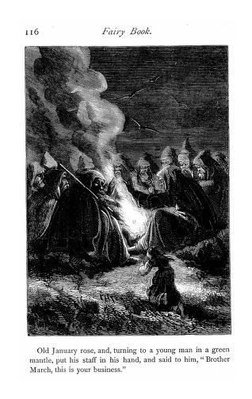

# The Twelve Months

In recent times, I originally heard this via Sue Bailey, during the preparation for our *'Tis Tales* set *Winter Tales* in December. 2022. I had a memory of it from way back, though no particular telling or teller — just the sense of the story — but it's one that really resonates for me. Taffy Thomas also has a version of it in his *Midwinter Folk Tales* collection.

The gist of the tale is this:

> Marushka, down trodden, lives with her step-mother and step-sister, Holena. Even though it is January, and the depth of Winter, her step-mother sends her out to find March violets; she goes up the mountain, sees a fire around which are twelve stones, with a robed and hooded person sitting on each, three dressed in white (snow), three in green (grass), three in gold (wheat) and three in deep purple (blackberries, or grapes, or dark winter cherries). On the largest stone, a man with a white beard and a club: January. They ask what she is doing; January swaps with March, and as the girl departs, she finds violets. The step-mother sends her to find strawberries; she returns to the mountain, January swaps with June, and she finds strawberries; her step-mother sends her out for red apples, January swaps with September, and she finds red apples, but may only pick two. Holena sets off to find more, is disrespectful to January. He waves the stick round his head, the fire dies down. Holena is lost in a Winter storm. Her mother goes out to find her and she is lost too. Marushka lives happier ever after.

Originating from a Czech fairy tale by Bozena Nemcova, the earliest appearance I have found for it is in an 1866 collection of tales translated from Edouard Laboulaye:

```{admonition} In *Laboulaye's fairy book*, 1866
:class: dropdown
https://archive.org/details/cu31924051612137/page/n121/mode/2up
Laboulaye's fairy book; fairy tales of all nations
by Laboulaye, Edouard, 1811-1883; Booth, Mary L. (Mary Louise), 1831-1889
Publication date 1866

p114-121
The Twelve Months A Bohemian Tale
Incl. illustration
Transl. Mary L Booth

THE TWELVE MONTHS.

A BOHEMIAN TALE.

There was once a woman who was left a widow with two children. The elder, who was only her step-daughter, was named Dobrunka; the younger, who was as wicked as her mother, was called Katinka. The mother worshipped her daughter, but she hated Dobrunka, simply because she was as beautiful as her sister was ugly. Dobrunka did not even know that she was pretty, and she could not understand why her step-mother flew into a rage at the mere sight of her. The poor child was obliged to do all the work of the house; she had to sweep, cook, wash, sew, spin, weave, cut the grass, and take care of the cow, while Katinka lived like a princess, that is to say, did nothing.

Dobrunka worked with a good will, and took reproaches and blows with the gentleness of a lamb; but nothing soothed her step-mother, for every day added to the beauty of the elder sister and the ugliness of the younger. "They are growing up," thought the mother, "and suitors will soon appear, who will refuse my daughter when they see this hateful Dobrunka, who grows beautiful on purpose to spite me. I must get rid of her, cost what it may."

One day in the middle of January, Katinka took a fancy for some violets. She called Dobrunka, and said, "Go to the forest and bring me a bunch of violets, that I may put them in my bosom and enjoy their fragrance."

"Oh, sister, what an idea!" answered Dobrunka; "as if there were any violets under the snow!"

"Hold your tongue, stupid fool," returned her sister, "and do as I bid you. If you do not go to the forest and bring me back a bunch of violets, I will beat you to a jelly." Upon this, the mother took Dobrunka by the arm, put her out of the door, and drew the bolt on her.

The poor girl went to the forest weeping bitterly. Every thing was covered with snow; there was not even a foot-path. She lost her way, and wandered about till, famishing with hunger and perishing with cold, she entreated God to take her from this wretched life.

All at once she saw a light in the distance. She went on, climbing higher and higher, until at last she reached the top of a huge rock, upon which a great fire was built. Around the fire were twelve stones, and on each stone sat a motionless figure, wrapped in a large mantle, his head covered with a hood which fell over his eyes. Three of these mantles were white like the snow, three were green like the grass of the meadows, three were golden like the; sheaves of ripe wheat, and three were purple like the grapes of the vine. These twelve figures, gazing at the fire in silence, were the Twelve Months of the year.

Dobrunka knew January by his long white beard. He was the only one that had a staff in his hand. The poor girl was terribly frightened. She drew near, saying, in a timid voice, "My good sirs, please to let me warm myself by your fire; I am freezing with cold."

January nodded his head. "Why have you come here, my, child?" he asked. "What are you looking for?"

"I am looking for violets," replied Dobrunka.

"This is not the season for them; there are no violets in the time of snow," said January, in his gruff voice.

"I know it," replied Dobrunka, sadly; "but my sister and mother will beat me to a jelly if I do not bring them some, My good sirs, please to tell me where I can find them."



March rose in turn, and stirred the fire with the staff, when behold! the flames rose, the snow melted, the buds put forth on the trees, the grass turned green under the bushes, the flowers peeped through the verdure, and the violets opened — it was spring.

"Make haste, my child, and gather your violets," said March.

Dobrunka gathered a large bouquet, thanked the Twelve Months, and joyfully ran home. You can imagine the astonishment of Katinka and the step-mother. The fragrance of the violets filled the whole house.

"Where did you find these fine things?" asked Katinka, in a disdainful voice.

"Up yonder, on the mountain," answered her sister. "It looked like a great blue carpet under the bushes."

Katinka put. the bouquet in her bosom, and did not even thank the poor child.

The next morning the wicked sister, as she sat idling by the stove, took a fancy for some strawberries.

"Go to the forest and bring me some strawberries," said she to Dobrunka.

"Oh, sister, what an idea! as if there were any strawberries under the snow!"

"Hold your tongue, stupid fool, and do as I bid you. If you don't go to the forest and bring me back a basket of strawberries, I will beat you to a jelly."

The mother took Dobrunka by the arm, put her out of the door, and drew the bolt on her.

The poor girl returned to the forest, looking with all her eyes for the light that she had seen the day before. She was fortunate enough to spy it, and she reached the fire trembling and almost frozen.

The Twelve Months were in their places, motionless and silent.

 My good sirs," said Dobrunka, "please to let me warm myself by your fire; I am almost frozen with cold."

"Why have you returned?" asked January. "What are you looking.for?"

"I am looking for strawberries," answered she.

"This is not the season for them," returned January, in his gruff voice; "there are no strawberries under the snow."

"I know it," replied Dobrunka, sadly; "but my mother and sister will beat me to a jelly if I do not bring them some. My good sirs, please to tell me where I can find them."

Old January rose, and, turning to a man in a golden mantle, he put his staff in his hand, saying, "Brother June, this is your business."

June rose in turn, and stirred the fire with the staff, when behold! the flames rose, the snow melted, the earth grew green, the trees were covered with leaves, the birds sang, and the flowers opened — it was summer. Thousands of little white stars enameled the turf, then turned to red strawberries, looking, in their green cups, like rubies set in emeralds.

"Make haste, my child, and gather your strawberries," said June.

Dobrunka filled her apron, thanked the Twelve Months, and joyfully ran home. You may imagine the astonishment of Katinka and the step-mother. The fragrance of the strawberries filled the whole house.

"Where did you find these fine things?" asked Katinka, in a disdainful voice.

"Up yonder on the mountain," answered her sister; "there were so many of them that they looked like blood poured on the ground.

Katinka and her mother devoured the strawberries without even thanking the poor child.

The third day the wicked sister took a fancy for some red apples. The same threats, the same insults, and the same violence followed. Dobrunka ran to the mountain, and was fortunate enough to find the Twelve Months warming themselves, motionless and silent.

"You here again, my child?" said old January, making room for her by the fire. Dobrunka told him, with tears, how, if she did not bring home some red apples, her mother and sister would beat her to death.

Old January repeated the ceremonies of the day before. "Brother September," said he to a gray-bearded man in a purple mantle, "this is your business."

September rose and stirred the fire with the staff", when behold! the flames ascended, the snow melted, and the trees put forth a few yellow leaves, which fell one by one before the wind — it was autumn. The only flowers were a few late pinks, daisies, and immortelles. Dobrunka saw but one thing, an apple-tree with its rosy fruit.

"Make haste, my child; shake the tree," said September.

She shook it, and an apple fell; she shook it again, and a second apple followed.

"Make haste, Dobrunka, make haste home!" cried September, in an imperious voice.

The good child thanked the Twelve Months, and joyfully ran home. You may imagine the astonishment of Katinka and the step-mother.

"Green apples in January! Where did you get these apples?" asked Katinka.

"Up yonder on the mountain; there is a tree there that is as red with them as a cherry-tree in July."

"Why did you bring only two? You ate the rest on the way."

"Oh, sister, I did not touch them; I was only permitted to shake the tree twice, and but two apples fell."

"Begone, you fool!" cried Katinka, striking her sister, who ran away crying.

The wicked girl tasted one of the apples; she had never eaten any thing so delicious in her life, neither had her mother. How they regretted not having any more!

"Mother," said Katinka, "give me my fur cloak. I will go to the forest and find the tree, and, whether I am permitted or not, I will shake it so hard that all the apples will be ours."

The mother tried to stop her. A spoiled child listens to nothing. Katinka wrapped herself in her fur cloak, drew the hood over her head, and hastened to the forest.

Every thing was covered with snow; there was not even a foot-path. Katinka lost her way, but she pushed on, spurred by pride and covetousness. She spied a light in the distance. She climbed and climbed till she reached the place, and found the Twelve Months each seated on his stone, motionless and silent. Without asking their permission, she approached the fire.

"Why have you come here? What do you want? Where are you going?" asked old January, gruffly.

"What matters it to you, old fool?" answered Katinka. "It is none of your business where I came from or whither I am going." She plunged into the forest. January frowned, and raised his staff above his head. In the twinkling of an eye the sky was overcast, the fire went out, the snow fell, and the wind blew. Katinka could not see the way before her. She lost herself, and vainly tried to retrace her steps. The snow fell and the wind blew. She called her mother, she cursed her sister, she cursed God. The snow fell and the wind blew. Katinka froze, her limbs stiffened, and she fell motionless. The snow still fell and the wind still blew.

The mother went without ceasing from the window to the door, and from the door to the window. The hours passed, and Katinka did not return.

"I must go and look for my daughter," said she. "The child has forgotten herself with those hateful apples." She took her fur cloak and hood, and hastened to the mountain. Every thing was covered with snow; there was not even a foot-path. She plunged into the forest, calling her daughter. The snow fell and the wind blew. She walked on with feverish anxiety, shouting at the top of her voice. The snow still fell and the wind still blew.

Dobrunka waited through the evening and the night, but no one returned. In the morning she took her wheel and spun a whole distaff full; there was still no news. "What can have happened?" said the good girl, weeping. The sun was shining through an icy mist, and the ground was covered with snow. Dobrunka prayed for her mother and sister. They did not return; and it was not till spring that a shepherd found the two corpses in the forest.

Dobrunka remained the sole mistress of the house, the cow, and the garden, to say nothing of a piece of meadow adjoining the house. But when a good and pretty girl has a field under her window, the next thing that follows is a young farmer, who offers her his heart and hand. Dobrunka was soon married. The Twelve Months did not abandon their child. More than once, when the north wind blew fearfully and the windows shook in their frames, old January stopped up all the crevices of the house with snow, so that the cold might not enter this peaceful abode.

Dobrunka lived to a good old age, always virtuous and happy, having, according to the proverb, winter at the door, summer in the barn, autumn in the cellar, and spring in the heart.

```

The same translation was also republished in *Library of the world's best literature, ancient and modern*, 1896, [p8749-8754](https://archive.org/details/worldsbestlitera15warn/page/8748/mode/2up).

The earliest version I have found as an explicit translation of Nemcova's tale is in a collection of *Czech folk tales* by Josef Baudis published in 1917:

```{admonition} In *Czech folk tales*, Josef Baudis, 1917
:class: dropdown
https://archive.org/details/czechfolktales00bauduoft
Czech folk tales
by Baudis, Josef
Publication date [1917]

The first two stories `[the first being "Twelve Months"]` have been retold by the novelist Bozena Nemcova (from the Slovak).

p1-15

THE TWELVE MONTHS

Once upon a time there lived a mother who had two daughters. One was her own child, the other her stepdaughter. She was very fond of her own daughter, but she would not so much as look at her step-daughter. The only reason was that Marusa, the stepdaughter, was prettier than her own daughter, Holena. The gentle-hearted Marusa did not know how beautiful she was, and so she could never make out why her mother was so cross with her whenever she looked at her. She had to do all the housework, tidying up the cottage, cooking, washing, and sewing, and then she had to take the hay to the cow and look after her. She did all this work alone, while Holena spent the time adorning herself and lazing about. But Marusa liked work, for she was a patient girl, and when her mother scolded and rated her, she bore it like a lamb. It was no good, however, for they grew crueller and crueller every day, only because Marusa was growing prettier and Holena uglier every day.

At last the mother thought: "Why should I keep a pretty stepdaughter in my house? When the lads come courting here, they will fall in love with Marusa and they won't look at Holena."

From that moment the stepmother and her daughter were constantly scheming how to get rid of poor Marusa. They starved her and they beat her. But she bore it all, and in spite of all she kept on growing prettier every day. They invented torments that the cruellest of men would never have thought of.

One day — it was in the middle of January — Holena felt a longing for the scent of violets.

"Go, Marusa, and get me some violets from the forest; I want to wear them at my waist and to smell them," she said to her sister.

"Great heavens! sister. What a strange notion! Who ever heard of violets growing under the snow?" said poor Marusa.

"You wretched tatterdemalion! how dare you argue when I tell you to do something? Off you go at once, and if you don't bring me violets from the forest I'll kill you!" said Holena threateningly.

The stepmother caught hold of Marusa, turned her out of the door, and slammed it to after her. She went into the forest weeping bitterly. The snow lay deep, and there wasn't a human footprint to be seen. Marusa wandered about for a long time, tortured by hunger and trembling with cold. She begged God to take her from the world.

At last she saw a light in the distance. She went towards the glow, and came at last to the top of a mountain. A big fire was burning there, and round the fire were twelve stones with twelve men sitting on them. Three of them had snow-white beards, three were not so old, and three were still younger. The three youngest were the handsomest of them all. They were not speaking, but all sitting silent. These twelve men were the twelve months. Great January sat highest of all; his hair and beard were as white as snow, and in his hand he held a club.

Marusa was frightened. She stood still for a time in terror, but, growing bolder, she went up to them and said: "Please, kind sirs, let me warm my hands at your fire. I am trembling with the cold."

Great January nodded, and asked her: "Why have you come here, my dear little girl? What are you looking for?"

"I am looking for violets," answered Marusa.

"This is no time to be looking for violets, for everything is covered with snow," answered Great January.

"Yes, I know; but my sister Holena and my stepmother said that I must bring them some violets from the forest. If I don't bring them, they'll kill me. Tell me, fathers, please tell me where I can find them."

Great January stood up and went to one of the younger months — it was March — and, giving him the club, he said: "Brother, take the high seat."

March took the high seat upon the stone and waved the club over the fire. The fire blazed up, the snow began to melt, the trees began to bud, and the ground under the young beech-trees was at once covered with grass and the crimson daisy buds began to peep through the grass. It was springtime. Under the bushes the violets were blooming among their little leaves, and before Marusa had time to think, so many of them had sprung up that they looked like a blue cloth spread out on the ground.

"Pick them quickly, Marusa!" commanded March.

Marusa picked them joyfully till she had a big bunch. Then she thanked the months with all her heart and scampered merrily home.

Holena and the stepmother wondered when they saw Marusa bringing the violets. They opened the door to her, and the scent of violets filled all the cottage.

"Where did you get them?" asked Holena sulkily.

"They are growing under the bushes in a forest on the high mountains."

Holena put them in her waistband. She let her mother smell them, but she did not say to her sister: "Smell them."

Another day she was lolling near the stove, and now she longed for some strawberries. So she called to her sister and said: "Go, Marusa, and get me some strawberries from the forest."

"Alas! dear sister, where could I find any strawberries ." Who ever heard of strawberries growing under the snow?" said Marusa.

"You wretched little tatterdemalion, how dare you argue when I tell you to do a thing? Go at once and get me the strawberries, or I'll kill you!"

The stepmother caught hold of Marusa and pushed her out of the door and shut it after her. Marusa went to the forest weeping bitterly. The snow was lying deep, and there wasn't a human footprint to be seen anywhere. She wandered about for a long time, tortured by hunger and trembling with cold. At last she saw the light she had seen the other day. Overjoyed, she went towards it. She came to the great fire with the twelve months sitting round it.

"Please, kind sirs, let me warm my hands at the fire. I am trembling with cold."

Great January nodded, and asked her: "Why have you come again, and what are you looking for here?"

"I am looking for strawberries."

"But it is winter now, and strawberries don't grow on the snow," said January.

"Yes, I know," said Marusa sadly; "but my sister Holena and my stepmother bade me bring them some strawberries, and if I don't bring them, they will kill me. Tell me, fathers, tell me, please, where I can find them."

Great January arose. He went over to the month sitting opposite to him — it was June — and handed the club to him, saying: "Brother, take the high seat."

June took the high seat upon the stone and swung the club over the fire. The fire shot up, and its heat melted the snow in a moment. The ground was all green, the trees were covered with leaves, the birds began to sing, and the forest was filled with all kinds of flowers. It was summer. The ground under the bushes was covered with white starlets, the starry blossoms were turning into strawberries every minute. They ripened at once, and before Marusa had time to think, there were so many of them that it looked as though blood had been sprinkled on the ground.

"Pick them at once, Marusa!" commanded June.

Marusa picked them joyfully till she had filled her apron full. Then she thanked the months with all her heart and scampered merrily home. Holena and the stepmother wondered when they saw Marusa bringing the strawberries. Her apron was full of them. They ran to open the door for her, and the scent of the strawberries filled the whole cottage.

"Where did you pick them?" asked Holena sulkily.

"There are plenty of them growing under the young beech-trees in the forest oh the high mountains."

Holena took the strawberries, and went on eating them till she could eat no more. So did the stepmother too, but they didn't say to Marusa: "Here is one for you."

When Holena had enjoyed the strawberries, she grew greedy for other dainties, and so on the third day she longed for some red apples.

"Marusa, go into the forest and get me some red apples," she said to her sister.

"Alas! sister dear, how am I to get apples for you in winter?" protested Marusa.

"You wretched little tatterdemalion, how dare you argue when I tell you to do a thing? Go to the forest at once, and if you don't bring me the apples I will kill you!" threatened Holena.

The stepmother caught hold of Marusa and pushed her out of the door and shut it after her. Marusa went to the forest weeping bitterly. The snow was lying deep; there wasn't a human footprint to be seen anywhere. But she didn't wander about this time. She ran straight to the top of the mountain where the big fire was burning. The twelve months were sitting round the fire; yes, there they certainly were, and Great January was sitting on the high seat.

"Please, kind sirs, let me warm my hands at the fire. I am trembling with cold."

Great January nodded, and asked her: "Why have you come here, and what are you looking for?"

"I am looking for red apples."

"It is winter now, and red apples don't grow in winter," answered January.

"Yes, I know," said Marusa sadly; "but my sister and my stepmother, too, bade me bring them some red apples from the forest. If I don't bring them, they will kill me. Tell me, father, tell me, please, where I could find them."

Great January rose up. He went over to one of the older months — it was September. He handed the club to him and said: "Brother, take the high seat."

Month September took the high seat upon the stone and swung the club over the fire. The fire began to burn with a red flame, the snow began to melt. But the trees were not covered with leaves; the leaves were wavering down one after the other, and the cold wind was driving them to and fro over the yellowing ground. This time Marusa did not see so many flowers. Only red pinks were blooming on the hillside, and meadow saffrons were flowering in the valley. High fern and thick ivy were growing under the young beech-trees. But Marusa was only looking for red apples, and at last she saw an apple-tree with red apples hanging high among its branches.

"Shake the tree at once, Marusa!" commanded the month.

Right gladly Marusa shook the tree, and one apple fell down. She shook it a second time, and another apple fell down.

"Now, Marusa, run home quickly!" shouted the month.

Marusa obeyed at once. She picked up the apples, thanked the months with all her heart, and ran merrily home.

Holena and the stepmother wondered when they saw Marusa bringing the apples. They ran to open the door for her, and she gave them two apples.

"Where did you get them?" asked Holena.

"There are plenty of them in the forest on the high mountain."

"And why didn't you bring more? Or did you eat them on the way home?" said Holena harshly.

"Alas! sister dear, I didn't eat a single one. But when I had shaken the tree once, one apple fell down, and when I shook it a second time, another apple fell down, and they wouldn't let me shake it again. They shouted to me to go straight home," protested Marusa.

Holena began to curse her: "May you be struck to death by lightning!" and she was going to beat her.

Marusa began to cry bitterly, and she prayed to God to take her to Himself, or she would be killed by her wicked sister and her stepmother. She ran away into the kitchen.

Greedy Holena stopped cursing and began to eat the apple. It tasted so delicious that she told her mother she had never tasted anything so nice in all her life. The step-mother liked it too. When they had finished, they wanted some more.

"Mother, give me my fur coat. I'll go to the forest myself. That ragged little wretch would eat them all up again on her way home. I'll find the place all right, and I'll shake them all down, however they shout at me."

Her mother tried to dissuade her, but it was no good. She took her fur coat, wrapped a cloth round her head, and off she went to the forest. Her mother stood on the threshold, watching to see how Holena would manage to walk in the wintry weather.

The snow lay deep, and there wasn't a human footprint to be seen anywhere. Holena wandered about for a long time, but the desire of the sweet apple kept driving her on. At last she saw a light in the distance. She went towards it, and climbed to the top of the mountain where the big fire was burning, and round the fire on twelve stones the twelve months were sitting. She was terrified at first, but she soon recovered. She stepped up to the fire and stretched out her hands to warm them, but she didn't say as much as "By your leave" to the twelve months; no, she didn't say a single word to them.

"Why have you come here, and what are you looking for?" asked Great January crossly.

"Why do you want to know, you old fool? It's no business of yours," replied Holena angrily, and she turned away from the fire and went into the forest.

Great January frowned and swung the club over his head. The sky grew dark in a moment, the fire burned low, the snow began to fall as thick as if the feathers had been shaken out of a down quilt, and an icy wind began to blow through the forest. Holena couldn't see one step in front of her; she lost her way altogether, and several times she fell into snowdrifts. Then her limbs grew weak and began slowly to stiffen. The snow kept on falling and the icy wind blew more icily than ever. Holena began to curse Marusa and the Lord God. Her limbs began to freeze, despite her fur coat.

Her mother was waiting for Holena; she kept on looking out for her, first at the window, then outside the door, but all in vain.

"Does she like the apples so much that she can't leave them, or what is the matter? I must see for myself where she is," decided the stepmother at last. So she put on her fur coat, she wTapped a shawl round her head, and went out to look for Holena. The snow was lying deep; there wasn't a human footprint to be seen; the snow fell fast, and the icy wind was blowing through the forest.

Marusa had cooked the dinner, she had seen to the cow, and yet Holena and her mother did not come back. "Where are they staying so long?" thought Marusa, as she sat down to work at the distaff. The spindle was full already and it was quite dark in the room, and yet Holena and the stepmother had not come back.

"Alas, Lord! what has come to them?" cried Marusa, peering anxiously through the window. The sky was bright and the earth was all glittering, but there wasn't a human soul to be seen. . . . Sadly she shut the window; she crossed herself, and prayed for her sister and her mother. ... In the morning she waited with breakfast, she waited with dinner; but however much she waited, it was no good. Neither her mother nor her sister ever came back. Both of them were frozen to death in the forest.

So good Marusa inherited the cottage, a piece of ploughland and the cow. She married a kind husband, and they both lived happily ever after.

```

Sabine Baring-Gould picked up on the tale and published it in his *A Book of Fairy Tales* in 1895, ascribing it to Wenzig in 1857:

```{admonition} Sabine Baring Gould, in *A Book of Fairy Tales*, 1895
:class: dropdown

https://archive.org/details/bookoffairytales00bariiala/page/66/mode/2up
A book of fairy tales
by Baring-Gould, S. (Sabine), 1834-1924
Publication date 1895
Pretty Marushcka
p67-78

"PRETTY MARUSCHKA. A Sclavonic tale. It is properly Slovakian, and is given by Wenzig in his [*West Slawischer Marchenschatz*](https://archive.org/details/westslawischerm00wenzgoog/), 1857. The story has a mythological importance, on account of the impersonation of the Twelve Months represented as seated round the great central fire of the sun. The fire-wheel occurs in traditional usage, not only in Sclavonic but also in Gaulish lands.

PRETTY MARUSCHKA

FAR away in the hazy purple of antiquity, when all stepmothers were wicked, and all younger sons were successful, there lived on the confines of a forest a woman who had two daughters: the one her own, the other only a step-child. Naturally, the love of the mother was concentrated on her own Helena, and, as naturally, she disliked Maruschka, who was the fairest, the gentlest, and the most pious of the two girls.

Little did pretty Maruschka know of her own surpassing beauty a fact proving to us how remote from the present age was that in which these damsels lived. Her hair was like the waving gold of the cornfield when the wind soughs over it, and her eyes were as the blue forget-me-not which smiles and glimmers in a quiet nook by the brookside. She was slim and graceful; her step was light, for her heart was free. Wherever she went she brought cheerfulness and smiles; like the little golden sunbeams which pierce among the tree-shadows of a forest, and light up unexpected beauties where all before was gloom; now painting a saffron butterfly, now kindling an emerald moss-tuft, now making a scarlet lily flame against the dusk of the forest glades behind.

Helena was dressed by her mother in gay colours for Sunday and Feast-day, but poor little Maruschka had only a dingy grey gown, cast off by her sister. Helena wore black shoes with silver buckles, but pretty Maruschka clattered up the churchyard path in wooden clogs. Helena wore a false gold chain of great links round her neck, but her half-sister had only a turquoise-coloured ribbon and a little silver cross with a crystal in it that was her only ornament and that had been given her by a lady whom she had guided into the road, when she had lost her way in the forest. As the mother and the two girls went to church on Sundays, the lads were all in the yard hanging about the tombstones; and the old woman heard them whisper, 'There is pretty Maruschka;' but never once did they say, 'See pretty Helena.' So she was angry, and hated the golden-haired, blue-eyed maiden. At home she made her do all the hard work scrub the floors, cook the victuals, mend the clothes whilst Helena stood all day before her glass, combing her hair and adorning herself with trinkets, and wishing it were Sunday that she might flare before the eyes of the young men in the churchyard.

Helena and her mother did all that lay in their power to make the little girl's life miserable. They scolded her, they beat her, they devised schemes of annoyance for her, but never could they ruffle the sweet temper of Maruschka. One day, in the depth of winter, Helena cried out, 'Ah, mel would that I had a bunch of violets in my bosom to-morrow, when I go to church. Run, Maruschka, run into the forest and pluck them for me, that I may have them to smell at whilst the priest gives us his sermon.'
'Oh, my sister 1' answered Maruschka, 'who ever heard of violets being gathered in midwinter, under the deep snow?'

'Idle hussey!' screamed Helena; 'go at once and fetch them. Have them I will, and you shall not come back without them.'

Then the mother chimed in with, 'Mind and bring a large bunch, or you shall not be taken in here for the night. Go!' and she caught her, thrust her from the house, and slammed the door behind her.

Bitterly weeping, the poor maiden wandered into the forest. The snow lay deep everywhere, undinted by human foot; white wreaths hung on the bushes, and the sombre pine-boughs were frosted over with snow. Here were the traces of a hare, there the prints of a badger. An owl called from the depths of the forest. The girl lost her way. Dusk came on, and a few stars looked through the interlacing boughs overhead, watching Maruschka. An icy wind moaned through the trees, shaking the pines as though they quaked with mortal fear, and then they bent their branches and shot their loads of snow in dust to the ground. Strange harp-like sounds reverberated through the gloom, and gratings of bough on bough, which seemed as though the wood demons were gnawing at fallen timbers. Now a great black crow, which had been brooding among dark firs and pines, startled by the footfall and sobs of the maiden, expanded his wings, and, with a harsh scream, rushed away, noisily, sending the life-blood with a leap to the girl's heart. Suddenly, before her far up on a hill-top a light appeared, ruddy and flickering. Maruschka, inspired with hope, made for it, scrambling up a rocky slope through deep snow-drifts. She reached the summit, and beheld a great fire. Around this fire were twelve rough stones, and on each stone sat a man. Three were grey-bearded, three were middle-aged, three were youths; and the last three were the youngest and fairest. They spake not, but looked intently on the roaring flames. He who sat in the seat of honour had a long staff in his hand. His hair was white, and fluttering in the cold wind.

Maruschka was startled, and watched them with astonishment for a little while; then mustering courage, she stepped within the circle and said:

'Dear, good friends, please suffer me to warm myself a little while at the fire, for, indeed, I am perishing with cold.' He with the flowing white hair raised his head, and said 'Yes, child, approach. But what brings you here?'

'I am seeking violets,' she answered. 'Violets! It is not the time for violets, when the snow lies deep?'

'Ah, sir! I know that well; but sister Helena and mother have bidden me bring them violets, and if I do not I must perish in the cold. You, kind shepherds, tell me where I may find violets!' Then the white aged one arose from his seat, stepped to one of the blooming youths, put his staff into his hand, and said——

'Brother March, take thou the pre-eminence.'

Then the Month March sat himself on the chief stone, and waved his staff over the fire. Instantly the flames rushed up and blazed with greater brilliancy, the snow began to thaw, the hazel-bushes were covered with catkins, and glossy buds appeared on the beech. Green herbs thrust up through the moist soil, a primrose gleamed from a dusky bank, and a sweet fragrance of violets was wafted by on a gentle breeze. Under a bush, the ground was purple with their scented blossoms. 'Quick, Maruschka, pluck!' ordered March. The girl hastily gathered a handful. Then she courtesied to the twelve Months, thanked them cordially, and hurried home.

Helena was amazed when her half-sister came with the bunch to the door. She opened it to her, and the house was filled with the delicious odour.

'Where did you find them?' she asked.

'High up on the mountain, under a hawthorn bush.'

Helena took the flowers, and set them in her bosom. She let her mother smell at them, but she never gave one to Maruschka. When they came home from church next day, Helena cast off her gay shawls, and sat down to supper. But she had no appetite for what was on the table. She was angry with her sister; for all the lads had fixed their eyes on Maruschka, and had not even been attracted to her by the fragrant bunch of violets. 'How beautiful is Maruschka to-day!' had said some of the older people; and none had spoken a good word of her. So sne sat and sighed, and hated the pretty girl more and more.

'Oh that I had strawberries!' she said. 'I can eat nothing this evening but strawberries. Run, Maruschka, into the forest and gather me a dishful.'

'Dear sister, this is not the time of the year for strawberries. Who ever heard of strawberries ripening under the snow?'

But the stepmother angrily exclaimed: 'Run, Maruschka, fetch them at once, as your sister has ordered, or I will strike you dead;' and she thrust her from the door.

The poor girl cried bitterly; she looked back at the firelight which glimmered through the casement, and thought how warm it was within, whilst without it was so piercingly cold. But she dared not return unless she had with her the desired fruit. So she plunged into the forest. The snow lay deep, and nowhere was a human footprint. Snow began to fall in fine powder, whitening her shoulders, clinging to the folds of her grey dress, and forming a cap of ice on her golden hair. In that dull rayless night there was no light to show the blue ribbon, which strayed among the tree boles, or to twinkle on the crystal of the silver cross.
Presently Maruschka saw, high up on the summit of a rugged hill, a blazing fire. She scrambled to it, and there she found the Twelve sitting solemn and silent around the flames, and the Ice Month, with his staff, sat still on the seat of honour.

'Dear, good friends, please suffer me to warm myself a little while at the fire,' she asked in a beseeching voice; 'for, indeed, I am perishing with cold.'

Then the one with the drifting white locks raised his head and said——

'Yes, child, approach. But what brings you here?'

'I am seeking strawberries,' she answered.

'Strawberries! It is not the time for strawberries when the snow lies deep?'

'Ah, sir! I know that well; but sister Helena and mother have bidden me bring them strawberries, or they will strike me dead. You, kind shepherds, tell me where I may find strawberries.' Then the white Ice Month arose from his seat, stepped across the area to one of the young men, put the staff into his hand, and said——

'Brother June, take thou the pre-eminence.'

Then the Month June sat himself on the chief stone, and waved his staff over the fire. Instantly it glowed like molten gold, beams of glory streamed from it through the forest, and it shone like a sun resting on the earth. Overhead, the clouds flamed and curled in wreaths of light-tinted rose, carnation, and purple, athwart a sky blue as the forget-me-not. Every trace of snow vanished, and the earth was buried in green. The trees were covered with rustling leaves. Blue-bells gleamed under their shadows, and then died away. Red-robin blushed in tufts, and then shed its ragged petals. Wild roses burst into glorious flower, and the soft air was charged with the scent of the sweet-briar. From among the forest-glades called, in cool notes, a wood-dove. The thrush began to warble, and the blackbird to pipe. A bright-eyed squirrel danced among the fresh green leaves on the tree-tops. Beside a brown stone was a patch of sloping green. It was dotted with little white stars with golden hearts. Now the leaves drop off, and the hearts swell, and flush, and glow, and become crimson.

'Quick, Maruschka, pluck!' said June. Then the girl joyfully hurried to the slope, and gathered an apronful of the luscious strawberries.

he courtesied to the twelve Months, thanked them cordially, and hurried home.

Helena was astonished as she saw her come to the house, and she ran to open the door. The whole cottage was fragrant with the odour of the strawberries.

'Where did you gather them?' asked Helena.

'High up on the mountains, under a brown rock.'

Helena took the strawberries, and ate them with her mother. She never offered even one to pretty Maruschka.

Next day, Helena had again no appetite for her supper.

'Oh, if I had only ripe apples!' she said; and then, turning to her sister, she ordered, 'Run, Maruschka, run into the wood and gather me some ripe apples.'

'Dear sister, this is not the time of the year for apples. Who ever heard of apples ripening in an icy wind?'

But her stepmother cried put, 'Run, Maruschka, fetch the apples as your sister has required, or I will strike you dead.'

And she thrust her from the door into the cold winter night-air.

The maiden hastened, sobbing, into the wood; the snow lay deep, and nowhere was there a human footprint. The new moon glimmered in a clear sky, and sent its feeble beams into the forest deeps, forming little trembling, silvery pools of light, which appeared and vanished, and formed again. And a low wind whispered a great secret in the trees, but so faint was the tone that none could make out what it said. There was a little opening in the wood; in the midst stood a grey wolf looking up at the moon and howling; but when Maruschka came near, it fled, and was lost among the shadows. The poor maiden shivered with cold, and her teeth chattered. Her lips were purple and her cheeks white; and the tears, as they formed, froze on her long eyelashes. She would have sunk on a snow-drift and died, had she not seen, up high on a rugged hill-top, a blazing fire. Towards it she made her way, and found it to be the same she had seen before. Round about, solemn and silent, sat the Twelve, and the Ice Month was on the seat of honour, clasping the staff of power.

'Dear, good friends, please suffer me to warm myself a little while at the fire,' she asked, in supplicating tones; 'for, indeed, I am perishing with cold.'

Then the one with the long white hair and frosty beard raised his head, and said: 'Yes, child, approach; but what brings you here?'

'I am seeking ripe apples,' she answered.

'Ripe apples! It is not the time for ripe apples, when the snow lies deep?'

'Ah, sir! I know that well; but sister Helena and mother have bidden me bring them ripe apples, or they will strike me dead. You, kind shepherds, tell me where I may find ripe apples.'

Then the Ice Month arose from his seat, stepped to one of the elder men, put the staff into his hand, and said—

'Brother September, take thou the pre-eminence.'

Then the Month September sat himself on the chief stone, and waved his staff over the fire. Whereat it glowed like a furnace, red and fierce; sparks flew about, and volumes of glaring hot smoke, like the vapour of molten metal, rolled up to heaven. In a moment the snow was gone. The trees were covered with sere leaves; the oak foliage was brown and crumpled, that of the ash yellow as sulphur; other trees seemed leafed with copper. Stray leaves floated past and were whirled by little wind-eddies into rustling heaps. A few yellow flowers shook in the hot air. Pinks hung over the rocks, covering their faces with wandering shadows. Ladyfern waved and wafted its pleasant odour. A constant hum of bees and beetles and flies sounded through the wood. Maruschka looked about her for apples, and beheld a tree on whose branches hung the ruddy fruit.

'Quick, Maruschka, shake!' commanded September.

Then she shook, and there fell an apple; she shook again, and there fell another.

'Quick, Maruschka, hasten home!' said the Month.

Then she courtesied to the Twelve, thanked them cordially, and returned to the house of her stepmother.

Helena marvelled not a little when she saw the red apples.

'How many have you plucked?' she asked.

'Only two.'

'Where did you find them?'

'High up, on the mountain-top, on a tree weighed down with them.'

'Why did you not gather more? Did you not eat them on your way home?' asked Helena, fiercely.

'Oh, dear sister, I have not tasted one! I shook once, and down fell an apple; I shook twice, and there fell another. I might not bring away more.'

Helena struck her, and drove her to the kitchen. Then she tasted one of the apples. Never before had she eaten one so sweet and juicy. The step-mother ate the second.

'Mother!' exclaimed Helena, 'give me my fur dress. I will go to the hill and bring some apples. That hussey has eaten all she took except two.' Then she wrapped herself up, and hurried into the wood. The snow lay deep, and nowhere was a human footprint Helena lost herself; but presently she was aware of a hill, and a fire burning at the summit. She hastened to the light. There she saw a great blaze, and round it sat the twelve Months, silent and solemn. He with the long snowy locks sat on the seat of honour, holding the rod of power. Helena stared at them, then, pushing through the circle, went to the fire, and began to warm herself.

'What seek you here?' asked the Ice Month, with a frown wrinkling his white brow.

'That is no business of yours,' answered Helena, sharply, over her shoulder.

The Ice Month shook his head, and, raising his arm, waved the staff over the fire. Instantly the flames sank, and the fire was reduced to a glowing spark. The clouds rolled over the sky, and, bursting, discharged snow in such quantities that nothing was visible in earth and heaven but drifting white particles. An icy wind rumbled in the forest and roared round the hill. Helena fled. Everywhere white fleeting spots whirling, falling, rising, scudding! She ran this way, then that; she stumbled over a fallen log, she gathered herself up and ran again; then she plunged into a deep drift; and the white cold down from the breast of heaven whirled and fell, and rose, and fleeted, and danced this side of her, and dropped here on her, and rested there on her, and lodged on this limb, and built up a white heap on that limb, then bridged over one fold and filled up another. She shook herself, and the particles fell off. But then they began their work again: they spangled her with white, they wove a white net, they filled up the interstices of her lace, they built a mound over her arm, they buried her foot, they raised a cairn above her bosom. Then they spun a dance around the white face which looked up at them, and began to whiten it still more; lastly, they smoothed the sheet over her, and the work was done.

The mother looked out of the window and wondered that Helena did not return. Hour after hour passed, and her daughter came not.

'Maybe the apples are so sweet that she cannot eat enough,' thought the mother. 'I will go seek them too.'

So she wrapped herself up in a thick shawl and went forth.

The snow lay deep, and nowhere was a human footprint. She called Helena, but received no answer. Then she lost her way. The snow fell, and the wind howled.

Maruschka sat over the fire and cooked supper. Mother and sister came back no more.
```

The tale then seems to start appearing in English language collections of Czech, Slav and Eastern European tales:

```{admonition} In *Fairy tales of the Slav peasants and herdsmen*, 1896
:class: dropdown

https://archive.org/details/cu31924029889635
Fairy tales of the Slav peasants and herdsmen
by Chodźko, Alexander, 1804-1891; Harding, Emily J., illus. and tr
Publication date 1896
p17-27

THE TWELVE MONTHS

THERE was once a widow who had two daughters, Helen, her own child by her dead husband, and Marouckla, his daughter by his first wife. She loved Helen, but hated the poor orphan, because she was far prettier than her own daughter. Marouckla did not think about her good looks, and could not understand why her stepmother should be angry at the sight of her. The hardest work fell to her share; she cleaned out the rooms, cooked, washed, sewed, spun, wove, brought in the hay, milked the cow, and all this without any help. Helen, meanwhile, did nothing but dress herself in her best clothes and go to one amusement after another. But Marouckla never complained; she bore the scoldings and bad temper of mother and sister with a smile on her lips, and the patience of a lamb. But this angelic behaviour did not soften them. They became even more tyrannical and grumpy, for Marouckla grew daily more beautiful, while Helen's ugliness increased. So the step-mother determined to get rid of Marouckla, for she knew that while she remained her own daughter would have no suitors. Hunger, every kind of privation, abuse, every means was used to make the girl's life miserable. The most wicked of men could not have been more mercilessly cruel than these two vixens. But in spite of it all Marouckla grew ever sweeter and more charming.

One day in the middle of winter Helen wanted some wood-violets.

"Listen," cried she to Marouckla; "you must go up the mountain and find me some violets, I want some to put in my gown; they must be fresh and sweet-scented — do you hear?"

"But, my dear sister, who ever heard of violets blooming in the snow?" said the poor orphan.

"You wretched creature! Do you dare to disobey me?" said Helen. "Not another word; off with you. If you do not bring me some violets from the mountain forest, I will kill you."

The stepmother also added her threats to those of Helen, and with vigorous blows they pushed Marouckla outside and shut the door upon her. The weeping girl made her way to the mountain. The snow lay deep, and there was no trace of any human being. Long she wandered hither and thither, and lost herself in the wood. She was hungry, and shivered with cold, and prayed to die. Suddenly she saw a light in the distance, and climbed towards it, till she reached the top of the mountain. Upon the highest peak burnt a large fire, surrounded by twelve blocks of stone, on which sat twelve strange beings. Of these the first three had white hair, three were not quite so old, three were young and handsome, and the rest still younger.

There they all sate silently looking at the fire. They were the twelve months of the year. The great Setchène (January) was placed higher than the others; his hair and moustache were white as snow, and in his hand he held a wand. At first Marouckla was afraid, but after a while her courage returned, and drawing near she said:

"Men of God, may I warm myself at your fire? I am chilled by the winter cold."

The great Setchène raised his head and answered:

"What brings thee here, my daughter? What dost thou seek?"

"I am looking for violets," replied the maiden.

"This is not the season for violets; dost thou not see the snow everywhere?" said Setchène.

"I know well, but my sister Helen and my stepmother have ordered me to bring them violets from your mountain: if I return without them they will kill me. I pray you, good shepherds, tell me where they may be found?"

Here the great Setchène arose and went over to the youngest of the months, and placing his wand in his hand, said:

"Brother Brezbne (March), do thou take the highest place."

Brezene obeyed, at the same time waving his wand over the fire. Immediately the flames rose towards the sky, the snow began to melt and the trees and shrubs to bud; the grass became green, and from between its blades peeped the pale primrose. It was Spring, and the meadows were blue with violets.

"Gather them quickly, Marouckla," said Brezene.

Joyfully she hastened to pick the flowers, and having soon a large bunch she thanked them and ran home. Helen and the stepmother were amazed at the sight of the flowers, the scent of which filled the house.

"Where did you find them?" asked Helen.

"Under the trees on the mountain slope," said Marouckla.

Helen kept the flowers for herself and her mother; she did not even thank her step-sister for the trouble she had taken. The next day she desired Marouckla to fetch her strawberries.

"Run," said she, "and fetch me strawberries from the mountain: they must be very sweet and ripe."

"But who ever heard of strawberries ripening in the snow?" exclaimed Marouckla.

"Hold your tongue, worm; don't answer me; if I don't have my strawberries I will kill you."

Then the stepmother pushed her into the yard and bolted the door. The unhappy girl made her way towards the mountain and to the large fire round which sat the twelve months. The great Setchène occupied the highest place.

"Men of God, may I warm myself at your fire? The winter cold chills me," said she, drawing near.

The great Setchène raised his head and asked:

"Why comest thou here? What dost thou seek?"

"I am looking for strawberries," said she.

"We are in the midst of winter," replied Setchène; "strawberries do not grow in the snow."

"I know," said the girl sadly, "but my sister and step-mother have ordered me to bring them strawberries; if I do not they will kill me. Pray, good shepherds, tell me where to find them."

The great Setchène arose, crossed over to the month opposite him, and putting the wand into his hand, said:

"Brother Tchervene (June), do thou take the highest place."

Tchervene obeyed, and as he waved his wand over the fire the flames leapt towards the sky. Instantly the snow melted, the earth was covered with verdure, trees were clothed with leaves, birds began to sing, and various flowers blossomed in the forest. It was summer. Under the bushes masses of star-shaped flowers changed into ripening strawberries. Before Marouckla had time to cross herself they covered the glade, making it look like a sea of blood.

"Gather them quickly, Marouckla," said Tchervene.

Joyfully she thanked the months, and having filled her apron ran happily home. Helen and her mother wondered at seeing the strawberries, which filled the house with their delicious fragrance.

"Wherever did you find them?" asked Helen crossly.

"Right up among the mountains; those from under the beech trees are not bad."

Helen gave a few to her mother and ate the rest herself; not one did she offer to her step-sister. Being tired of strawberries, on the third day she took a fancy for some fresh red apples.

"Run, Marouckla," said she, "and fetch me fresh red apples from the mountain."

"Apples in winter, sister? why, the trees have neither leaves nor fruit."

"Idle slut, go this minute," said Helen; "unless you bring back apples we will kill you."

As before, the stepmother seized her roughly and turned her out of the house. The poor girl went weeping up the mountain, across the deep snow upon which lay no human footprint, and on towards the fire round which were the twelve months. Motionless sat they, and on the highest stone was the great Setchène.

"Men of God, may I warm myself at your fire? The winter cold chills me," said she, drawing near.

The great Setchène raised his head.

"Why com'st thou here? What dost thou seek?" asked he.

"I am come to look for red apples," replied Marouckla.

"But this is winter, and not the season for red apples," observed the great Setchène.

"I know," answered the girl, "but my sister and step-mother sent me to fetch red apples from the mountain; if I return without them they will kill me."

Thereupon the great Setchène arose and went over to one of the elderly months, to whom he handed the wand, saying:

"Brother Zaré (September), do thou take the highest place."

Zaré moved to the highest stone and waved his wand over the fire. There was a flare of red flames, the snow disappeared, but the fading leaves which trembled on the trees were sent by a cold north-east wind in yellow masses to the glade. Only a few flowers of autumn were visible, such as the fleabane and red gillyflower, autumn colchicums in the ravine, and under the beeches bracken and tufts of northern heather. At first Marouckla looked in vain for red apples. Then she espied a tree which grew at a great height, and from the branches of this hung the bright red fruit. Zaré ordered her to gather some quickly. The girl was delighted and shook the tree. First one apple fell, then another.

"That is enough," said Zaré, "hurry home."

Thanking the months, she returned joyfully. Helen marvelled and the stepmother wondered at seeing the fruit.

"Where did you gather them?" asked the step-sister.

"There are more on the mountain top," answered Marouckla.

"Then why did you not bring more?" said Helen angrily; "you must have eaten them on your way back, you wicked girl."

"No, dear sister, I have not even tasted them," said Marouckla. "I shook the tree twice; one apple fell each time. I was not allowed to shake it again, but was told to return home."

"May Perum smite you with his thunderbolt," said Helen, striking her.

Marouckla prayed to die rather than suffer such ill-treatment. Weeping bitterly, she took refuge in the kitchen. Helen and her mother found the apples more delicious than any they had ever tasted, and when they had eaten both longed for more.

"Listen, mother," said Helen. "Give me my cloak; I will fetch some more apples myself, or else that good-for-nothing wretch will eat them all on the way. I shall be able to find the mountain and the tree. The shepherds may cry 'Stop,' but I shall not leave go till I have shaken down all the apples."

In spite of her mother's advice she put on her pelisse, covered her head with a warm hood, and took the road to the mountain. The mother stood and watched her till she was lost in the distance.

Snow covered everything, not a human footprint was to be seen on its surface. Helen lost herself and wandered hither and thither. After a while she saw a light above her, and following in its direction reached the mountain top. There was the flaming fire, the twelve blocks of stone, and the twelve months. At first she was frightened and hesitated; then she came nearer and warmed her hands. She did not ask permission, nor did she speak one polite word.

"What has brought thee here? What dost thou seek?" said the great Setchène severely.

"I am not obliged to tell you, old greybeard; what business is it of yours?" she replied disdainfully, turning her back on the fire and going towards the forest.

The great Setchène frowned, and waved his wand over his head. Instantly the sky became covered with clouds, the fire went down, snow fell in large flakes, an icy wind howled round the mountain. Amid the fury of the storm Helen added curses against her step-sister. The pelisse failed to warm her benumbed limbs. The mother kept on waiting for her; she looked from the window, she watched from the doorstep, but her daughter came not. The hours passed slowly, but Helen did not return.

"Can it be that the apples have charmed her from her home?" thought the mother. Then she clad herself in hood and pelisse and went in search of her daughter. Snow fell in huge masses; it covered all things, it lay untouched by human footsteps. For long she wandered hither and thither; the icy north-east wind whistled in the mountain, but no voice answered her cries.

Day after day Marouckla worked and prayed, and waited; but neither stepmother nor sister returned, they had been frozen to death on the mountain. The inheritance of a small house, a field, and a cow fell to Marouckla. In course of time an honest farmer came to share them with her, and their lives were happy and peaceful.

```

```{admonition} In *The shoemaker's apron; a second book of Czechoslovak fairy tales and folk tales*, Parker Hoysted Fillmore, 1920
:class: dropdown

https://archive.org/details/shoemakersaprons00fill/page/n15/mode/2up
The shoemaker's apron; a second book of Czechoslovak fairy tales and folk tales
by Fillmore, Parker Hoysted, 1878-

Publication date 1920

p3-21

"Some few of the stories such as Nemcova's very beautiful Twelve Months and Erben's spirited Zlatovlaska and to a less degree Nemcova's hero tale, Vitazko are already in such definitive form that it would be profanation to 'edit' them. They especially the first two have been told once and for all."

THE STORY OF MARUSHKA AND THE WICKED HOLENA

THE TWELVE MONTHS

THERE was once a woman who had two girls. One was her own daughter, the other a step-child. Helena, her own daughter, she loved dearly, but she couldn't bear even the sight of Marushka, the stepchild. This was because Marushka was so much prettier than Helena. Marushka, the dear child, didn't know how pretty she was and so she never understood why, whenever she stood beside Holena, the stepmother frowned so crossly.

Mother and daughter made Marushka do all the housework alone. She had to cook and wash and sew and spin and take care of the garden and look after the cow. Holena, on the contrary, spent all her time decking herself out and sitting around like a grand lady.

Marushka never complained. She did all she was told to do and bore patiently their everlasting fault-finding. In spite of all the hard work she did she grew prettier from day to day, and in spite of her lazy life Holena grew uglier.

"This will never do," the stepmother thought to herself. "Soon the boys will come courting and once they see how pretty Marushka is, they'll pay no attention at all to my Holena. We had just better do all we can to get rid of that Marushka as soon as possible."

So they both nagged Marushka all day long. They made her work harder, they beat her, they didn't give her enough to eat, they did everything they could think of to make her ugly and nasty. But all to no avail. Marushka was so good and sweet that, in spite of all their harsh treatment, she kept on growing prettier.

One day in the middle of January Holena took the notion that nothing would do but she must have a bunch of fragrant violets to put in her bodice.

"Marushka!" she ordered sharply. "I want some violets. Go out to the forest and get me some."

"Good heavens, my dear sister!" cried poor Marushka. "What can you be thinking of? Whoever heard of violets growing under the snow in January?"

"What, you lazy little slattern!" Holena shouted. You dare to argue with me! You go this minute and if you come back without violets I'll kill you!"

The stepmother sided with Holena and, taking Marushka roughly by the shoulder, she pushed her out of the house and slammed the door.

The poor child climbed slowly up the mountain side weeping bitterly. All around the snow lay deep with no track of man or beast in any direction. Marushka wandered on and on, weak with hunger and shaking with cold.

"Dear God in heaven," she prayed, 'take me to yourself away from all this suffering."

Suddenly ahead of her she saw a glowing light. She struggled towards it and found at last that it came from a great fire that was burning on the top of the mountain. Around the fire there were twelve stones, one of them much bigger and higher than the rest. Twelve men were seated on the stones. Three of them were very old and white; three were not so old; three were middle-aged; and three were beautiful youths. They did not talk. They sat silent gazing at the fire. They were the Twelve Months.

For a moment Marushka was frightened and hesitated. Then she stepped forward and said, politely:

"Kind sirs, may I warm myself at your fire? I am shaking with cold."

Great January nodded his head and Marushka reached her stiff fingers towards the flames.

"This is no place for you, my child," Great January said. "Why are you here?"

"I'm hunting for violets," Marushka answered.

"Violets? This is no time to look for violets with snow on the ground!"

"I know that, sir, but my sister, Helena, says I must bring her violets from the forest or she'll kill me and my mother says so, too. Please, sir, won't you tell me where I can find some?"

Great January slowly stood up and walked over to the youngest Month. He handed him a long staff and said:

"Here, March, you take the high seat."

So March took the high seat and began waving the staff over the fire. The fire blazed up and instantly the snow all about began to melt. The trees burst into bud; the grass revived; the little pink buds of the daisies appeared; and, lo, it was spring!

While Marushka looked, violets began to peep out from among the leaves and soon it was as if a great blue quilt had been spread on the ground.

"Now, Marushka," March cried, "there are your violets! Pick them quickly!"

Marushka was overjoyed. She stooped down and gathered a great bunch. Then she thanked the Months politely, bade them good-day, and hurried away.

Just imagine Helena and the stepmother's surprise when they saw Marushka coming home through the snow with her hands full of violets. They opened the door and instantly the fragrance of the flowers filled the cottage.

"Where did you get them?" Helena demanded rudely.

"High up in the mountain," Marushka said. "The ground up there is covered with them."

Holena snatched the violets and fastened them in her waist. She kept smelling them herself all afternoon and she let her mother smell them, but she never once said to Marushka:

"Dear sister, won't you take a smell?"

The next day as she was sitting idle in the chimney corner she took the notion that she must have some strawberries to eat. So she called Marushka and said:

"Here you, Marushka, go out to the forest and get me some strawberries."

"Good heavens, my dear sister," Marushka said, "where can I find strawberries this time of year? Whoever heard of strawberries growing under the snow?"

"What, you lazy little slattern!" Holena shouted. "You dare to argue with me! You go this minute and if you come back without strawberries, I'll kill you!"

Again the stepmother sided with Holena and, taking Marushka roughly by the shoulder, she pushed her out of the house and slammed the door.

Again the poor child climbed slowly up the mountain side weeping bitterly. All around the snow lay deep with no track of man or beast in any direction. Marushka wandered on and on, weak with hunger and shaking with cold. At last she saw ahead of her the glow of the same fire that she had seen the day before. With happy heart she hastened to it. The Twelve Months were seated as before with Great January on the high seat.

Marushka bowed politely and said:

"Kind sirs, may I warm myself at your fire? I am shaking with cold."

Great January nodded and Marushka reached her stiff fingers towards the flames.

"But Marushka," Great January said, "why are you here again? What are you hunting now?"

"I'm hunting for strawberries," Marushka answered.

"Strawberries? But, Marushka, my child, it is winter and strawberries do not grow in the snow."

Marushka shook her head sadly.

"I know that, sir, but my sister, Helena, says I must bring her strawberries from the forest or she will kill me and my mother says so, too. Please, sir, won't you tell me where I can find some?"

Great January slowly stood up and walked over to the Month who sat opposite him. He handed him the long staff and said:

"Here, June, you take the high seat."

So June took the high seat and began waving the staff over the fire. The flames blazed high and with the heat the snow all about melted instantly. The earth grew green; the trees decked themselves in leaves; the birds began to sing; flowers bloomed and, lo, it was summer! Presently little starry white blossoms covered the ground under the beech trees. Soon these turned to fruit, first green, then pink, then red, and, with a gasp of delight, Marushka saw that they were ripe strawberries.

"Now, Marushka," June cried, "there are your strawberries! Pick them quickly!"

Marushka picked an apronful of berries. Then she thanked the Months politely, bade them good-bye, and hurried home.

Just imagine again Holena and the stepmother's surprise as they saw Marushka coming through the snow with an apronful of strawberries!

They opened the door and instantly the fragrance of the berries filled the house.

'Where did you get them?' Holena demanded rudely.

"High up in the mountain," Marushka answered, "under the beech trees."

Holena took the strawberries and gobbled and gobbled and gobbled. Then the stepmother ate all she wanted. But it never occurred to either of them to say:

"Here, Marushka, you take one."

The next day when Holena was sitting idle, as usual, in the chimney corner, the notion took her that she must have some red apples. So she called Marushka and said:

"Here you, Marushka, go out to the forest and get me some red apples."

"But, my dear sister," Marushka gasped, "where can I find red apples in winter? '

"What, you lazy little slattern, you dare to argue with me! You go this minute and if you come back without red apples I'll kill you! '

For the third time the stepmother sided with Holena and, taking Marushka roughly by the shoulder, pushed her out of the house and slammed the door.

So again the poor child went out to the forest. All around the snow lay deep with no track of man or beast in any direction. This time Marushka hurried straight to the mountain top. She found the Months still seated about their fire with Great January still on the high stone.

Marushka bowed politely and said: "Kind sirs, may I warm myself at your fire? I am shaking with cold."

Great January nodded and Marushka reached her stiff fingers towards the flames.

'Why are you here again, Marushka?" Great January asked. "What are you looking for now?"

"Red apples," Marushka answered. "My sister, Holena, says I must bring her some red apples from the forest or she will kill me, and my mother says so, too. Please, sir, won't you tell me where I can find some?"

Great January slowly stood up and walked over to one of the older Months. He handed him the long staff and said:

"Here, September, you take the high seat."

So September took the high seat and began waving the staff over the fire. The fire burned and glowed. Instantly the snow disappeared. The fields about looked brown and yellow and dry. From the trees the leaves dropped one by one and a cool breeze scattered them over the stubble. There were not many flowers, only wild asters on the hillside, and meadow saffron in the valleys, and under the beeches ferns and ivy. Presently Marushka spied an apple-tree weighted down with ripe fruit.

"There, Marushka," September called, "there are your apples. Gather them quickly."

Marushka reached up and picked one apple. Then she picked another.

"That's enough, Marushka!" September shouted. "Don't pick any more!"

Marushka obeyed at once. Then she thanked the Months politely, bade them good-bye, and hurried home.

Helena and her stepmother were more surprised than ever to see Marushka coming through the snow with red apples in her hands. They let her in and grabbed the apples from her.

"Where did you get them?' Holena demanded.

"High up on the mountain," Marushka answered. "There are plenty of them growing there."

"Plenty of them! And you only brought us two!" Holena cried angrily. "Or did you pick more and eat them yourself on the way home?"

"No, no, my dear sister," Marushka said. "I haven't eaten any, truly I haven't. They wouldn't let me pick any more than two. They shouted to me not to pick any more."

"I wish the lightning had struck you dead!' Holena sneered. "I've a good mind to beat you!"

After a time the greedy Holena left off her scolding to eat one of the apples. It had so delicious a flavor that she declared she had never in all her life tasted anything so good. Her mother said the same. When they had finished both apples they began to wish for more.

"Mother," Holena said, "go get me my fur cloak. I'm going up the mountain myself. No use sending that lazy little slattern again, for she would only eat up all the apples on the way home. I'll find that tree and when I pick the apples I'd like to see anybody stop me!"

The mother begged Helena not to go out in such weather, but Holena was headstrong and would go. She threw her fur cloak over her shoulders and put a shawl on her head and off she went up the mountain side.

All around the snow lay deep with no track of man or beast in any direction. Holena wandered on and on determined to find those wonderful apples. At last she saw a light in the distance and when she reached it she found it was the great fire about which the Twelve Months were seated.

At first she was frightened but, soon growing bold, she elbowed her way through the circle of men and without so much as saying: "By your leave," she put out her hands to the fire. She hadn't even the courtesy to say: "Good-day."

Great January frowned.

'Who are you?" he asked in a deep voice. "And what do you want?"

Holena looked at him rudely.

"You old fool, what business is it of yours who I am or what I want!"

She tossed her head airily and walked off into the forest.

The frown deepened on Great January's brow. Slowly he stood up and waved the staff over his head. The fire died down. Then the sky grew dark; an icy wind blew over the mountain; and the snow began to fall so thickly that it looked as if some one in the sky were emptying a huge feather-bed.

Holena could not see a step before her. She struggled on and on. Now she ran into a tree, now she fell into a snowdrift. In spite of her warm cloak her limbs began to weaken and grow numb. The snow kept on falling, the icy wind kept on blowing.

Did Holena at last begin to feel sorry that she had been so wicked and cruel to Marushka? No, she did not. Instead, the colder she grew, the more bitterly she reviled Marushka in her heart, the more bitterly she reviled even the good God Himself.

Meanwhile at home her mother waited for her and waited. She stood at the window as long as she could, then she opened the door and tried to peer through the storm. She waited and waited, but no Holena came.

"Oh dear, oh dear, what can be keeping her?" she thought to herself. "Does she like those apples so much that she can't leave them, or what is it? I think I'll have to go out myself and find her."

So the stepmother put her fur cloak about her shoulders, threw a shawl over her head, and started out.

She called: "Holena! Holena!" but no one answered.

She struggled on and on up the mountain side. All around the snow lay deep with no track of man or beast in any direction.

"Holena! Holena!"

Still no answer.

The snow fell fast. The icy wind moaned on.

At home Marushka prepared the dinner and looked after the cow. Still neither Holena nor the step-mother returned.

"What can they be doing all this time?" Marushka thought.

She ate her dinner alone and then sat down to work at the distaff.

The spindle filled and daylight faded and still no sign of Holena and her mother.

"Dear God in heaven, what can be keeping them!" Marushka cried anxiously. She peered out the window to see if they were coming.

The storm had spent itself. The wind had died down. The fields gleamed white in the snow and up in the sky the frosty stars were twinkling brightly. But not a living creature was in sight. Marushka knelt down and prayed for her sister and mother.

The next morning she prepared breakfast for them. They'll be very cold and hungry," she said to herself.

She waited for them but they didn't come. She cooked dinner for them but still they didn't come. In fact they never came, for they both froze to death on the mountain.

So our good little Marushka inherited the cottage and the garden and the cow. After a time she married a farmer. He made her a good husband and they lived together very happily.

```

It also seems that the tale was collected by Jeremiah Curtin, although it wasn't published under his name until after his death:

```{admonition} In *Fairy tales of eastern Europe*, Jeremiah Curtin, 1914
:class: dropdown

https://archive.org/details/cu31924028083479/page/n21/mode/2up
Fairy tales of eastern Europe
by Curtin, Jeremiah, 1835-1906

Publication date 1914

[Posthumous work of Jeremiah Curtin . Listed as a Russian Tale]

`INTRODUCTION

`The present collection of "Fairy Tales of Eastern Europe" was gathered by him personally in the course of his travels. They were obtained by word of mouth in direct converse with the people in their daily lives — when stopping perhaps in some rude wayside cabin, or mingling as one of them in their festivals. In this way the author has preserved the quaint flavor of the original stories.`

p1-8

FAIRY TALES OF EASTERN EUROPE
THE TWELVE MONTHS

A WOMAN had two daughters, one was her own, the other was a step-daughter. She loved Holena, her own daughter, but hated Marushka, the step-daughter, for she was prettier and smarter than
Holena.

Holena sat around in idleness, while'Marushka had to cook, wash, spin, weave, bring grass and take care of the cow. She was willing to work, she didn't know why her mother hated her, but she bore reproaches with patience.

At last the step-mother and her daughter thought only of how 'to get rid of poor Marushka. They tortured her with hunger, and beat her, but she endured it all and grew more beautiful each day.
pne day, in the middle of winter, Holena pretended to want violets, and she said to Marushka, —

"Go to the woods and get me some violets. I want to put them in my belt and enjoy their perfume."

"But, sister, what has come to your mind? I have never heard of violets blossoming in winter," answered
Marushka.

"How do you dare to question when I command? Worthless creature, toad! If you do not go this minute to the woods and get me violets I will kill you," threatened Holena.

The step-mother seized Marushka, pushed her out of the house, and closed the door, the girl went to the forest, weeping bitterly.

Deep snow was on the ground; there was no trace of a path. Long she wandered, she was hungry and cold, and prayed to God to take her out of the world.

At last, off in the distance, she saw a bright light. She went toward it and ascending a hill she came to a fire; around the fire on twelve stones, sat twelve men; three old men with long white beards, three somewhat.' younger, three in years of manhood, and three beautiful youths. They were sitting in silence and looking calmly on the fire. They were the Twelve Months.

December sat in the first place; his hair and beard were white as snow; he held a scepter in his hand.

Marushka stood in astonishment, but after a time, summoning courage, she drew near, and asked, —

"Kind men, will you let me warm myself at the fire? I am shivering with cold."

December nodded his head. When the maid was warm, he asked, "why are you here?"

"I am looking for violets," answered Marushka.

"But there are no violets in winter; everything is covered with snow."

"I know that," answered Marushka, sadly; "but my mother and sister have sent me for violets; if I do not get them they will kill me. Tell me, good shepherds, is there any place where I can find violets?"

December rose from his seat, went to the youngest month, and said, —

"Brother March, sit in the first place."

March took the highest place and waved the scepter above the fire; that instant the fire burned more powerfully. The snow thawed; birds appeared on the branches and grass grew green, beneath the trees; flowers began to open — Spring had come. In the thickets violets were blooming; there were so many that they were like a blue carpet.

"Quick, Marushka, pluck them!" said March.

Marushka gathered a great bouquet, thanked the Twelve Months, and hurried home.

Holena and her mother were astonished when they saw Marushka coming with a large bunch of violets in her hand. They opened the door; she entered and the whole house was filled with the perfume.

Where did you find them?" asked Holena. "On a hill; there are many of them under the trees." Holena took the violets, put them in her belt and enjoyed their perfume; she didn't offer even one of them to Marushka.

The next day they sent Marushka for strawberries, Long she wandered around in the cold, praying God to take her out of the world; then she came to the Twelve Months and again met with a kind reception. Learning what she wanted, December left his place and going to the month sitting just opposite, gave him the scepter, and said, — -. "Brother June, sit in the first place."

June sat in the highest place and waved the scepter above the fire; that instant the flames leaped high, the snow melted, the earth was covered with grass, the trees with leaves; the birds began to sing; many-colored flowers bloomed in the forest — Summer had come. Little white blossoms gleamed, like stars, in the grass, as if some one had put them there on purpose. Before Marushka's eyes the flowers became fruit, and the berries were ripe. She could not look around before the grass was dotted with them as if some one had sprinkled it with blood-drops.

Marushka gathered many berries and took them to her sister.

Helena ate some of them and gave her mother some, but did not offer even one to Marushka. The next day Holena wanted apples, and she sent Marushka for them. The unfortunate girl waded through deep snow and wandered around in the cold praying God to take her out of the world. At last she found the Twelve Months sitting in front of their fire as formerly. When she told them what she had been sent for, December gave the scepter to his brother September, who sat in the first place and waved the scepter over the fire. The fire burned brighter and the snow vanished, but Nature had a solemn face; leaves were falling from the trees, a fresh wind drove them hither and thither over the dry and yellow grass. Marushka saw no flowers, but she saw an apple tree loaded with red fruit.

"Shake the tree quickly," said September.

She shook it; one blushing apple fell. She shook it again; another fell.

"Now hurry home," said September.

She obeyed, and carried home the two apples.

Holena wondered at their beauty and so did her mother.

"Where did you get them?"

"On a hill; there are many there yet."

"Why didn't you bring more?" asked Holena, angrily. "No doubt you ate them on the road."

"I did not. I shook the tree once — one apple fell; I shook it again — another fell. They wouldn't let me shake it again; they told me to go home."

"May lightning strike you!" screamed Holena, and she wanted to beat her sister.

The poor girl began to cry. Holena ate an apple; it seemed to her wonderfully sweet. She finished, and said to her mother, —

"Give me my cloak, I'll go into the forest myself. If that good-for-nothing girl goes she will be sure to eat the apples. I'll shake off every apple whether they permit me to or not, it's all the same to me."

She put on her cloak, tied a shawl over her head and; went out.
The snow was deep, there was no trace of a human foot anywhere. She wandered long, and at last she came to the Twelve Months. Without asking leave Holena walked straight to the fire and began to warm her hands.

"What do you want; why are you here?" asked December, severely.
"Why ask, old man? What business is it of yours; where I am going?" answered Holena, and turned to go into the forest. December frowned and raised his scepter. That moment the fire died down, the heavens grew dark, snow fell in great flakes, as if some one were shaking feathers out of a tick; and a cutting, all-chilling wind whistled through the forest. Holena could not see one step before her; she felt that her limbs were growing stiff. She cursed Marushka, and stumbled on.

The mother, waiting at home, looked through the window, and ran to the gate; but hours passed by, one after another, and no Holena came.

"Most likely she found the apples so good that she can't stop eating them. I'll go myself and look for her," said the mother.
She put on her cloak, threw a shawl over her head and went in search of her daughter.

Time passed. Marushka got supper ready, and fed the cow, but neither Holena nor her mother came.

"Where are they stopping so long?" thought Marushka, and she sat down to spin. The spinning was finished, then night came, but still they were not at home.

"Lord be merciful to us! What has happened to them?" said the kind-hearted girl.

She looked out. The heavens were gleaming with stars, the earth glittering with snow, but no human being was visible anywhere. She closed the door, made the sign of the cross, repeated "Our Father" for her step-mother and sister, and then lay down to sleep. The next day she looked for them at breakfast, waited for them at dinner; but in vain — they came not again to the house of living man.

```
